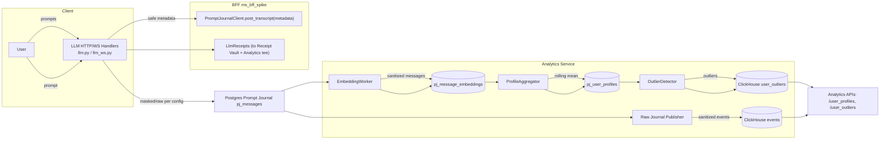
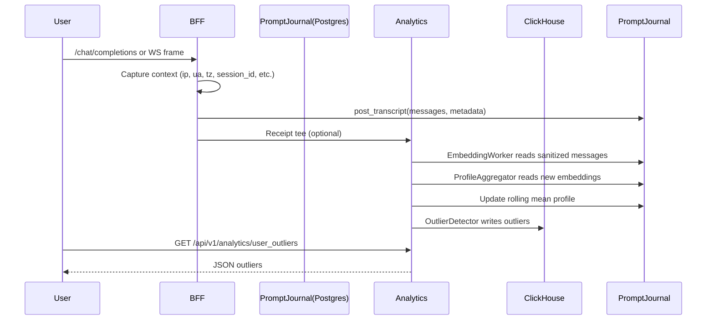
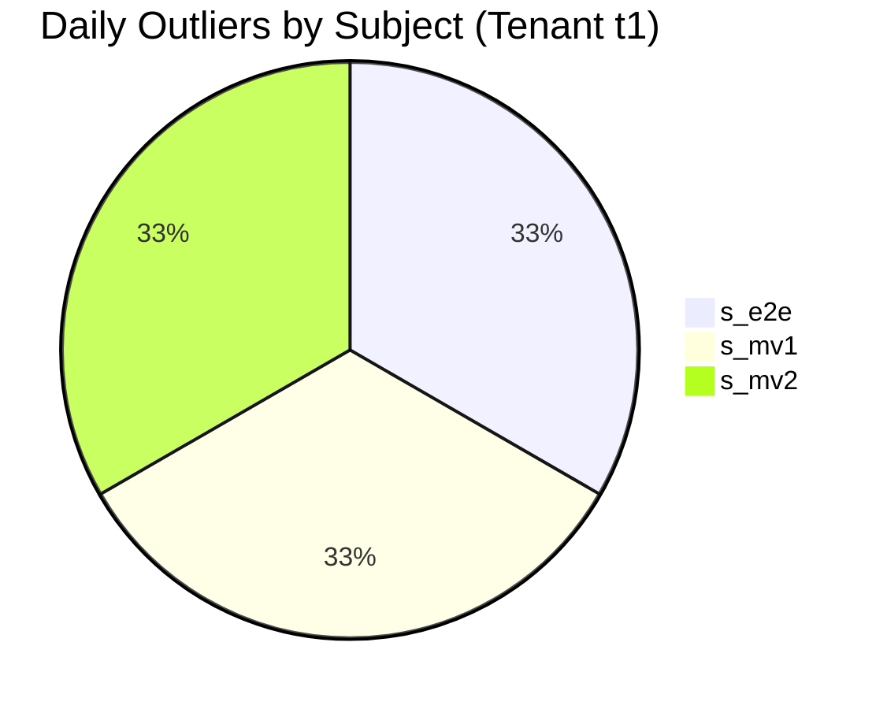

### EmpowerNow Prompt Analytics Profiles and Outlier Detection
A cross-functional guide for Executives, Product, Admin/Support, DevOps/SRE, and QA

---

### Executive Overview
- • **What it is**: A platform feature that enriches AI prompt analytics with context (IP, user agent, timezone, session), builds per-user behavior profiles using vector embeddings (pgvector), and flags anomalous prompts in real time.
- • **Business value**:
  - • **Risk reduction**: Detects misuse, policy violations, or compromised accounts via unusual prompt patterns.
  - • **Trust and safety**: Alerts on out-of-policy or novel risky behaviors for rapid response.
  - • **Customer insights**: Identifies shifts in usage to guide product and pricing decisions.
  - • **Operational efficiency**: Self-serve APIs and dashboards reduce ad-hoc investigations.

---

### Product Management Overview
- • **Core capabilities**:
  - • **Contextual analytics**: Each prompt is stored with safe metadata for segmentation and cohort analysis.
  - • **User profiles**: Rolling mean vector per user reflects “typical” embedding of prompts; evolves with usage.
  - • **Outlier detection**: Cosine distance between new prompt embeddings and that user’s profile; configurable thresholds.
  - • **APIs & dashboards**: Query profiles and outliers; visualize daily patterns (by tenant/user).
- • **Primary use cases**:
  - • **Abuse monitoring**: New, atypical prompts for a user, or spikes across a tenant.
  - • **Customer success**: Early detection of onboarding issues or unexpected use behaviors.
  - • **Data-driven roadmap**: Discover emerging themes to inform product features.
- • **KPIs**:
  - • Outliers per day/tenant, Top anomalous users, Time-to-respond on alerts, Profile coverage and staleness.

---

### Architecture at a Glance



---

### Data Flow (Sequence)



---

### Key Concepts
- • **Context enrichment**: BFF attaches a safe metadata allowlist to prompt journal entries (e.g., `ip`, `user_agent`, `timezone`, `time_of_day`, `day_of_week`, `session_id`).
- • **User profiles (pgvector)**: A per-user rolling mean of embeddings built from sanitized messages; maintained in `pj_user_profiles(profile_vector, last_embedding, message_count, updated_at)`.
- • **Outlier detection**: Computes cosine distance between new embedding and profile; emits an outlier event if distance ≥ threshold.
- • **Storage**:
  - • Postgres (Prompt Journal): `pj_messages`, `pj_message_embeddings`, `pj_user_profiles`.
  - • ClickHouse: `user_outliers` table; `daily_user_outliers` MV for daily aggregates.

---

### APIs
- • **GET /api/v1/analytics/user_profiles?tenant_id&subject_id&limit&offset**
  - • Returns: `tenant_id, subject_id, message_count, updated_at` (vectors omitted).
  - • Scope: `analytics:profiles`
- • **GET /api/v1/analytics/user_outliers?tenant_id&subject_id&days_back&limit**
  - • Returns: `ts, tenant_id, subject_id, message_id, distance, threshold`.
  - • Scope: `analytics:outliers`

Example (PowerShell):
```powershell
Invoke-RestMethod -Headers @{ 'X-Scopes'='analytics:outliers' } `
  -Uri 'http://analytics:8100/api/v1/analytics/user_outliers?tenant_id=t1&days_back=7&limit=50' `
  -Method GET
```

---

### Admin/Support Guide
- • **When to use**:
  - • Investigate a user’s anomalies by time window, tenant, or subject.
  - • Triage alerts from dashboards; resolve false positives by tuning thresholds.
- • **How to locate**:
  - • Start with `user_outliers` for last 24 hours per tenant.
  - • Drill into an outlier’s `message_id` and cross-reference with Prompt Journal if needed.
- • **Playbook**:
  - • Identify spike → Confirm user context (IP region/time) → Check for policy blocks → Escalate if sensitive.

---

### DevOps/SRE Guide

#### Deployment & Configuration
- • **Service**: `analytics` (FastAPI) with background workers.
- • **Core environment variables** (Analytics):
  - • `PROMPT_JOURNAL_DSN`: Postgres DSN for Prompt Journal (supports file:primary secrets).
  - • `RAW_PROMPT_MODE` (bool), `RAW_PUBLISH_ALLOWLIST` (CSV/JSON list).
  - • `EMBEDDINGS_PROVIDER` (e.g., `hash`), `EMBEDDINGS_DIMENSION` (e.g., `1536`), `EMBEDDINGS_BATCH_SIZE` (e.g., `64`), `EMBEDDINGS_MASKED_ONLY` (bool).
  - • `PROFILE_AGGREGATOR_ENABLED` (true/false), `OUTLIER_DETECTOR_ENABLED` (true/false), `OUTLIER_THRESHOLD` (e.g., `0.40`).
  - • `PJ_RETENTION_DAYS` (e.g., `90`).
  - • ClickHouse: `CLICKHOUSE_URL`, `CLICKHOUSE_USER`, `CLICKHOUSE_PASSWORD`, `CLICKHOUSE_DATABASE`, `CLICKHOUSE_POOL_SIZE`.
  - • Privacy/retention flags (from settings): `attribute_allowlist`, `tenant_opt_out`, `retention_days`.
- • **Core environment variables** (BFF):
  - • `analytics_attribute_allowlist`: CSV list of safe metadata keys forwarded to Analytics.
  - • `RECEIPT_VAULT_URL` (optional), `REDIS_URL`, and standard BFF runtime flags.

#### Docker Compose (excerpt)
```yaml
# analytics service (docker-compose-authzen4.yml)
environment:
  - PROMPT_JOURNAL_DSN=file:primary:prompt-journal-dsn
  - RAW_PROMPT_MODE=true
  - RAW_PUBLISH_ALLOWLIST=t1
  - EMBEDDINGS_PROVIDER=hash
  - EMBEDDINGS_DIMENSION=1536
  - EMBEDDINGS_MASKED_ONLY=false
  - PROFILE_AGGREGATOR_ENABLED=true
  - OUTLIER_DETECTOR_ENABLED=true
  - OUTLIER_THRESHOLD=0.40
  - PJ_RETENTION_DAYS=90
  - CLICKHOUSE_URL=http://clickhouse:8123
  - CLICKHOUSE_DATABASE=analytics
```

#### Observability & Metrics
- • **Prometheus**:
  - • `profiles_updated_total`
  - • `outliers_emitted_total`
  - • `outlier_distance_histogram`
- • **Dashboards** (Grafana):
  - • Daily outliers per tenant and per subject
  - • Profile update rate and backlog
  - • Outlier distances vs thresholds
  - • CH/PG health, worker lags, error rates
- • **Alarms**:
  - • Spike in outliers for a tenant
  - • Worker failure or prolonged lag
  - • ClickHouse/Redis connectivity issues

#### Scaling & Reliability
- • **Scale dimensions**:
  - • Embeddings provider throughput, Profile aggregator batch sizes, Outlier detection polling.
- • **Failure domains**:
  - • CH unavailable: API returns 500 for CH-backed queries only; PG-backed APIs still work.
  - • PG unavailable: Workers pause gracefully; API calls that depend on PG will 500.
  - • Use Kubernetes HPA on CPU/latency, Queue lengths, and worker lag.

---

### Developer Notes

#### Data Models (simplified)
- • Postgres:
  - • `pj_messages(id, tenant_id, subject_id, mode, content, metadata JSONB, created_at)`
  - • `pj_message_embeddings(message_id, embedding vector(d), dimension, created_at)`
  - • `pj_user_profiles(tenant_id, subject_id, message_count, profile_vector vector(d), last_embedding vector(d), updated_at)`
- • ClickHouse:
  - • `user_outliers(ts, tenant_id, subject_id, message_id, distance, threshold, mode, metadata)`
  - • `daily_user_outliers` MV: counts per day/tenant/subject.

#### Rolling Mean (profile update)
- **Formula**: For new vector x at count n, new_mean = old_mean + (x - old_mean) / (n + 1).

#### Outlier Distance
- **Metric**: Cosine distance \(1 - \cos(\theta)\). Threshold configurable (e.g., 0.40).

---

### QA Test Plan

- • **Unit**:
  - • Rolling mean math correctness (incremental updates).
  - • Cosine distance edge cases (zero-norm, dimension mismatch).
  - • Threshold behavior (on/off by epsilon).
- • **API**:
  - • `GET /user_profiles`: filters, pagination, scopes enforced.
  - • `GET /user_outliers`: filters, `days_back`, limit, scopes enforced.
- • **E2E**:
  - • Insert sanitized prompts for a user → embeddings written → profile updated → outlier emitted → visible in CH API/MV.
  - • Verify MV daily counts reflect raw outliers in timeframe.
- • **Performance**:
  - • Scale tests on embeddings worker and outlier throughput.
- • **Fault-injection**:
  - • CH outage → API error handling.
  - • PG outage → worker backoff and recovery.

---

### Privacy modes (sanitized, balanced, raw)
- • **Strict (Sanitized)**: Masked text only is persisted and embedded; only sanitized events flow to Kafka/ClickHouse. This is the default.
- • **Balanced (Field‑level raw)**: Masked text plus select raw fields are stored envelope‑encrypted; optional raw embeddings are derived only from allowed fields. Kafka/ClickHouse remain sanitized.
- • **Full‑fidelity (Raw)**: Full prompt/response is stored encrypted (PG row or object storage pointer); raw never goes to Kafka/ClickHouse by default; short retention and narrow RBAC apply.
- • **How mode is chosen**: Policy‑driven via PDP constraints and obligations (e.g., `constraints.prompt_archive.{mode,retention_days}`; obligations like `require_user_consent`, `dlp_scan_before_commit`). Tokens may also carry `authorization_details`/`aria_extensions` hints; BFF/ARIA enforce synchronously.

---

### Privacy, Security, and Compliance
- • **Safe metadata**: Controlled via allowlist at both BFF and Analytics; do not store sensitive PII in metadata.
- • **Masking**: `EMBEDDINGS_MASKED_ONLY=true` masks prompts prior to embedding; raw handling gated by `RAW_PROMPT_MODE` and allowlist.
- • **Retention**: `PJ_RETENTION_DAYS` for Prompt Journal; ClickHouse `TTL` in table schema (e.g., 90 days) for outliers.
- • **DSAR**:
  - • Analytics DSAR endpoints (subject tombstone) hide records immediately; Prompt Journal DSAR deletes PG rows/embeddings; CH TTL for tombstones is in schema.
- • **Secrets**: DSNs and keys resolved via `file:primary:` pointers from Docker secrets or mounted volumes.

---

### Real-World Scenarios
- • **Account takeover**: User prompts shift suddenly (e.g., from “generate marketing copy” to “dump passwords”); outliers spike; alert triggers an investigation and forced re-auth.
- • **Tenant misuse**: A tenant’s traffic includes rate-limited or disallowed content; product and compliance teams are alerted to intervene.
- • **Feature adoption**: New prompt themes cluster as outliers initially; PMs use insights to shape onboarding and documentation.

---

### Rollout Plan
- • **Phase 1 – DB migrations**: Ensure Prompt Journal tables and CH schemas exist.
- • **Phase 2 – Deploy analytics**: Start with workers disabled; validate APIs/health.
- • **Phase 3 – Enable ProfileAggregator**: Monitor profile coverage and latency.
- • **Phase 4 – Enable OutlierDetector**: Conservative threshold; validate alert volumes.
- • **Phase 5 – Dashboards & Alerts**: Turn on tenant-level alerting; iterate thresholds.
- • **Phase 6 – Privacy gates**: Enforce allowlists; validate DSAR flows; document retention.

---

### Configuration Reference (Quick)
- • Analytics:
  - • `PROFILE_AGGREGATOR_ENABLED`, `OUTLIER_DETECTOR_ENABLED`
  - • `OUTLIER_THRESHOLD`, `PJ_RETENTION_DAYS`
  - • `ATTRIBUTE_ALLOWLIST`, `TENANT_OPT_OUT`
  - • `CLICKHOUSE_URL`, `CLICKHOUSE_DATABASE`
  - • `PROMPT_JOURNAL_DSN`
- • BFF:
  - • `analytics_attribute_allowlist`
  - • `RECEIPT_VAULT_URL` (optional)
  - • Standard BFF security / session / Kafka settings

---

### Visualizing Outliers (Daily)



Or use the provided MV `daily_user_outliers` in ClickHouse for accurate per-day counts suitable for dashboards.

---

### Appendix: Operational Tips
- • **Backfilling profiles**: Use the embeddings backfill script to initialize `pj_user_profiles` from historical sanitized prompts before enabling the detector.
- • **Threshold tuning**: Start high (e.g., 0.5–0.6) to avoid alert fatigue; reduce gradually with dashboards to match your risk posture.
- • **Scaling**: If CH insert latency rises, increase pool size or split inserts; consider separate worker pods for aggregator vs detector; adjust batch sizes.

If you want, I can generate a ready-to-import Grafana dashboard JSON and an Ops runbook tailored to your environment next.