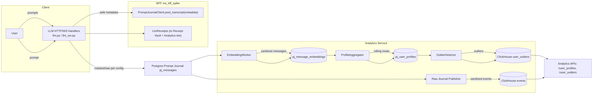
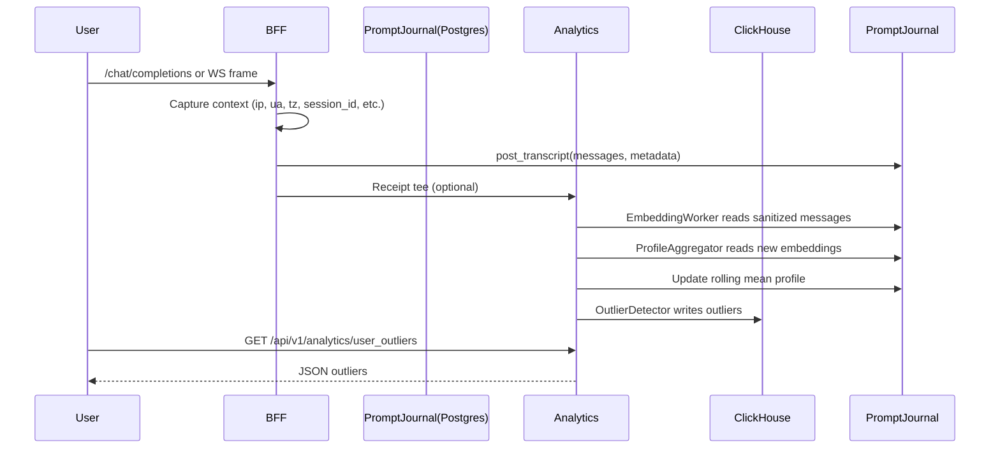

### EmpowerNow Prompt Analytics Profiles and Outlier Detection
A cross-functional guide for Executives, Product, Admin/Support, DevOps/SRE, and QA

---

### Executive Overview
- • **What it is**: A platform feature that enriches AI prompt analytics with context (IP, user agent, timezone, session), builds per-user behavior profiles using vector embeddings (pgvector), and flags anomalous prompts in real time.
- • **Business value**:
  - • **Risk reduction**: Detects misuse, policy violations, or compromised accounts via unusual prompt patterns.
  - • **Trust and safety**: Alerts on out-of-policy or novel risky behaviors for rapid response.
  - • **Customer insights**: Identifies shifts in usage to guide product and pricing decisions.
  - • **Operational efficiency**: Self-serve APIs and dashboards reduce ad-hoc investigations.

---

### Product Management Overview
- • **Core capabilities**:
  - • **Contextual analytics**: Each prompt is stored with safe metadata for segmentation and cohort analysis.
  - • **User profiles**: Rolling mean vector per user reflects “typical” embedding of prompts; evolves with usage.
  - • **Outlier detection**: Cosine distance between new prompt embeddings and that user’s profile; configurable thresholds.
  - • **APIs & dashboards**: Query profiles and outliers; visualize daily patterns (by tenant/user).
- • **Primary use cases**:
  - • **Abuse monitoring**: New, atypical prompts for a user, or spikes across a tenant.
  - • **Customer success**: Early detection of onboarding issues or unexpected use behaviors.
  - • **Data-driven roadmap**: Discover emerging themes to inform product features.
- • **KPIs**:
  - • Outliers per day/tenant, Top anomalous users, Time-to-respond on alerts, Profile coverage and staleness.

---

### Architecture at a Glance



---

### Data Flow (Sequence)



---

### Key Concepts
- • **Context enrichment**: BFF attaches a safe metadata allowlist to prompt journal entries (e.g., `ip`, `user_agent`, `timezone`, `time_of_day`, `day_of_week`, `session_id`).
- • **User profiles (pgvector)**: A per-user rolling mean of embeddings built from sanitized messages; maintained in `pj_user_profiles(profile_vector, last_embedding, message_count, updated_at)`.
- • **Outlier detection**: Computes cosine distance between new embedding and profile; emits an outlier event if distance ≥ threshold.
- • **Storage**:
  - • Postgres (Prompt Journal): `pj_messages`, `pj_message_embeddings`, `pj_user_profiles`.
  - • ClickHouse: `user_outliers` table; `daily_user_outliers` MV for daily aggregates.
- • **Classifier export scope (labels_allowlist)**: If the BFF classifier config sets `policy_export.labels_allowlist`, only those labels are exported to PDP as `context.category_*`. This narrows which categories can drive PDP policies (deny/budgets). For analytics based on receipts/category, ensure the allowlist matches what you want attributed. See `docs/bff_ai_prompt_classifier.md` for guidance and example YAML.

---

### APIs
- • **GET /api/v1/analytics/user_profiles?tenant_id&subject_id&limit&offset**
  - • Returns: `tenant_id, subject_id, message_count, updated_at` (vectors omitted).
  - • Scope: `analytics:profiles`
- • **GET /api/v1/analytics/user_outliers?tenant_id&subject_id&days_back&limit**
  - • Returns: `ts, tenant_id, subject_id, message_id, distance, threshold`.
  - • Scope: `analytics:outliers`

Example (PowerShell):
```powershell
Invoke-RestMethod -Headers @{ 'X-Scopes'='analytics:outliers' } `
  -Uri 'http://analytics:8100/api/v1/analytics/user_outliers?tenant_id=t1&days_back=7&limit=50' `
  -Method GET
```

---

### Admin/Support Guide
- • **When to use**:
  - • Investigate a user’s anomalies by time window, tenant, or subject.
  - • Triage alerts from dashboards; resolve false positives by tuning thresholds.
- • **How to locate**:
  - • Start with `user_outliers` for last 24 hours per tenant.
  - • Drill into an outlier’s `message_id` and cross-reference with Prompt Journal if needed.
- • **Playbook**:
  - • Identify spike → Confirm user context (IP region/time) → Check for policy blocks → Escalate if sensitive.

---

### DevOps/SRE Guide

#### Deployment & Configuration
- • **Service**: `analytics` (FastAPI) with background workers.
- • **Core environment variables** (Analytics):
  - • `PROMPT_JOURNAL_DSN`: Postgres DSN for Prompt Journal (supports file:primary secrets).
  - • `RAW_PROMPT_MODE` (bool), `RAW_PUBLISH_ALLOWLIST` (CSV/JSON list).
  - • `EMBEDDINGS_PROVIDER` (e.g., `hash`), `EMBEDDINGS_DIMENSION` (e.g., `1536`), `EMBEDDINGS_BATCH_SIZE` (e.g., `64`), `EMBEDDINGS_MASKED_ONLY` (bool).
  - • `PROFILE_AGGREGATOR_ENABLED` (true/false), `OUTLIER_DETECTOR_ENABLED` (true/false), `OUTLIER_THRESHOLD` (e.g., `0.40`).
  - • `PJ_RETENTION_DAYS` (e.g., `90`).
  - • ClickHouse: `CLICKHOUSE_URL`, `CLICKHOUSE_USER`, `CLICKHOUSE_PASSWORD`, `CLICKHOUSE_DATABASE`, `CLICKHOUSE_POOL_SIZE`.
  - • Privacy/retention flags (from settings): `attribute_allowlist`, `tenant_opt_out`, `retention_days`.
- • **Core environment variables** (BFF):
  - • `analytics_attribute_allowlist`: CSV list of safe metadata keys forwarded to Analytics.
  - • `RECEIPT_VAULT_URL` (optional), `REDIS_URL`, and standard BFF runtime flags.

#### Docker Compose (excerpt)
```yaml
# analytics service (docker-compose-authzen4.yml)
environment:
  - PROMPT_JOURNAL_DSN=file:primary:prompt-journal-dsn
  - RAW_PROMPT_MODE=true
  - RAW_PUBLISH_ALLOWLIST=t1
  - EMBEDDINGS_PROVIDER=hash
  - EMBEDDINGS_DIMENSION=1536
  - EMBEDDINGS_MASKED_ONLY=false
  - PROFILE_AGGREGATOR_ENABLED=true
  - OUTLIER_DETECTOR_ENABLED=true
  - OUTLIER_THRESHOLD=0.40
  - PJ_RETENTION_DAYS=90
  - CLICKHOUSE_URL=http://clickhouse:8123
  - CLICKHOUSE_DATABASE=analytics
```