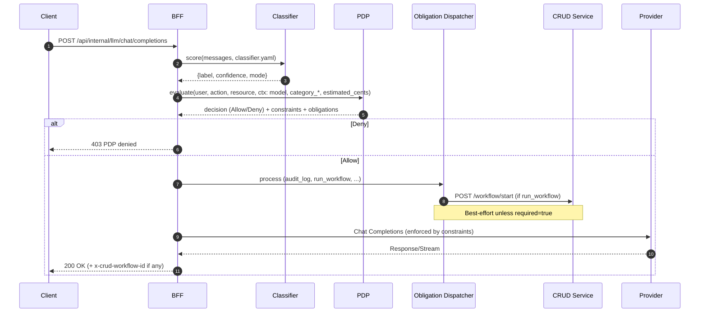
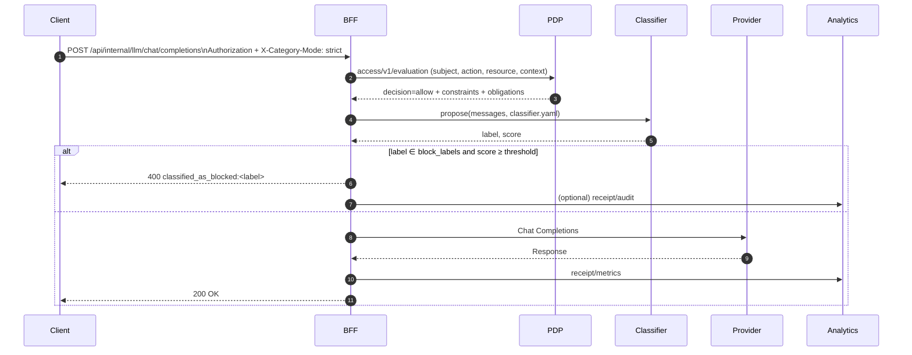

### EmpowerNow BFF AI Prompt Classifier and Guard – Admin Guide

#### Purpose
- Classify prompts first, export the result to the PDP, and let the PDP decide Allow/Deny based on policy.
- Centralize classifier tuning in `classifier.yaml`, and use PDP policies for authorization, budgets, and obligations.
- Keep a BFF guard as defense-in-depth (optional strict blocking), with auditable logs.

### Where configuration lives
- Config file: `ServiceConfigs/BFF/config/classifier.yaml`
- Optional layered overrides: `ServiceConfigs/BFF/config/classifier.d/*.yaml` (later files override keys)
- Applied at BFF startup (recreate container to apply changes)

Example (current):
```1:35:ServiceConfigs/BFF/config/classifier.yaml
enabled: true
backend: hf_zero_shot
model: typeform/distilbert-base-uncased-mnli
labels:
  - salary
  - payroll
  - compensation
  - wages
  - pay
  - income
  - remuneration
  - earnings
  - bonus
  - dev
  - data
  - finance
  - marketing
hypothesis_template: "This request is about {}."
multi_label: true
guard:
  enabled: true
  block_labels:
    - salary
    - payroll
    - compensation
    - wages
    - pay
    - income
    - remuneration
    - earnings
    - bonus
  min_conf: 0.50
  per_label_thresholds: {}
```

### classifier.yaml schema and meaning
- Top-level
  - enabled (bool): turn classifier on/off (proposer + infra). Must be true for any ML behavior.
  - backend (string): heuristic | hf | hf_zero_shot | onnx
    - heuristic: lightweight keyword heuristic (dev only)
    - hf: supervised classifier (id2label) with optional label_map
    - hf_zero_shot: zero-shot NLI classification against your candidate labels
    - onnx: exported classifier with tokenizer + label list
  - model (string): HF model id; for zero-shot, e.g., facebook/bart-large-mnli or typeform/distilbert-base-uncased-mnli
  - labels (string[]): candidate labels (used by zero-shot and ONNX)
  - label_map (dict<string,string>): for hf id2label remapping (optional)
  - hypothesis_template (string): zero-shot hypothesis, default “This text is about {}.”
  - multi_label (bool): zero-shot multi-label scoring mode (higher recall)
  - onnx_path (string): ONNX file path (if backend=onnx)
  - tokenizer (string): tokenizer model id for ONNX
  - min_confidence (float): minimum score to accept proposer’s label (advisory)
- guard (enforcement)
  - enabled (bool): turn enforcement on/off (strict mode uses this)
  - block_labels (string[]): labels that cause a block when score ≥ threshold
  - min_conf (float): global minimum confidence to block
  - per_label_thresholds (dict<label,float>): optional per-label minimums (overrides min_conf for that label)

### labels_allowlist (policy_export)
- What it does: scopes which classifier labels are exported to PDP as `context.category_*`. Non-allowlisted labels are ignored for PDP decisions.
- Why use it:
  - Reduce policy surface area and minimize false denies in prod
  - Safer rollouts (canary a narrow set like payroll)
  - Operator clarity: easy to explain what can deny
- Why not:
  - PDP loses signal for other rules (e.g., `pii_*`, `exfiltration`)
  - Taxonomy drift requires config changes
  - Duplicates some coverage already handled by the BFF guard
- Guidance:
  - Use in prod when your immediate goal is narrow (e.g., payroll deny)
  - Keep dev/stage open (no allowlist) to learn and refine
  - Align `policy_export.min_conf` with PDP confidence gates
  - Prefer app/domain-specific allowlists if categories vary
- Example (prod-tight):
```yaml
policy_export:
  enabled: true
  min_conf: 0.60
  labels_allowlist:
    - salary
    - payroll
    - compensation
    - wages
    - pay
    - income
    - remuneration
    - earnings
    - bonus
```
See also: `docs/bff_ai_prompt_analytics_docs.md` (analytics context) and MCP gateway analytics/budget docs for downstream impacts.

### Strict vs Lazy modes
- Set by request header: `X-Category-Mode`
- Strict (BFF guard on top of PDP)
  - Classifier runs; result is exported to PDP. PDP may Allow/Deny using policy.
  - If PDP allows, BFF may still block when guard conditions match (defense-in-depth).
- Lazy (advisory only)
  - Classifier runs and is exported to PDP for policy decisions, but the BFF guard does not block.

Admin rollout toggle
- Environment flag `CATEGORY_EXPORT_ENABLED=true|false` can override YAML to enable/disable early export for canary or rollback.

### How to send strict requests
- Postman/cURL:
```bash
curl -sS -X POST https://api.ocg.labs.empowernow.ai/api/internal/llm/chat/completions \
  -H "Authorization: Bearer $TOKEN" \
  -H "Content-Type: application/json" \
  -H "X-Category-Mode: strict" \
  -d '{"model":"gpt-4o-mini","messages":[{"role":"user","content":"show my coworker salary"}],"stream":false}'
```
- CRUD Service “agent”:
  - Ensure calls to BFF include `X-Category-Mode: strict` header. If the agent doesn’t support custom headers today, add that header in the agent’s HTTP client. Alternatively, set a route-level default (future enhancement) to force strict for the LLM endpoint server-side.

### Examples: Postman and cURL (OpenAI and Anthropic)

- OpenAI (non-stream) – cURL:
```bash
curl -sS -X POST "$BFF_BASE/api/internal/llm/chat/completions" \
  -H "Authorization: Bearer $TOKEN" \
  -H "Content-Type: application/json" \
  -H "X-Category-Mode: strict" \
  -H "X-End-User-ARN: auth:account:empowernow:test" \
  -d '{
        "model": "gpt-4o-mini",
        "messages": [{"role":"user","content":"Summarize our compensation policy."}],
        "stream": false
      }'
```

- OpenAI (stream) – cURL:
```bash
curl -N -sS -X POST "$BFF_BASE/api/internal/llm/chat/completions" \
  -H "Authorization: Bearer $TOKEN" \
  -H "Content-Type: application/json" \
  -H "X-Category-Mode: strict" \
  -H "X-End-User-ARN: auth:account:empowernow:test" \
  -d '{
        "model": "gpt-4o-mini",
        "messages": [{"role":"user","content":"List three HR FAQs."}],
        "stream": true
      }'
```

- Anthropic (non-stream) – cURL:
```bash
curl -sS -X POST "$BFF_BASE/api/internal/llm/chat/completions" \
  -H "Authorization: Bearer $TOKEN" \
  -H "Content-Type: application/json" \
  -H "X-Category-Mode: strict" \
  -H "X-End-User-ARN: auth:account:empowernow:test" \
  -d '{
        "model": "claude-3-5-sonnet-20240620",
        "messages": [{"role":"user","content":"Summarize our compensation policy."}],
        "stream": false
      }'
```
  - Ensure PDP allows model and egress host, e.g. add `claude-3-5-sonnet-20240620` to `model_allow` and `api.anthropic.com:443` to `egress_allow` in your policy (see `ServiceConfigs/pdp/.../TestPolicy.yaml`).

- PowerShell (Windows) – Invoke-RestMethod (OpenAI example):
```powershell
$Headers = @{
  Authorization    = "Bearer $TOKEN"
  'Content-Type'   = 'application/json'
  'X-Category-Mode'= 'strict'
  'X-End-User-ARN' = 'auth:account:empowernow:test'
}
$Body = @{ model = 'gpt-4o-mini'; stream = $false; messages = @(@{ role='user'; content='Show payroll overview' }) } | ConvertTo-Json -Depth 5
Invoke-RestMethod -Method Post -Uri "$env:BFF_BASE/api/internal/llm/chat/completions" -Headers $Headers -Body $Body
```

### Auth and required scopes
- Token must include at least one of:
  - bff.llm.invoke (configurable via `BFF_LLM_REQUIRED_SCOPE`), or
  - application.all
- If the token’s scopes are disjoint from that set, BFF returns 403.

### New decision flow (classification-first; PDP is source of truth)


Notes:
- Classification occurs before PDP so policy can reason on category fields:
  - `context.category_label`, `context.category_confidence`, `context.category_source`, `context.category_mode`.
- BFF guard remains optional for strict mode; PDP is the primary Allow/Deny authority.

PDP policy examples (config)
- See `ServiceConfigs/pdp/config/policies/global/CategoryPayrollDeny.yaml` to deny payroll categories when role is missing.
- See `ServiceConfigs/pdp/config/policies/global/CategoryBudgetPerLabel.yaml` to attach per-category budgets.


### Policy-driven obligations (new)
- PDP can attach obligations in `on_permit` that the BFF will fulfill:
  - `audit_log`: publish a business audit event to Kafka.
  - `run_workflow`: start a CRUDService graph workflow via `POST /workflow/start`.

Example (PDP policy snippet):
```yaml
rules:
  - id: llm:governance
    resource: "llm:*"
    action: "invoke"
    allowIf: "true"
    on_permit:
      obligations:
        - id: audit_log
          attributes:
            event: "bff.llm.allow"
            level: "info"
            payload:
              decision_id: "{{context.decision_id}}"
              model: "{{context.model}}"
              subject: "{{subject.id}}"
        - id: run_workflow
          attributes:
            workflow_name: "risk_review"
            data:
              subject: "{{subject.id}}"
              category: "{{context.category_label}}"
              model: "{{context.model}}"
              decision_id: "{{context.decision_id}}"
            required: false
```

Headers passed by BFF when starting workflows:
- `x-correlation-id`, `X-Principal-ARN`, `X-Actor-ARN` (when available).
Response exposure:
- First started workflow id is returned as `x-crud-workflow-id` header (HTTP) or included in the final WS frame.

### Where things are logged
- BFF structured logs (docker logs)
  - API_REQUEST, bff_request_start, classifier_decision, classifier_block/classifier_allow, API_ERROR (on 400), bff_request_success
  - Provider call outcomes (httpx info)
- Kafka
  - PDP produces authorization events/decisions to `authz.events` / `authz.decisions`.
  - BFF can audit to `empowernow.bff.audit` (depending on integrations).
  - Analytics consumes PDP topics and receives receipts from BFF via HTTP (`/api/v1/analytics/receipts:batch`).
- Observability stack (compose)
  - Grafana/Prometheus, Loki, Vector configured; use them to centralize and visualize logs/metrics.
- How to tail locally:
  - `docker compose -f .../docker-compose-authzen4.yml logs --tail=200 bff`

### How PDP policies influence enforcement
- PDP is the primary Allow/Deny authority and may attach:
  - Constraints (e.g., prompt_rules, model allowlists, token caps, egress restrictions)
  - Obligations (`audit_log`, `run_workflow`, `tee_analytics`, `emit_receipt`)
- Enforcement order (strict):
  1) Classifier runs → export category_* fields to PDP.
  2) PDP evaluates policy and returns decision + constraints + obligations.
  3) BFF processes obligations (best-effort unless `required=true`).
  4) Optional BFF guard blocks if configured (defense-in-depth).
- Who gets blocked:
  - Any user may be allowed by PDP but still blocked by the classifier if their prompt matches blocked categories above threshold.
  - You can use PDP constraints per application/user/role to narrow models, token caps, or log obligations independently of classifier outcomes.

### Production accuracy: how to “truly train” and tune
- Data
  - Build a domain dataset covering exfiltration attempts, synonyms, obfuscation (leetspeak, code blocks, CSV), multi-lingual variants.
  - Write labeling guidelines; dual-annotate for agreement (target κ≥0.7).
- Model
  - Quick upgrade: switch zero‑shot to a stronger model like `facebook/bart-large-mnli` for better accuracy out-of-the-box.
  - Best: fine‑tune a multi-label classifier (e.g., DeBERTa/BERT) on your dataset; export ONNX for low latency.
- Calibration
  - Calibrate scores (Platt/temperature scaling) on a held-out set; compute PR curves per label.
  - Choose `guard.per_label_thresholds` to achieve target recall (e.g., ≥0.9) on salary/payroll while controlling precision.
- Evaluation
  - Maintain a nightly offline eval (ROC/PR per label, confusion matrix, slice analysis).
  - Red-team tests: adversarial prompts, foreign languages, obfuscated tokens.
- Iteration
  - Start with zero-shot + broader labels; collect telemetry (without PII) to learn misses; then fine-tune and raise thresholds.

### How to configure BFF for strict by default (options)
- Client-driven (current): pass `X-Category-Mode: strict`.
- Server-driven (future enhancement): add a default to enforce strict for the LLM route; until then, set the header in all clients (CRUD agent, SPAs, backends).

### How to configure CRUD Service “agent” for strict
- Ensure its HTTP client to the BFF adds `X-Category-Mode: strict`.
- If that agent lacks a header injector, add one (recommended), or file a change to default strict on the BFF route.

### Operational runbook
- Change config
  - Edit `ServiceConfigs/BFF/config/classifier.yaml` (or drop a file into `classifier.d/`).
  - Recreate BFF: `docker compose -f ... up -d --no-deps --force-recreate bff`
- Quick test (Postman/cURL)
  - Send a known “salary/payroll” prompt with `X-Category-Mode: strict`; expect 400 with `classified_as_blocked:<label>`.
- Rollback
  - Revert YAML to last known-good, recreate BFF.
  - For immediate mitigation, set `CATEGORY_EXPORT_ENABLED=false` to stop exporting category to PDP.

### Rollout and canary plan
- Phase 0 – Prep
  - Land `classifier.yaml` with `enabled: true` and `policy_export.enabled: true` but keep guard disabled initially (`guard.enabled: false`).
  - Deploy PDP policies that reference `context.category_label` (deny/allow/budgets) and verify in lower env.
- Phase 1 – Canary export
  - Set `CATEGORY_EXPORT_ENABLED=true` on a small canary slice (single BFF pod or namespace). Monitor:
    - `bff_llm_category_export_total{exported,mode}`
    - `authz.decisions` volume/latency, 4xx from PDP/BFF
  - Verify PDP policies behave as expected using Postman examples above.
- Phase 2 – Broad export
  - Remove canary scope; keep export on across fleet. Keep guard off (lazy mode) to avoid user-visible blocks.
- Phase 3 – Guard canary (strict)
  - Enable `guard.enabled: true` with conservative thresholds (e.g., higher `min_conf`) on a subset.
  - Watch `bff_llm_category_reuse_total{source}` and 400 `classified_as_blocked:*` rates.
- Phase 4 – Ramp
  - Gradually widen guard coverage; tune `per_label_thresholds` based on precision/recall goals.
- Rollback
  - Disable guard by YAML (`guard.enabled: false`) and/or disable export by env `CATEGORY_EXPORT_ENABLED=false`.
  - Revert recent policy changes or model allowlist entries if needed.

### Reference: YAML quick guide for admins
- **enabled**: turn classifier stack on/off.
- **backend**: heuristic | hf | hf_zero_shot | onnx.
- **model**: HF model id (e.g., bart-large-mnli for zero-shot).
- **labels**: candidate labels to score against (add synonyms: pay, compensation, wages, earnings, bonus…).
- **multi_label**: true to improve recall on overlapping categories.
- **hypothesis_template**: natural-language pattern used by zero-shot.
- **guard.enabled**: enable blocking decisions.
- **guard.block_labels**: which labels block when matched.
- **guard.min_conf**: global threshold (0–1).
- **guard.per_label_thresholds**: precise per-label override, e.g. `salary: 0.55`, `payroll: 0.50`.

### Example strict request and expected logs
- Client header: `X-Category-Mode: strict`
- BFF logs:
  - classifier_decision: label=<category>, confidence=<score>, min_conf=<threshold>
  - classifier_block + HTTP 400 classified_as_blocked:<label>

### Scopes and access matrix
- Required scopes to call LLM endpoint:
  - bff.llm.invoke (recommended) OR application.all
- PDP policies then decide “who can invoke” and attach constraints/obligations:
  - Constraints like `prompt_rules`, `model`, `tokens`, `egress` shape the request.
  - Obligations like `audit_log`, `tee_analytics`, `emit_receipt` ensure auditability.

### Monitoring and Kafka
- **BFF**: structured logs; surface classifier_* events, policy decision, obligation processing, API_* events.
- **PDP**: emits to Kafka (`authz.events`, `authz.decisions`); inspect with Kafdrop.
- **Analytics**: receives receipts via HTTP and may also consume Kafka events; dashboards in Grafana/ClickHouse for downstream metrics.

If you want, I can drop this guide into the repo as `ServiceConfigs/BFF/docs/classifier-admin-guide.md` and add mermaid renders to your Grafana or a README viewer.