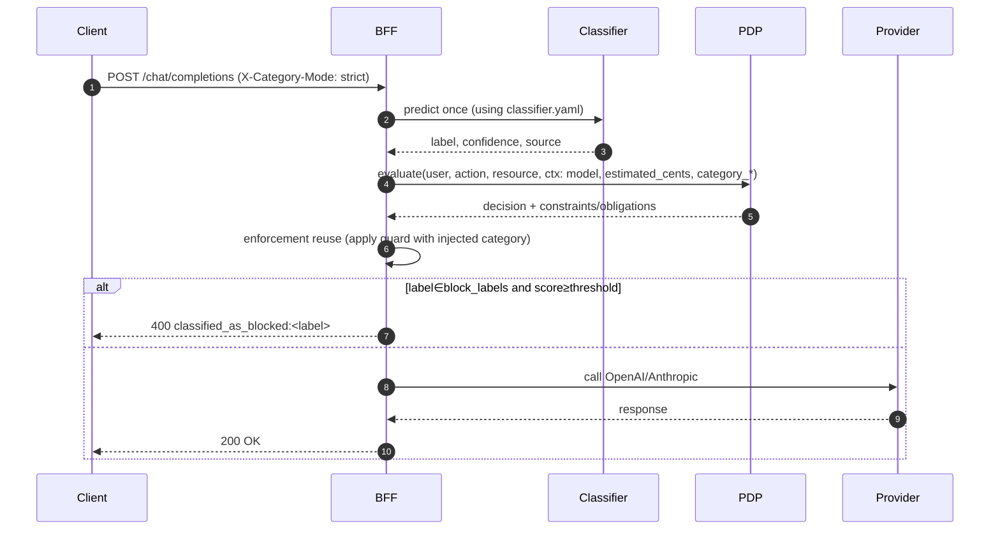

### Design: PDP-aware category export and single-pass enforcement

Goal
- Let PDP make authorization/budget decisions using the ML category before any provider call.
- Preserve strict-mode guard so BFF still blocks unsafe content prior to provider.
- Avoid duplicate inference and keep config admin-driven via YAML.

Key changes
- Early prediction
  - Move ML category prediction to happen before PDP evaluate in `api/v1/endpoints/llm.py`.
  - Reuse the same prediction later in enforcement to avoid a second inference.
- PDP context export
  - Add fields to PDP evaluate context:
    - category_label: string (e.g., salary, payroll, earnings)
    - category_confidence: float [0..1]
    - category_source: enum {ml, heuristic, disabled}
    - category_mode: enum {strict, lazy, immediate} (from header)
  - Keep existing model and estimated_cents hints.
- Enforcement reuse
  - Teach `LlmEnforcer` to accept an injected category result (label, score, source, mode) and skip inference if provided.
  - Guard still applies thresholds and block_labels from YAML to the injected category in strict mode.
- Config extensions (classifier.yaml)
  - Optional policy_export block for future filtering or anonymization (defaults to enabled):
    - policy_export.enabled: bool (default true)
    - policy_export.min_conf: float (optional floor for exporting to PDP)
    - policy_export.labels_allowlist: [string] (optional filter)
- Streaming parity
  - Mirror early prediction + PDP context export and enforcement reuse in `api/v1/endpoints/llm_ws.py`.
- Observability
  - Structured logs:
    - classifier_predicted_for_pdp {label, confidence, mode, exported:true/false}
    - classifier_reused_for_enforcement {label, confidence, mode}
- Backward compatibility
  - If classifier disabled or prediction fails, PDP call proceeds without category fields; enforcement behaves as today.

Data flow (strict)


Security and correctness
- PDP can now allow/deny based on category and user attributes (e.g., dev vs payroll), attach budgets per category, or force model changes.
- BFF guard still blocks if unsafe even when PDP allows (defense in depth).

Config snippet (extension)
- Add to `ServiceConfigs/BFF/config/classifier.yaml` (optional):
```yaml
policy_export:
  enabled: true
  min_conf: 0.40
  labels_allowlist: []  # empty = all
```

Validation impact
- Ensure PDP policy definition supports reading `context.category_label` and `context.category_confidence`.
- Example PDP policy (budget per category) you can extend similarly to your `BudgetCategoryDev.yaml`.

Risks/mitigations
- Duplicate inference: avoided via reuse.
- Latency: single inference + PDP call (unchanged overall).
- Back-compat: category fields are additive; if missing, PDP policies should default gracefully.

### Developer TODOs

Phase 1 – Core plumbing
1) Add classifier.policy_export to YAML schema and load into settings
- Location: `ms_bff_spike/ms_bff/src/core/config.py` (ClassifierConfig)
- Fields: enabled, min_conf (optional), labels_allowlist (optional)

2) Early ML prediction before PDP (non-stream)
- File: `ms_bff_spike/ms_bff/src/api/v1/endpoints/llm.py`
- Extract messages and category_mode header
- Call proposer once; capture {label, confidence, source}
- Apply policy_export filters to decide if exported
- Add to pdp_ctx: category_label, category_confidence, category_source, category_mode

3) Enforcement reuse to avoid duplicate inference
- File: `ms_bff_spike/ms_bff/src/services/llm_enforcement.py`
- Allow `precomputed_category: Optional[Dict]` in preflight or a dedicated setter on the enforcer
- If present, use precomputed label/confidence in strict guard instead of inferring

4) Structured logs
- Emit classifier_predicted_for_pdp and classifier_reused_for_enforcement with correlation_id

Phase 2 – Streaming and registry
5) Mirror early prediction/export in `ms_bff_spike/ms_bff/src/api/v1/endpoints/llm_ws.py`
- Ensure SSE path injects the same category info to PDP
- Reuse in stream enforcement (relay_with_enforcement)

6) Provider registry – no changes needed
- Anthropic/OpenAI routing stays by model prefix

Phase 3 – PDP and policies
7) Confirm PDP context contract
- Ensure PDP accepts category_label/category_confidence in its request schema
- Update any server-side schema or extractors if needed

8) Author example PDP policies using category
- Add dev/payroll category-based budget/allow rules in `ServiceConfigs/pdp/config/policies/...`
- Provide one example with allowIf based on `context.category_label`

Phase 4 – Tests
9) Unit tests
- LlmEnforcer uses injected category and blocks/permits correctly
- YAML policy_export gating: export/no-export per min_conf/allowlist
- Provider selection unaffected

10) Integration tests
- End-to-end strict: PDP sees category, returns constraints, guard blocks if blocked label
- Lazy mode: PDP sees category but guard does not block; provider reached

Phase 5 – Docs and examples
11) Update admin docs (bff_ai_prompt_classifier.md)
- Add PDP-aware category export, schema additions, flow diagrams
- Strict vs lazy matrix and examples
- Postman/cURL for OpenAI and Anthropic

12) Rollout and feature flag
- Optional: add a temporary env `CATEGORY_EXPORT_ENABLED=true` to gate behavior for canary
- Add canary plan and rollback note to docs

Acceptance criteria
- PDP receives category fields on both chat and streaming endpoints.
- Guard uses the same single prediction (no duplicate inference).
- Strict mode blocks as before; lazy behaves as before.
- Tests pass; logs include new structured events.
- Docs updated and clear for admins and ops.