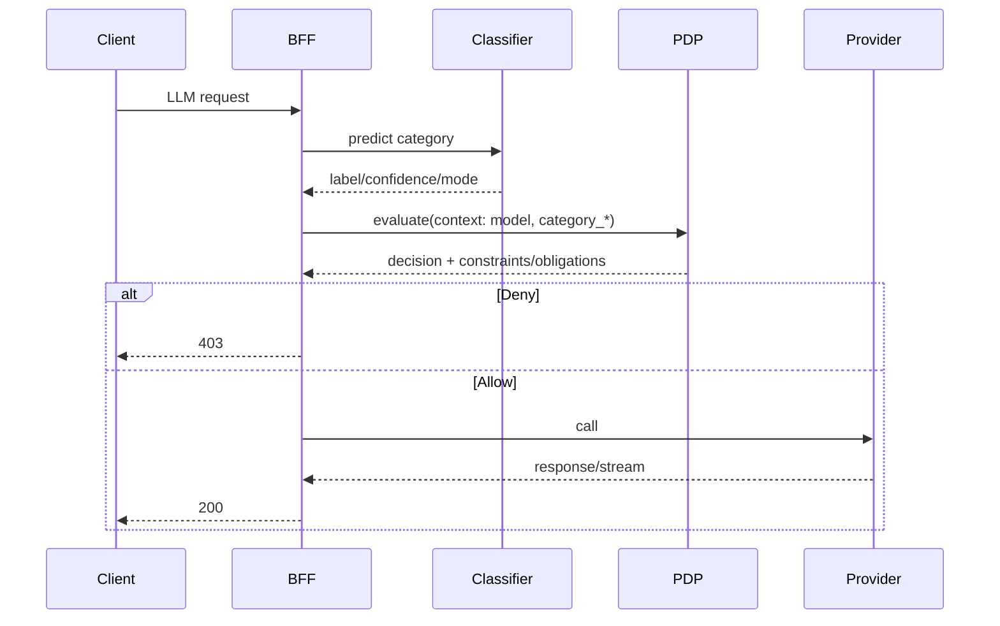

### Brainstorm notes (raw)

- Problem signals
  - Multi‑IdP reality (Entra, Okta, Keycloak) + legacy SSO (SiteMinder) + hybrid apps (web, APIs, legacy protocols)
  - App teams don’t want to rewire per‑IdP; they want stable sessions, headers, and simple “works everywhere”
  - AI adoption outpaced governance; need policy, spend control, journaling at the edge
  - Business continuity pressure: “login can’t go down” and “AI costs can’t blow up”

- Category mashup (what we really are)
  - Identity Orchestration Gateway (session unification, IdP continuity)
  - Access Gateway / Identity‑Aware Reverse Proxy (ForwardAuth, header/bearer injection)
  - Policy Enforcement Point (Zero Trust at the edge)
  - Legacy SSO Compatibility Layer (SMSESSION alias + header mapping)
  - AI Gateway (provider proxy, policy, spend, journaling)
  - Optional Virtual Directory/Identity Aggregation partner (schema abstraction via VDS), but decoupled

- Unfair advantages
  - IdP continuity + session abstraction + SiteMinder compatibility in one plane
  - AI governance built into the same edge path (authz, budgets, receipts, journaling) before egress to providers
  - Works with what you have (Traefik, existing IdPs, legacy apps), not against it
  - Optional VDS enrichment for normalized attributes without coupling

- First‑principles
  - Apps should be IdP‑agnostic and AI‑provider‑agnostic
  - Identity and AI governance belong at the edge, closest to users and policies
  - Continuity is a product capability, not a playbook
  - Decoupled components; narrow, versioned contracts; graceful degradation

- Name directions
  - EmpowerNow Identity & AI Edge (IAE)
  - EmpowerNow Orchestration Gateway
  - EmpowerNow Continuity & AI Governance Gateway

---

### Product overview (executive)

- What it is
  - EmpowerNow Identity & AI Edge is an Identity Orchestration Gateway with built‑in AI governance. It abstracts any IdP behind a single, secure session and gives your apps normalized identity via headers or bearer. At the same edge, it governs AI usage—authorizing prompts, enforcing spend policies, journaling interactions, and proxying base model providers.

- Why it matters
  - Migrations, mergers, and multi‑cloud create identity sprawl. Legacy apps still need cookies/headers; modern apps want bearer. Meanwhile AI usage is exploding without controls. We unify these at the edge, so apps remain simple, safe, and fast.

- What it replaces/augments
  - Franken‑stacks of per‑app IdP wiring, custom reverse proxy rules, brittle SiteMinder shims, ad‑hoc AI proxies, and spreadsheet budgets.

- Outcomes
  - Faster app delivery (IdP‑agnostic)
  - Fewer auth incidents (continuity failover/fallback)
  - Governed AI usage (policy + budgets + receipts)
  - Lower migration risk (SMSESSION alias + legacy headers)

---

### Core capabilities

- Identity orchestration
  - Unified, opaque server‑side session for any IdP (Entra, Okta, Keycloak, etc.)
  - Continuity: health‑based failover/fallback for new logins
  - Session compatibility for legacy apps: optional SiteMinder‑style `SMSESSION` alias + legacy header mapping
  - ForwardAuth with Traefik: inject normalized identity headers and optionally bearer to backends

- AI gateway & governance
  - Provider proxy/facade: OpenAI‑compatible endpoints, streaming, and model routing
  - Classifier‑first: BFF classifies prompts and exports category_* to PDP; PDP decides Allow/Deny and attaches constraints/obligations.
  - Obligation dispatcher: `audit_log` → Kafka; `run_workflow` → CRUDService workflows, with correlation and ARNs.
  - Spend/budget controls with receipts; idem and rate limits
  - Prompt journaling and category tagging; observability of usage

- Optional enrichment via VDS (decoupled)
  - Normalized identity attributes (email, name, groups) across sources (HR/AD/IdP)
  - Pull‑only, short‑timeout API; BFF caches enrichment in session; never blocks auth

- Security & operations
  - HttpOnly/Secure/SameSite cookies; CSRF protection; session binding (IP/UA)
  - JWKS verification with alg allowlists; DPoP‑ready; JARM/PAR support
  - Metrics, traces, and structured logs for both identity and AI paths
  - Clear SLOs, failure isolation, and feature flags for progressive rollout

---

### Differentiators

- One edge, two hard problems solved: identity continuity and AI governance
- Works with legacy and modern apps simultaneously (cookies + headers + bearer)
- Zero rewrites for apps expecting SiteMinder behaviors
- AI controls before egress, not as an afterthought (policy + budgets + receipts)
- Decoupled enrichment (VDS) to avoid tight coupling and shared failures

---

### Primary use cases

- IdP migration & coexistence
  - Swap/rotate IdPs behind a unified session; legacy apps keep working via `SMSESSION` alias and headers

- Zero‑touch app onboarding
  - App teams just trust the gateway; receive standard identity headers and, if needed, bearer; no IdP specifics

- AI policy & spend control
  - Enforce who can use which model, at what cost, with streaming receipts and journaling for audit

- Resilience as a feature
  - Health‑driven failover/fallback for new logins; optional header enrichment even when some sources are degraded

---

### Architecture at a glance

- Edge plane
  - Traefik ForwardAuth → EmpowerNow Gateway (verify) → inject headers/optional bearer → backends

- Identity plane
  - OIDC with PAR/JARM; unified server‑side session; optional `SMSESSION` alias; CSRF and binding; continuity monitors

- AI plane
  - REST/WS endpoints (OpenAI‑compatible), policy enforcement, budgeting, journaling; provider egress proxy

- Enrichment (optional, decoupled)
  - VDS `/v1/identity/normalized` with short timeouts; results cached in session; system continues if VDS is down

---

### Who buys it

- CISO / Security leadership
  - Reduce attack surface, unify policy, gain audit trails for identity and AI

- Platform engineering / Architecture
  - One way to onboard apps; consistent edge patterns; fewer bespoke integrations

- App/API teams
  - Faster time‑to‑market; no IdP rewrites; standard headers; AI features without managing providers

- Data/AI leaders
  - Policy, budgets, usage telemetry, and receipts—without slowing teams down

---

### Competitive framing

- Identity orchestrators: focus on migration and continuity—few address legacy cookie/header compatibility and AI governance together.
- AI gateways/proxies: focus on model connectivity—few enforce enterprise identity policy, budgets, and prompt journaling at the same edge.
- We combine both in one edge plane, decoupled from enrichment, with a pragmatic, “works‑with-what‑you‑have” posture.

---

### Proof points to highlight

- Keep apps running during IdP outages thanks to continuity for new logins
- Legacy app keeps working as we replace SiteMinder (alias cookie + headers)
- AI policy blocks an unsafe prompt, budgets cap spend, receipts journal usage
- All done without changing app code—just route through the gateway

---

### Packaging and go‑to‑market ideas

- Starter (Identity Edge): session unification, continuity, SiteMinder compatibility, header/bearer injection
- Plus (Identity + AI Edge): Starter + AI gateway (policy, budgets, journaling, provider proxy)
- Enrichment (Add‑on): VDS normalized attributes and groups
- Pricing axes: protected apps/services, monthly active users, AI usage governed, provider connectors

---

### Positioning statement (external)

EmpowerNow Identity & AI Edge is an orchestration gateway that keeps your apps IdP‑agnostic and your AI usage under control. It unifies sessions across any IdP, preserves legacy compatibility, and enforces policy, spend, and journaling for AI—at the same edge—so teams ship faster with less risk.

---

### Elevator pitch (internal)

We are the front door for identity and AI. Swap IdPs behind us, keep legacy apps alive, and govern AI prompts and spend—without changing your apps. It’s continuity and control in one gateway, built to work with what you already run.

If you’d like, I can drop this into a new docs/Product_Overview.md and add a short “AI Gateway capabilities” section to IdP_orchestration.md for completeness.