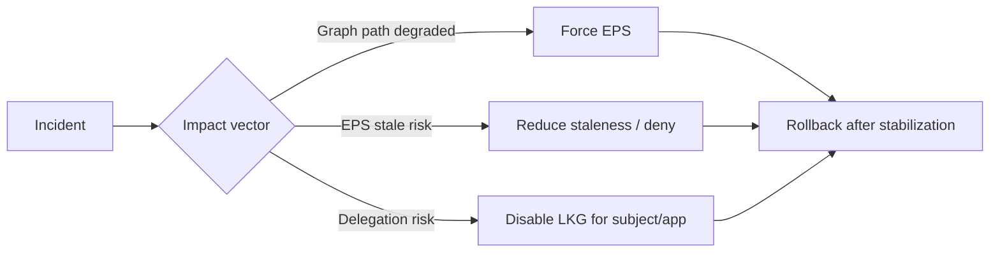

# Break‑Glass Procedures (ReBAC v1)

Emergency actions to stop the bleeding safely and fast. Use only during incidents and roll back as soon as possible.

## Decision Flow Overview



## 1) Force EPS (disable Graph‑Eval for affected apps)
When Graph‑Eval path is degraded (timeouts/5xx) or unstable.

Steps:
1. Remove impacted app(s) from `GRAPH_EVAL_APPS`
2. Optionally set `EVALUATION_MODE=eps` (global default)
3. Keep `GRAPH_EVAL_ENABLED=true` for other pilots if unaffected

Example (compose env override):
```env
GRAPH_EVAL_ENABLED=true
EVALUATION_MODE=eps
GRAPH_EVAL_APPS=
```

## 2) Constrain Staleness / Deny on Error
When EPS freshness risk increases (CDC lag, upstream outages).

Options:
- Lower LKG max staleness (e.g., 60–120s)
- Deny on EPS error for specific high‑risk apps (temporary)

Example knobs:
```env
# Reduce staleness window
LKG_MAX_STALENESS_SEC=120
```

## 3) Disable LKG for Specific Subjects/Apps
When a revocation or high‑risk change must take effect immediately.

Approach:
- Publish a hard‑evict event (preferred)
- Or use an admin endpoint/tooling (if available) to mark `{subject, app}` as hard‑evicted

Effect:
- PDP will skip LKG for those keys; requires fresh EPS/verification or denies according to policy

## 4) Raise Alert Sensitivity
During incident windows, catch regressions faster.

- Lower CDC lag alert threshold (e.g., 1500ms)
- Lower p95 latency alert band temporarily

## 5) Communication & Guardrails
- Announce changes to app owners and SRE
- Apply smallest scope first (per‑app > global)
- Document exact env deltas and timestamps for rollback

## 6) Rollback
- Restore original `GRAPH_EVAL_APPS` and staleness settings
- Unmark hard‑evicted subjects/apps after verification
- Monitor dashboards for 30–60 minutes post‑rollback

## Quick Reference
| Scenario | Action |
|---------|--------|
| Graph timeouts/5xx | Force EPS for affected app(s) |
| CDC lag spike | Lower staleness; monitor; page data platform |
| Delegation revoke | Hard‑evict; skip LKG; require fresh verification |
| Missing receipts | Verify producer envs/topic; check logs; restart producer if needed |

## References
- `docs/operations/runbook.md`
- `docs/operations/rollout_playbook.md`
- `docs/security/security_integrity_guide.md`
