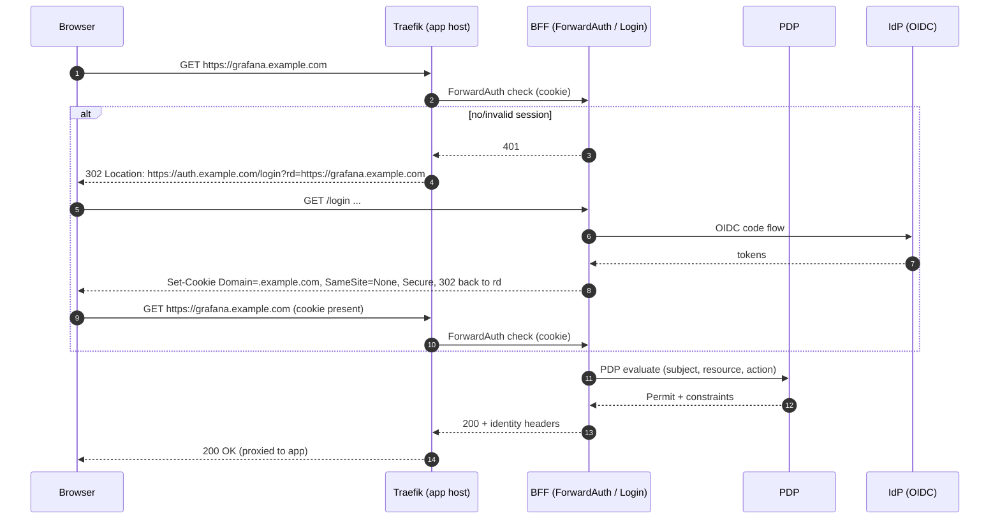
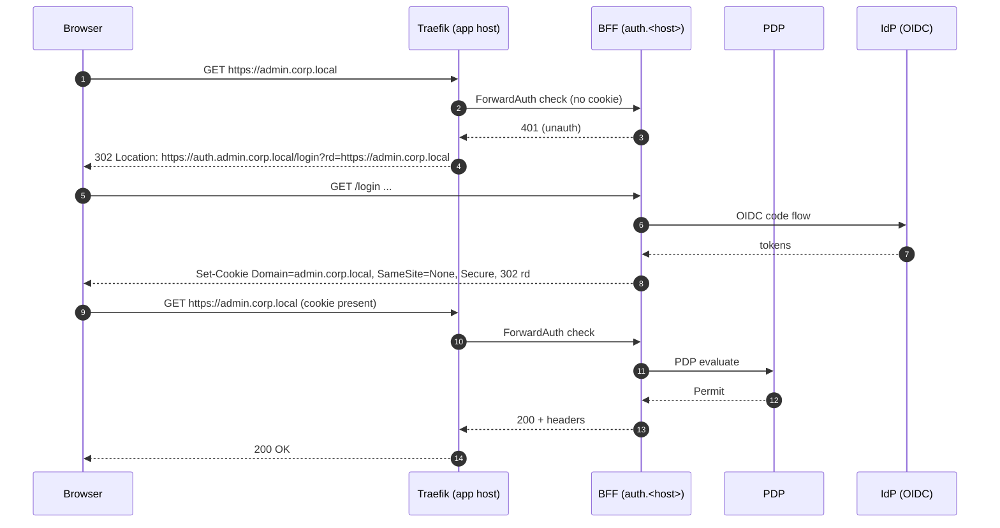
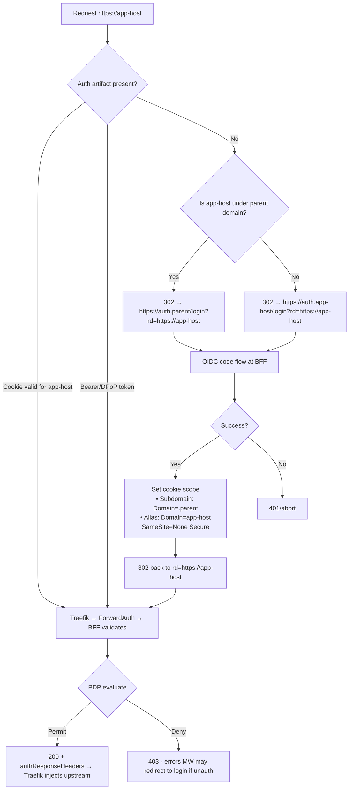

## Cross‑Domain SSO with BFF: Subdomain and Auth‑Alias Patterns

This guide explains how to run the BFF as a gateway for browser apps across both a single parent domain and multiple root domains, including DNS, Traefik, and BFF configuration. It includes real‑world examples and end‑to‑end flows.

### What you get
- **One login for many apps** with PDP authorization and Traefik ForwardAuth
- **No app code changes**; credentials never reach the browser
- **Works across domains**: use an auth alias per host to mint a host‑scoped cookie

---

## 1) Patterns at a glance

### A. Cross‑subdomain (one parent domain)
- Cookie: `Domain=.example.com; SameSite=None; Secure`
- Apps: `grafana.example.com`, `kibana.example.com`, `tabix.example.com`
- Login host: `auth.example.com`



### B. Cross‑domain via per‑host “auth alias” (recommended)
- For apps like `admin.corp.local` and `tools.partner.net`
- DNS: create `auth.<host>` CNAME → BFF ingress (e.g., `bff.company.net`)
- Login occurs at `https://auth.<host>/login` and sets a cookie scoped to `<host>`



### 1.1) Unified flow and decision chart



Step‑by‑step
1. User hits `https://<app-host>`. Traefik calls BFF via ForwardAuth.
2. If a valid artifact is present (host‑scoped cookie, or Bearer/DPoP), BFF validates and proceeds.
3. If absent, Traefik redirects to the correct login host:
   - Subdomain pattern: `https://auth.<parent>/login?rd=https://<app-host>`
   - Auth‑alias pattern: `https://auth.<app-host>/login?rd=https://<app-host>`
4. BFF completes OIDC code flow and sets the cookie scope:
   - Subdomain: `Domain=.parent`, `SameSite=None`, `Secure`
   - Auth‑alias: `Domain=<app-host>`, `SameSite=None`, `Secure`
5. Browser returns to `<app-host>` with cookie; Traefik re‑invokes ForwardAuth.
6. BFF evaluates PDP (`subject, resource, action`). On permit, it returns identity headers (and optional brokered Authorization header); on deny, Traefik returns 403.
7. Traefik injects headers upstream; the browser never sees backend credentials.
8. API clients can skip cookies and supply Bearer/DPoP; the same ForwardAuth decision path applies.

### 1.2) Architecture (components and subgraphs)

```mermaid
graph LR
  %% Layout groups
  subgraph DNS [DNS]
    DNSA[app-host A/CNAME → Traefik]
    DNSAuth[auth.app-host CNAME → BFF]
  end

  subgraph EDGE [Edge / Data Plane]
    T[Traefik]
    Apps[Admin/Web Apps<br/>Grafana/Kibana/Tabix/...]
  end

  subgraph BFFCP [BFF / Control Plane]
    BFF[BFF<br/>• ForwardAuth handler<br/>• OIDC login /login<br/>• Header templating<br/>• Quotas/filters]
    R[(Redis - Sessions and Broker leases)]
  end

  subgraph IDENTITY [Identity]
    IDP[IdP - OIDC]
    PDP[PDP - ABAC]
  end

  subgraph PROVIDERS [Secrets & Workflows]
    CRUD[CRUDService<br/>• Workflows]
    VAULT[OpenBao/Vault]
  end

  %% Flows
  Browser((Browser)) -->|HTTPS https://app-host| T
  DNSA -.->|resolves| T
  T -- ForwardAuth --> BFF
  BFF -->|OIDC code flow| IDP
  BFF -->|Evaluate subject, resource, action| PDP
  BFF -->|Cache sessions/leases| R
  BFF -->|run_workflow issue/revoke| CRUD
  CRUD -->|DB creds| VAULT
  T -->|Inject identity/Authorization headers| Apps
  %% Auth alias login path
  Browser -.->|302 to auth.app-host/login| BFF
  DNSAuth -.->|resolves| BFF
  ```

Legend
- DNS: separate records for the app host and its `auth.<app-host>` alias (cross‑domain pattern)
- Edge: Traefik is the data plane; apps never see raw tokens or passwords
- BFF: handles ForwardAuth, login, PDP checks, and optional credential brokering (via CRUDService)
- Identity: IdP for OIDC, PDP for ABAC decisions
- Providers: CRUDService runs workflows; OpenBao/Vault issues short‑lived credentials


---

## 2) DNS and certificates

### Cross‑subdomain
- A records/CNAMEs for `auth.example.com` and each app host to Traefik ingress
- TLS: wildcard or SAN cert for `*.example.com`

### Cross‑domain (auth alias)
- For each app host `X`, add `auth.X` CNAME → BFF ingress (e.g., `bff.company.net`)
- TLS: obtain certs for every `auth.X` (use ACME DNS or pre‑provisioned certs)

---

## 3) Traefik dynamic config

### Common: ForwardAuth middleware and authResponseHeaders
```yaml
http:
  middlewares:
    bff-forwardauth:
      forwardAuth:
        address: "http://bff:8083/auth/forward"
        trustForwardHeader: true
        authResponseHeaders:
          - "Authorization"
          - "X-WEBAUTH-USER"
          - "X-User-ID"
```

### Redirect unauth to login
Use the errors middleware to transform 401/403 from ForwardAuth into a redirect to the right login host.

#### Cross‑subdomain
```yaml
http:
  middlewares:
    auth-errors-subdomain:
      errors:
        status:
          - "401-403"
        service: bff-login-subdomain
        query: "/login?rd={url}"

  services:
    bff-login-subdomain:
      loadBalancer:
        servers:
          - url: "https://auth.example.com"
```

Attach both middlewares to your app routers:
```yaml
http:
  routers:
    grafana:
      rule: "Host(`grafana.example.com`)"
      service: grafana_svc
      middlewares: ["bff-forwardauth", "auth-errors-subdomain"]
```

#### Cross‑domain (per‑host auth alias)
For each app host, point 401/403 to its own `auth.<host>`.
```yaml
http:
  middlewares:
    auth-errors-admin-corp-local:
      errors:
        status: ["401-403"]
        service: bff-login-admin-corp-local
        query: "/login?rd={url}"

  services:
    bff-login-admin-corp-local:
      loadBalancer:
        servers:
          - url: "https://auth.admin.corp.local"

  routers:
    admin_corp_local:
      rule: "Host(`admin.corp.local`)"
      service: admin_svc
      middlewares: ["bff-forwardauth", "auth-errors-admin-corp-local"]
```

Security add‑ons (recommended):
- IP allowlists for admin UIs
- mTLS and/or Basic on `/auth/*` (BFF login) if appropriate
- Rate limits on ForwardAuth and login endpoints

---

## 4) BFF configuration

### Cookies
- Cross‑subdomain: set cookie `Domain=.example.com`, `SameSite=None`, `Secure`
- Cross‑domain (auth alias): set cookie `Domain=<original_app_host>` (derived from `rd`/`X-Forwarded-Host`)

Example (pseudo‑config):
```yaml
auth:
  cookie:
    name: "bff_session"
    secure: true
    samesite: "None"
    domain_strategy:
      mode: infer_from_request_host   # sets Domain to requested app host
      parent_domain: ".example.com"  # used when subdomain mode is enabled
```

### Login endpoints
- `/login?rd=<url>` starts OIDC code flow; on success sets cookie, redirects to `rd`
- `/logout` clears cookie (and revokes brokered leases if configured)

### PDP and headers
- ForwardAuth calls PDP for `resource` and `action` derived from router/host config
- On permit, BFF returns identity headers (and optional brokered Authorization headers if configured)

---

## 5) Real‑world examples

### Example 1 — Subdomain: Grafana and Kibana
- Hosts: `grafana.example.com`, `kibana.example.com`
- Login: `auth.example.com`
- Cookie: `Domain=.example.com`

Traefik routers use `bff-forwardauth` + `auth-errors-subdomain`. BFF maps hosts to resources: `admin_ui:grafana`, `admin_ui:kibana` and enforces PDP.

### Example 2 — Cross‑domain: Partner tools
- Hosts: `admin.corp.local`, `tools.partner.net`
- Login aliases: `auth.admin.corp.local`, `auth.tools.partner.net` (CNAME → `bff.company.net`)
- Cookies: `Domain=admin.corp.local` and `Domain=tools.partner.net`, isolated

Traefik routers each attach a per‑host `auth-errors-...` middleware pointing to the corresponding `auth.<host>` service.

### Example 3 — Per‑customer portals
- Hosts: `portal.customerA.io`, `portal.customerB.io`
- Alias: `auth.portal.customerA.io`, `auth.portal.customerB.io`
- Benefits: strict isolation, customer‑scoped cookies, independent PDP policies

---

## 6) Security and SLOs
- Cookies are host‑scoped or parent‑scoped by design; no third‑party cookies
- Browser never sees backend credentials; Traefik injects headers upstream only
- SLOs: ForwardAuth P99 ≤ 120 ms; first‑deny after PDP flip ≤ 5 s p95
- Use Splunk audit for login, allow/deny, and (if used) brokered lease lifecycle

---

## 7) Troubleshooting
- 401 loop: ensure `errors` middleware is attached and login host is reachable over TLS
- Cookie not present: check `Domain` and `SameSite=None; Secure` (HTTPS only)
- Wrong domain cookie: verify `domain_strategy` and `X-Forwarded-Host`
- CORS/API clients: prefer bearer/DPoP tokens; do not rely on cookies

---

## 8) Minimal checklist
- DNS: `auth.<host>` CNAMEs resolve to BFF ingress; certs issued
- Traefik: `bff-forwardauth` + per‑host `errors` middleware to `auth.<host>`
- BFF: cookie domain strategy set; OIDC issuer/audience configured; PDP wired
- Security: rate limits, IP allowlists, header scrubbing, TLS everywhere


