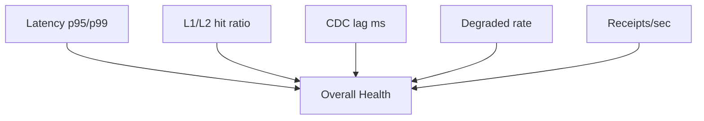

# Day‑2 Ops Guide (PDP ReBAC v1)

Daily operations for SRE/Support: dashboards, Decision Lab triage, safe changes.

## Dashboards

What to watch daily:
- Latency p50/p95/p99 for authorize endpoint
- L1/L2 cache hit ratio
- CDC lag (`cdc_lag_ms`)
- Degraded rate (`increase(degraded_total[5m])`)
- Kafka receipts volume/sec

## Decision Lab Triage
1. Reproduce the user’s request in Decision Lab (copy exact `subject/action/resource/context`)
2. Confirm decision and provenance (`eps_etag` or `graph_snapshot_id`)
3. Expand policy decisions and decision factors to locate matching rules
4. If `degraded=true` receipts correspond, check PIP/Redis health and CDC lag
5. Capture `correlation_id` and attach to ticket

## Safe Config Changes
- Per‑app mode toggle (Admin UI): EPS ↔ Graph‑Eval
- Redis TTL tuning for EPS
- Alerts thresholds (CDC lag, latency p95)

Rollout safety:
- Prefer small increments (one app at a time)
- Monitor dashboards 30–60 minutes after changes
- Keep rollback steps ready (see Rollout Playbook)

## Daily/Weekly Tasks
- Verify `authz.receipts` presence (Kafdrop)
- Review degraded spikes; correlate with incidents
- Check parity jobs status (nightly)
- Audit policy changes in source repos

## Incident Checklists
- Latency spike: cache ratio ↓? PIP latency ↑? Graph depth caps?
- CDC lag: broker health, publisher status, Redis throughput
- Missing receipts: producer envs, topic exists, consumer health

## References
- `docs/operations/runbook.md`
- `docs/operations/rollout_playbook.md`
- `docs/operations/governance_auditability.md`
