## ARIA v1 Deep Dive — Visual Deck

### Purpose
- Tell the story end-to-end with visuals: what shipped, how it works, and why it’s safer and faster.

### Contents
- 1) Opener — What’s unique and why it matters (before ▶ after)
- 2) Architecture — Control vs Data planes; control points heatmap
- 3) Core contracts — Passports, Plans, Pins, Receipts
- 4) Flows — MCP tool path, BFF streaming, failure/deny receipts
- 5) Receipts & Analytics — Ground truth, APIs, metrics
- 6) Budgets — PDP-led governance, multi-pool extension
- 7) Consent — IdP obligations + state machine
- 8) Membership PIP — capabilities, data-scope, step-up, chaining
- 9) Identity chaining — delegated vs brokered, PoP continuity
- 10) Shipped vs Deferred — impact KPIs and ops
- Appendix — Repo map, rollout plan, acceptance tests

---

## GTM intro — Positioning for buyers

### One‑liner value proposition
Provable AI guardrails that cap spend, stop data leaks, and pass audit — without slowing teams.

### Who buys and why (ICP/personas)
- CIO/CISO: reduce risk and pass audits with evidence
- VP Eng / AI Platform: ship faster, keep costs predictable
- FinOps: enforce budgets, avoid overruns, forecast accurately
- Risk/Compliance: tamper‑evident trail for approvals and policies

### Flagship use cases (business outcomes)
- Spend governance for GenAI: budgets pre‑gate + settle + receipts → predictable costs
- Agent/tool safety: schema pins, egress control, param allowlists → prevent breakage/exfiltration
- Audit‑ready operations: signed, hash‑chained receipts → faster audits and RCA

### Differentiation (battlecard)
- You: policy → enforcement → signed receipts (provable), stream‑time caps, pairwise identity, plan contracts, registry pins
- Others: logs after the fact, coarse scopes, best‑effort throttling, limited evidence

### Trust & security narrative
- Privacy: pairwise identities; no raw prompts in receipts
- Standards: JWT/JWKS, RAR; DPoP‑ready; fail‑closed defaults
- Egress pinning and redirect re‑checks; minimal blast radius rollout

### Value framework (non‑numeric)
- Fewer overruns; shorter audit prep; fewer incidents; safe rollouts

### Pilot plan (4–6 weeks)
- Scope: 1–2 use cases (LLM spend governance + one high‑risk tool)
- Success criteria: predictable spend, zero critical policy escapes, receipts coverage
- Deliverables: receipts, dashboards, runbooks; go/no‑go for broader rollout

### Objections & answers
- “Will this slow delivery?” → decision caching and stream‑time enforcement keep p95 low
- “Are we locked in?” → standards and simple HTTP; portable receipts
- “What about PII?” → hashes/snapshots only; no raw tokens in receipts

---

## Narrative — From agent risk to provable control

AI agents unlocked speed but introduced new failure modes: schema changes breaking tools at runtime, prompt outputs leaking data, runaway token spend, and logs that couldn’t prove what really happened. Teams shipped faster, but leaders lacked hard controls and evidence.

We fixed that by moving authorization to where actions actually occur and by making every decision and action provable. The design separates decision from enforcement: a central PDP decides once, and lightweight enforcement points (ARIA Gateway for tools, BFF for LLMs) apply constraints in real time. Every action produces a signed, hash‑chained receipt, so audit and incident response start from facts—not guesses.

Execution begins at the IdP. The service exchanges standard OAuth tokens for an ARIA Passport: a JWT that binds an agent to a specific user (pairwise identity), pins the tool schemas it can call, optionally carries a signed plan of steps, and includes a budget envelope and a per‑call id. The passport is audience‑scoped, so tokens only work at the intended enforcement point.

At the edge, the ARIA Gateway (for tools) and the BFF (for LLMs) enforce policy with low latency. They check the user/agent binding, verify schema pins, validate the current plan step, fetch a decision from the PDP, and then shape the request: apply egress allowlists, enforce parameter allowlists, and inject server‑side data scopes. For LLMs, the BFF preflights budget, caps output during streaming, and reconciles cost on provider usage.

Spend is predictable because budgets are enforced twice: the PDP can pre‑gate a request using live Analytics state, and the PEPs hold and settle against real usage. This two‑phase model prevents overspend while keeping throughput high.

Every decision produces evidence. After each call, the enforcement point emits a signed receipt that includes a snapshot of the policy in effect, hashes of the request parameters, and a link to the previous receipt for that agent. Analytics verifies receipts, maintains chain continuity, derives spend, and exposes a hot runtime for dashboards and budget checks.

Some controls belong before issuance. When policy requires consent, the PDP returns an obligation and the IdP pauses token issuance with a device‑flow‑style handle. Approval resumes the exchange. This keeps synchronous limits at the edge and asynchronous approvals where they fit naturally: at the IdP.

When downstream SaaS requires it, identity chaining lets the gateway obtain or broker a short‑lived assertion to call provider APIs on behalf of the user. It’s policy‑gated, DPoP‑ready, and captured in receipts, so the chain of custody remains intact.

Today’s release delivers the core: passports, schema pins, plan contracts, PDP decisions, real‑time enforcement, budgets, and receipts‑first Analytics. Advanced features—like default PoP, SPIFFE/mTLS to tools, transaction tokens, and signed registry attestations—are flag‑guarded with a clear runway.

The result is a platform that caps spend, stops data leaks, and passes audits—while letting product teams keep shipping.

---

## Executive summary — Business value & cyber risk reduction

- Spend control and savings (immediate)
  - PDP pre-gate + stream-time settle eliminate AI spend leakage and overruns
  - Demonstrable savings versus baseline with fast payback
- Provable compliance and auditability
  - Actions covered by signed, hash-chained receipts → audit prep time materially reduced
  - Clear lineage for approvals/budgets, aligned with SOC2/ISO/NIST expectations
- Fewer incidents, faster recovery
  - Schema pins prevent breaking changes; egress allowlists cut exfiltration paths
  - Deny receipts with reasons reduce MTTR for Support/PM
- Safer velocity for product teams
  - Controlled rollouts (schema previous-window), reversible flags for advanced crypto features
  - Central policy (PDP) + local enforcement (PEPs) → faster iteration with guardrails

Executive KPIs (track monthly)
- % spend within budget bands; variance vs forecast
- GPT/LLM cost per active user/session; trend vs prior release
- Policy deny accuracy (pre-gate vs settle delta) and avoided costs
- Audit coverage (% actions with valid receipt) and time-to-audit packet
- Security: blocked risky egress, chain continuity %, consent SLA

---

## 1) Opener — What’s unique and why it matters

- Agent-to-tool auth at the MCP boundary with pairwise identities (user-bound agents)
- Plan contracts bind steps and parameters; idempotent budget holds
- Stream-time enforcement for LLMs (preflight, truncate, settle)
- Signed, hash-chained receipts as audit ground truth

Before ▶ After (value):
- Before: coarse scopes, best-effort budgets, logs as truth, weak provenance
- After: per-user pairwise principals, provable spend caps, signed receipts, policy-driven egress/params

Outcome KPIs (tracked):
- PDP evaluation latency p95 (tracked)
- Registry/receipt call latency p95 (tracked)
- Receipts chain_ok rate (tracked)
- Analytics hot-state GET latency p95 (tracked)
- Budget deny precision (pre-gate vs settle)

### Outcomes & KPIs (business + engineering)
- Reduced spend leakage: PDP pre-gate + PEP settle; variance tracked post-rollout
- Audit readiness: all actions receipt-covered; chain continuity monitored
- Time-to-detect drift: schema pin mismatches detected at request time
- MTTR on policy issues: deny receipts with reason + constraints_fp enable faster recovery
- Latency SLOs: defined per environment and reviewed with Ops

---

## 2) Architecture overview (Control vs Data planes)

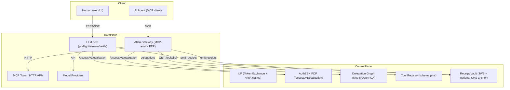

Speaker note: Emphasize separation of concerns and where decisions vs enforcement live.

Control points heatmap (enforcement highlights):
- IdP: obligations pre-issuance (consent, DPoP binding), schema pins aggregation
- ARIA: schema pins, plan step, egress, params allowlist, receipts
- BFF: preflight budget, stream-time truncation, settle, receipts
- PDP: constraints/obligations, budget checks, membership PIP

### Threats → Controls map
| Threat/Risk | Control | Where enforced |
| --- | --- | --- |
| Tool schema drift | Schema pins (version/hash, 4h previous window) | IdP (pin), ARIA (verify) |
| Overspend | PDP budgets pre-gate + PEP hold/settle | PDP, BFF |
| Prompt leakage / unsafe output | Stream-time enforcement + prompt rules | BFF |
| Identity replay / token theft | Pairwise sub + optional DPoP `cnf.jkt` | IdP (mint), PEPs (verify later) |
| Unapproved egress | Egress allowlist + redirect re-checks | ARIA |
| Missing audit trail | Signed, chained receipts | ARIA/BFF + Receipt Vault |

---

## 3) Core contracts (Passports, Plans, Pins, Receipts)

### ARIA Passport (JWT, minimal fields)
```json
{
  "sub": "pairwise:…",
  "act": {"sub": "agent:svc-123:for:…"},
  "aud": "aria.gateway",
  "authorization_details": [{"type":"aria_agent_delegation","tools":["mcp:…"]}],
  "aria": {
    "bound_sub": "pairwise:…",
    "schema_pins": {"mcp:tool": {"schema_version":"1.2.0","schema_hash":"sha256:…"}},
    "plan_contract_jws": "<JWS|null>",
    "call_id": "…",
    "budget": {"initial": 100.0, "currency": "USD"}
  }
}
```

Explainer — What, who, why
- What it is: The agent’s access token. Issued by the IdP via token exchange.
- Who consumes: ARIA Gateway (PEP) verifies and enforces; PDP uses properties for decisions.
- Why it matters: Binds the agent to a specific user (pairwise), pins tool schemas, and carries plan/budget context.

Key fields in practice
- `sub`: Pairwise user identifier (privacy-preserving per audience).
- `act.sub`: Agent principal bound to the same user (`agent:<service>:for:<pairwise>`).
- `aud`: Audience; ARIA Gateway rejects tokens for the wrong audience.
- `authorization_details`: RAR capabilities (which tools the agent may invoke).
- `aria.bound_sub`: Must match `sub`; ARIA checks binding.
- `aria.schema_pins`: Tool schema version/hash to prevent schema drift.
- `aria.plan_contract_jws`: Optional signed plan steps (enforce order/params).
- `aria.call_id`: Correlates actions/receipts; enables idempotency.
- `aria.budget`: Declares spend envelope communicated to PEPs.

### Plan Contract (JWS payload)
```json
{
  "steps": [
    {"index":0,"tool":"mcp:flights:search","params_fingerprint":"sha256:…","max_cost":0.50}
  ]
}
```

Explainer — Why plans
- Purpose: Bind a multi-step tool workflow to a specific order, tool set, and hashed parameters.
- Enforcement: ARIA validates the current step against this JWS (index, tool, params_fingerprint).
- Value: Prevents parameter drift/escalation between planning and execution; supports per-step cost caps via `max_cost`.

### Receipt (JWS payload, hash-chained)
```json
{
  "agent_id":"agent:…",
  "call_id":"…",
  "resource":{"type":"tool","id":"mcp:…"},
  "policy_snapshot": {"tokens":{"max_output":1024}},
  "params_hash":"sha256:…",
  "prev_hash":"0000…"
}
```

Explainer — Receipts as ground truth
- What it is: Signed fact of what was decided/executed, with policy snapshot and hashes.
- Who signs/verifies: Receipt Vault signs (RS256); Analytics verifies and tracks chain continuity.
- Why it matters: Tamper-evident audit trail without storing sensitive params.

Key fields in practice
- `resource`: What was invoked (tool/model id).
- `policy_snapshot`: Constraints/limits in effect (egress, tokens, data_scope).
- `params_hash`: Canonical hash of shaped params (no raw data stored).
- `prev_hash`: Links to previous receipt for the same agent (hash chain).
- `usage` (when present): Token/cost usage for settle and analytics.

Schema pin rollout window:
- Exact match required, or previous_version/hash allowed for ≤ 4h window
- Slide callout: reduces blast radius during incremental tool schema deploys

---

## 4) End-to-end flows

### A. Agent → Tool via ARIA (MCP)
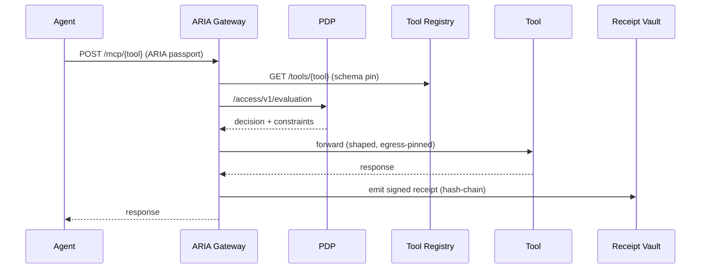

### B. Human/Bot → LLM via BFF (stream-time enforcement)
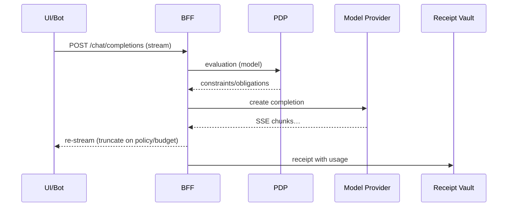

### C. Deny/failure path (deny receipts)
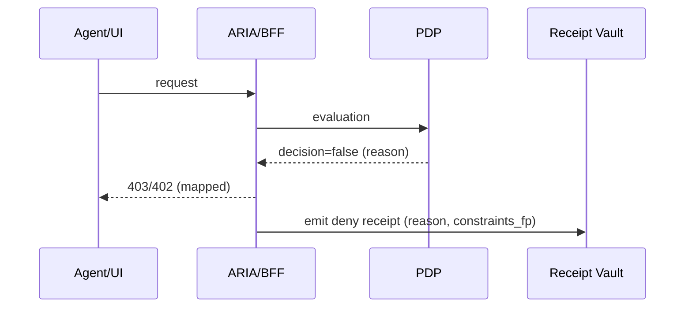

Example deny receipt (excerpt)
```json
{
  "decision": "Deny",
  "reason": "budget_insufficient_for_request",
  "call_id": "...",
  "agent_id": "agent:...",
  "resource": {"type":"model","id":"gpt-4o-mini"},
  "spend_snapshot": {"remaining_cents": 90, "limit_cents": 1000, "period": "daily", "scope": "user"},
  "prev_hash": "..."
}
```

Operator playbook (Support):
- Check deny reason; confirm pool remaining via Analytics GET
- If policy misconfig, route to PM/Architects; else advise user to adjust prompt/budget

---

## 4b) Bouncing ball — step-by-step (no diagram)

Scenario: External agent invokes a tool via ARIA Gateway. Each hop shows inputs, checks/enforcement, and artifacts.

1) Agent → ARIA Gateway (ingress)
- Inputs: `Authorization: Bearer <ARIA Passport>`, body (params)
- Checks:
  - Token audience (`aud=aria.gateway`), token integrity (signature in prod)
  - Pairwise binding: `sub == aria.bound_sub` and `act.sub` bound to the same pairwise id
  - `authorization_details` includes requested capability
- Outcome: proceed or 401/403 with mapped reason

2) ARIA → Tool Registry (schema pin)
- Inputs: `tool_id`
- Checks: exact `schema_version/hash` match OR previous version/hash within rollout window
- Outcome: verified or 403 schema pin mismatch

3) ARIA → Plan validation (if present)
- Inputs: `aria.plan_contract_jws`, params
- Checks: current step index from `call:{call_id}:step`; tool id and `params_fingerprint`
- Outcome: proceed or 403 plan step violation

4) ARIA → PDP (decision)
- Inputs: subject (agent+bound user), action, resource (tool), context `{capability}`
- PDP: capability check (Membership), assemble constraints (egress, tokens, data_scope, params, step-up), optional budget check
- Outcome: `decision=true` with `constraints/obligations`, else `decision=false`

5) ARIA enforcement (PEP)
- Preconditions: step-up/consent headers
- Egress: host allowlist, redirect re-checks
- Params: allowlist regex; attach `row_filter_sql`
- Outcome: 401/403 on violation, else proceed

6) ARIA → Tool (egress)
- Inputs: shaped params, headers (`X-Delegator-ID`, `X-Agent-ID`)
- Outcome: tool response

7) Receipt emission
- Inputs: `call_id`, `agent_id`, `resource`, `policy_snapshot`, `params_hash`, optional `usage`
- Actions: get previous chain head → set `prev_hash`; sign via Receipt Vault; store new head
- Outcome: receipt JWS available for Analytics

8) Analytics (async)
- Verify JWS, check chain, derive cost, update hot counters/budgets
- Runtime GETs power dashboards and PDP budget checks

Artifacts per hop
- Token: ARIA Passport (IdP)
- Pin: `{schema_version, schema_hash}`
- Plan: Plan JWS
- PDP: `{decision, context.constraints, obligations}`
- Receipt: JWS with `prev_hash`
- Analytics: budgets/daily spend keys in Redis

## 4c) Bouncing ball — flowcharts

### 1) Ingress at ARIA (passport & binding)
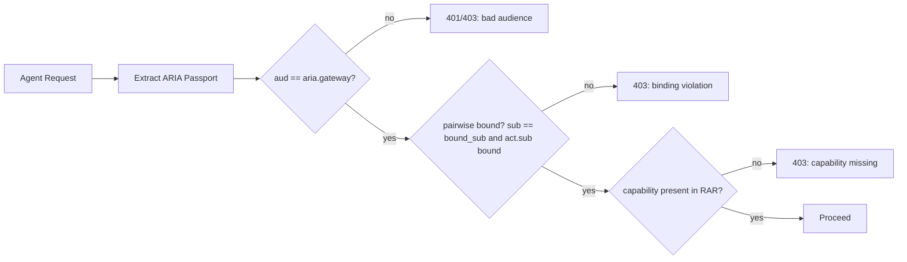

### 2) Schema pin verification (Tool Registry)
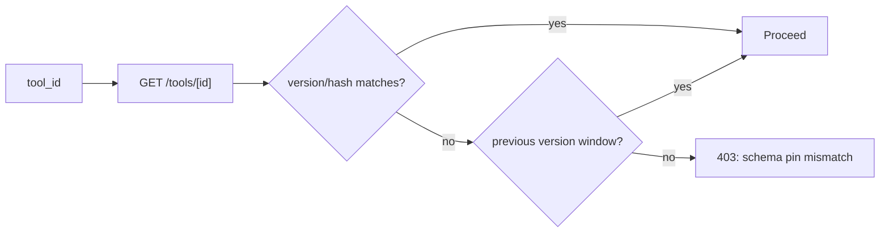

### 3) Plan step validation (if present)
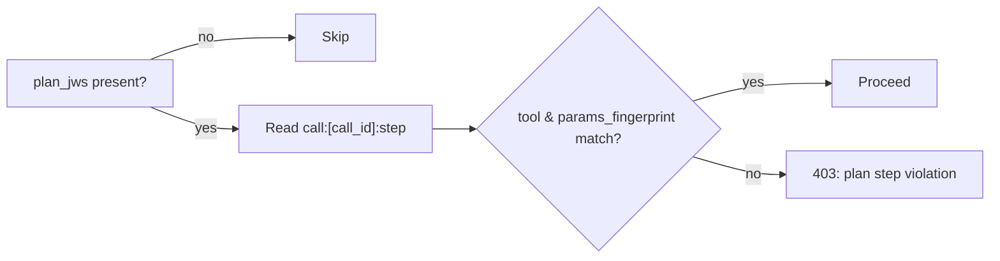

### 4) PDP decision
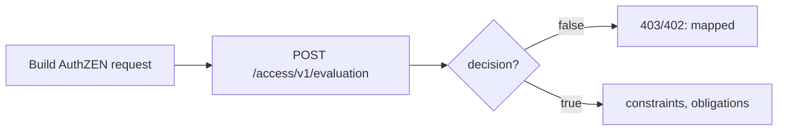

### 5) PEP enforcement (preconditions, egress, params)
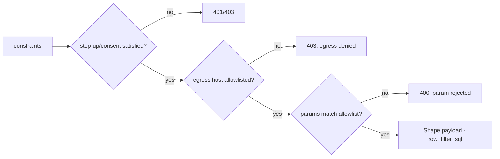

### 6) Tool call & response
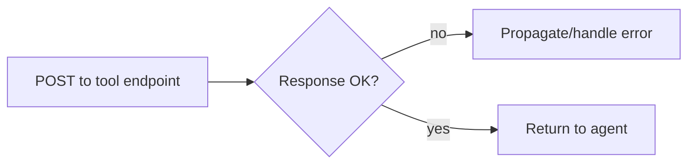

### 7) Receipt emission & chain


### 8) Analytics ingest (async)
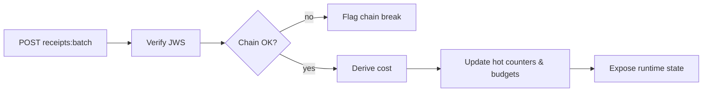

---

## 5) Receipts and Analytics (ground truth)

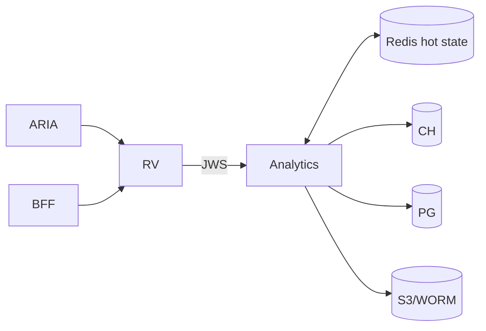

- Verify JWS, check chain continuity per agent
- Derive spend (usage.cost_usd → token pricing → tool cost-per-call)
- Runtime APIs: batch ingest, budgets state (daily/monthly), hot counters

Key metrics to display:
- aria_analytics_receipts_total{outcome}, aria_analytics_chain_breaks_total
- mcp_receipt_emit_ms, llm_budget_denied_total{reason}
- daily_spend_usd per tenant (runtime/hot)

---

## 6) PDP-led budgets (AI spend governance)

Visual: PDP evaluates `constraints.spend_budget` against Analytics hot state; PEPs pass `tenant_id` + `estimated_cents`.

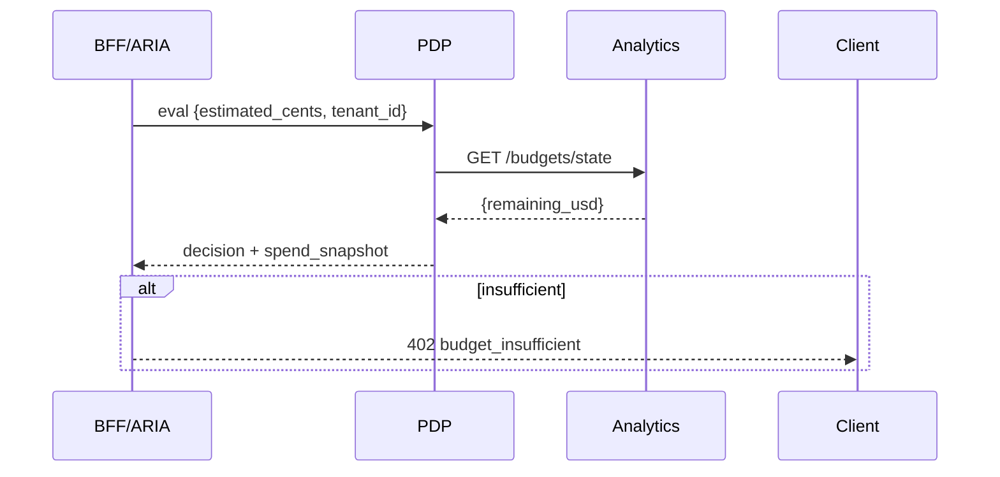

Multi-pool extension (provider/model/category)
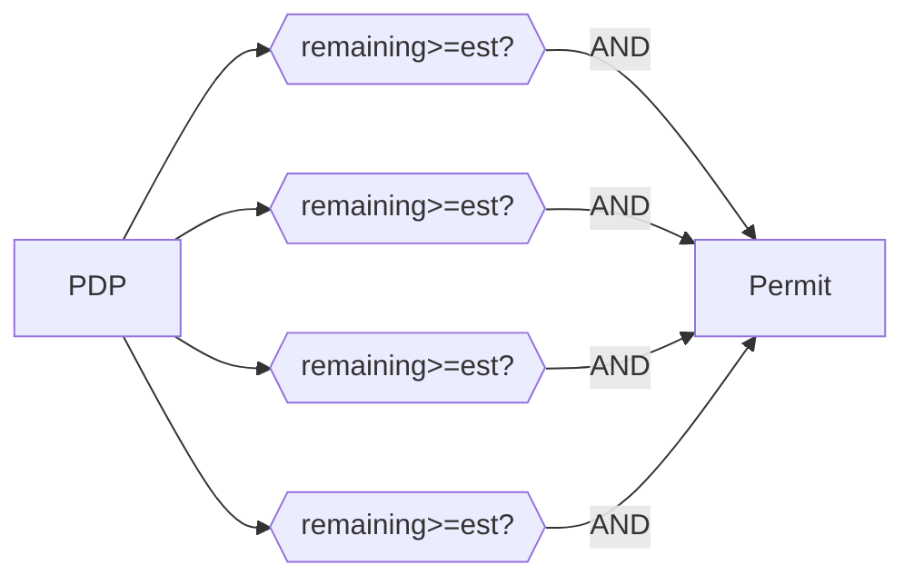

### Pre-gate vs settle (PEP interplay)
- PDP pre-gate: allow/deny based on live remaining + estimate → consistent policy errors (402)
- PEP hold: reserve maximum affordable spend up-front; stream-time enforcement
- Settle: reconcile on provider usage; refund delta; emit final receipt with usage

---

## 7) Pre-issuance consent at IdP (obligation)

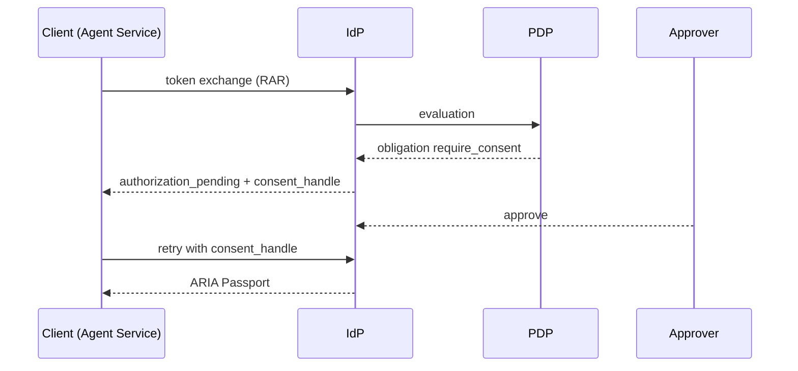

State machine
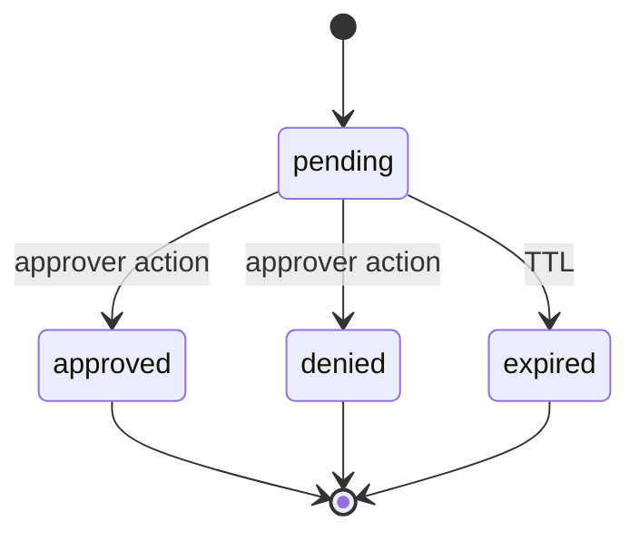

---

## 8) Membership PIP → PDP constraints

- Capabilities: gating tool execution by user+agent
- Data scope: tenant_ids + row_filter_sql → injected server-side
- Step-up hints: MFA requirements
- Identity chaining eligibility: allowed audiences/scopes

Flow
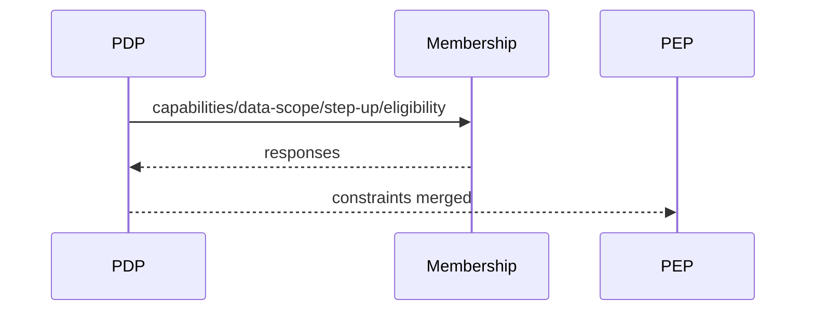

### Identity & IGA specifics
- Pairwise binding: `sub` and `act.sub` are per-audience; prevents cross-RP correlation
- Consent: ephemeral Redis record (TTL), device-flow-like pending, single-use handle
- Trust: JWKS for IdP and Receipt Vault; verifiers fetch and cache keys
- Delegations: Membership graph is the source of truth; PDP consumes via PIP

#### Pairwise binding — in practice (simple)
- What it is: The IdP issues privacy-preserving identifiers per audience ("sector"). The same human has different `sub` values at different relying parties.
- How it’s bound: The agent identity `act.sub` encodes the same pairwise suffix as the user `sub`. Gateways verify:
  - `aria.bound_sub == sub`
  - `act.sub == agent:{service}:for:<pairwise_suffix(sub)>`
- Why it matters: Limits replay/linkability across services, and scopes blast radius if a token leaks.
- Example (JWT excerpt):
```json
{
  "sub": "pairwise:9a7b1c2d3e4f5a6b",
  "aud": "aria.gateway",
  "act": {"sub": "agent:svc-123:for:9a7b1c2d3e4f5a6b"},
  "aria": {"bound_sub": "pairwise:9a7b1c2d3e4f5a6b"}
}
```
- Ops note: For cross-system correlation, use `agent_id` and `call_id` (not raw `sub`). Receipts always include these.

---

## 9) Identity chaining (optional v1.1)

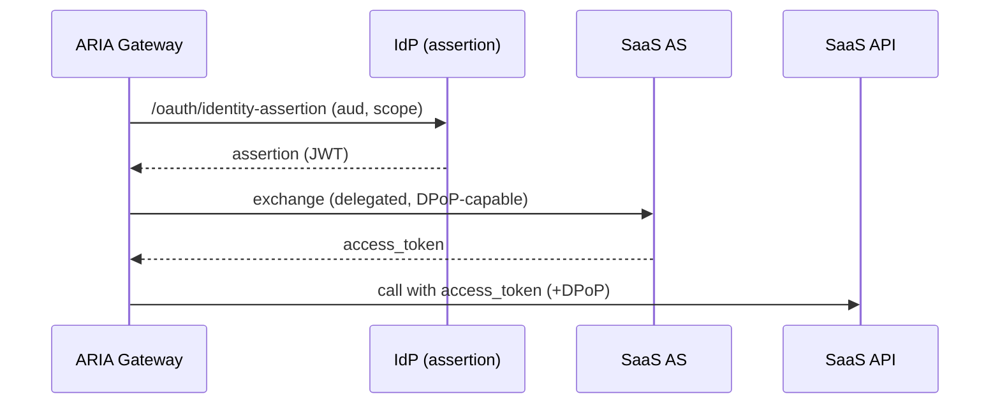

Receipt addition: `identity_chain` snapshot {provider, audience, scopes, token_hash}.

Mode comparison
- Delegated: PoP continuity, ARIA controls token exchange and RS PoP; recommended
- Brokered: simpler wiring; PoP continuity limited; acceptable where RS doesn’t require PoP

#### Identity chaining — in practice
- What it is: A short‑lived Identity Assertion (JWT) issued by the IdP for a specific downstream audience (e.g., Microsoft Graph). The gateway exchanges it for an access token.
- Policy gates: PDP must allow the requested audience/scope (`constraints.identity_chain.allowed_audiences/scopes`), with a max TTL.
- Two modes:
  - Delegated: Gateway requests assertion and performs the token exchange itself (keeps PoP continuity for RS calls).
  - Brokered: IdP performs exchange and returns the downstream token (simpler; weaker PoP continuity).
- Security properties: Short TTL, audience-bound, optionally DPoP; receipts include an `identity_chain` snapshot (audience, scopes, provider, token hash).
- Assertion example (JWT, excerpt):
```json
{
  "iss": "https://idp.example.com",
  "sub": "pairwise:acme-graph:9a7b…",  
  "aud": "https://graph.microsoft.com",
  "act": {"sub": "agent:svc-123:for:9a7b…"},
  "scp": ["User.Read"],
  "exp": 1735686300
}
```

---

## 10) Shipped vs Deferred; Ops

### Shipped
- IdP token exchange (passports, pins, plan JWS)
- ARIA Gateway PEP; BFF stream-time enforcement
- PDP constraints/obligations; Membership PIP
- Receipt Vault; Analytics (receipt-centric ingest); PDP-led budgets

### Deferred/Flags
- PoP default at PEP, SPIFFE/mTLS to tools, transaction tokens
- Signed registry attestations; deny receipts; rate limiting; redirect policy hardening; leak guard

### Observability
- Metrics: ARIA/BFF/PDP/Analytics; receipts chain heads in Redis

Impact KPIs (track on rollout):
- Deny accuracy (policy vs runtime settle)
- Mean receipt signing latency; chain continuity %
- Budget overrun incidents (target 0 in enforce mode)

### Roadmap timeline (flags)
- Now: ARIA v1 core, receipts-first Analytics, PDP budgets (enforce), consent for select tools
- Next: identity chaining (delegated) for one tool, deny receipts everywhere, rate limits
- Later: PoP default at PEP, SPIFFE/mTLS to tools, transaction tokens, signed registry attestations

## 11) Ops readiness & SLOs
- SLOs: PDP p95 ≤ 1.5s; receipt sign p95 ≤ 60ms; Analytics GET ≤ 250ms; ARIA tool egress p95 ≤ provider budget
- Alerts: chain_breaks_total > 0; spike in budget_denied_total; PDP latency p95 > SLO; registry/vault errors_total
- Runbooks: links to troubleshooting receipts, budget pools, and schema pin mismatches (add in docs site)

## 12) QA/test plan (risk-mapped)
- Receipt chain continuity → tamper-evident lineage
- Spend derivation (tokens → pricing) and tool CPC → accurate spend
- Budget deny vs remaining → governance correctness (map to 402)
- Consent state machine (pending→approved/denied/expired) → issuance safety
- Identity chaining delegated flow → PoP continuity

## Glossary (quick)
- PEP/PDP: Policy Enforcement/Decision Point
- RAR: Rich Authorization Requests (authorization_details)
- DPoP: Demonstration of Proof-of-Possession (`cnf.jkt`)
- Plan JWS: signed step contract (tool, params_fingerprint, max_cost)
- Schema pins: tool schema version/hash pins with rollout window
- Pairwise: per-audience subject identifiers for privacy

---

## Appendix — Speaker notes (quick hitters)
- Lead with receipts as immutable ground truth
- Map PDP constraints to concrete enforcement in ARIA/BFF
- Safety-first defaults: schema pins, allowlists, egress, budgets
- Flags provide reversible rollout for advanced crypto features

Repo map (where things live)
- `idp/` — token exchange, DPoP, plan signing
- `pdp/` — evaluation, constraints merge, membership PIP
- `aria/` — PEP, registry/vault clients, plan/budget/receipt utils
- `bff/` — stream-time enforcement, provider client
- `tool_registry/`, `receipt_vault/`, `analytics/` — pins, receipts, spend

Rollout plan (phased)
1) Core ARIA v1 (passports, PEPs, receipts) in dev; validate receipts chain
2) Enable PDP-led budgets (advisory → enforce)
3) Turn on consent obligations for selected high-risk tools
4) Add identity chaining for 1 tool (delegated)

Acceptance tests (prove today)
- Receipt chain continuity; spend derivation; budget deny; tool CPC


