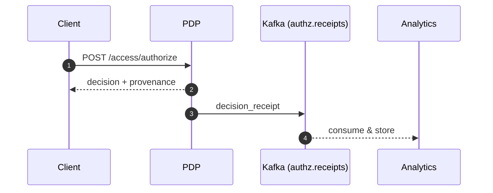
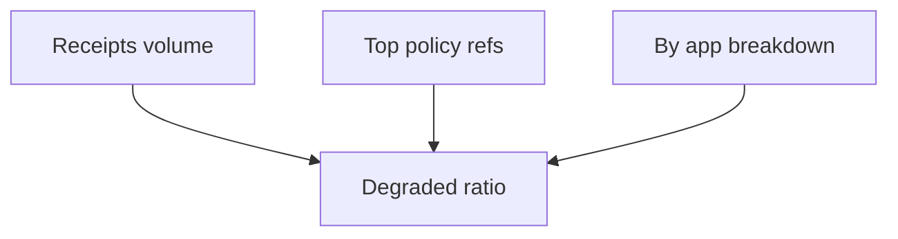

# Governance & Auditability (ReBAC v1)

Guidance to operationalize decision provenance for audits, compliance, and incident response.

## Receipt Flow



Receipt includes:
- `decision_id` (UUID)
- `eps_etag` or `graph_snapshot_id`
- `policy_refs[]` (when available)
- `degraded` flag
- `correlation_id`

## Audit Workflows

### A) Routine Audit
1. Query analytics by time range and `correlation_id`
2. Filter on `degraded=true` or specific `policy_refs`
3. Export subset for review

### B) Incident Triage
1. Reproduce decision in Decision Lab (copy request)
2. Cross‑check receipt’s `eps_etag`/`graph_snapshot_id` with PIP/PDP logs
3. Validate CDC lag; inspect policy changes around the time window
4. Attach receipt JSON to the ticket

## Retention & Storage
- Receipts are small JSON events; store in scalable analytics DB (e.g., ClickHouse) or object storage
- Suggested retention: 90 days for routine ops, 1 year for regulated domains (adjust per policy)
- Index by `decision_id`, `correlation_id`, `subject_id`, `app_id`, and time

## Data Model (Example)
```sql
CREATE TABLE decisions_receipts (
  ts DateTime,
  decision_id String,
  correlation_id String,
  subject_id String,
  app_id String,
  eps_etag String NULL,
  graph_snapshot_id String NULL,
  degraded Bool,
  policy_refs Array(String)
) ENGINE = MergeTree() ORDER BY (ts, app_id, subject_id);
```

## Configuration
| Setting | Default | Meaning |
|---------|---------|---------|
| ENABLE_KAFKA_PRODUCER | false | Enable receipt emission |
| KAFKA_TOPIC_PREFIX | authz | Namespace for topics |
| Analytics consumer topics | `authz.receipts` | Subscribe in analytics service |

## Controls & Integrity
- Boundary enforcement prevents cross‑app bleed in receipts
- EPS integrity via SHA256; optional JWS for multi‑hop trust
- CDC lag alerting to reduce stale grant windows

## Dashboards
- Receipts volume over time
- `degraded=true` rate
- Top `policy_refs` by frequency
- App breakdown of decisions and degraded ratio



## SOP: Missing Receipts
1. Verify `ENABLE_KAFKA_PRODUCER=true`
2. Validate `KAFKA_BOOTSTRAP_SERVERS` connectivity
3. Confirm topic exists (`authz.receipts`) via Kafdrop
4. Check PDP logs for `decision_receipt`
5. Inspect Analytics consumer health

## SOP: High Degraded Rate
1. Correlate with CDC lag and membership/PIP availability
2. Inspect Redis health and hit ratios
3. Validate hard‑evict usage for revocations
4. Consider lowering staleness budgets temporarily

## References
- `docs/security/security_integrity_guide.md`
- `docs/deployment/rebac_deployment_configuration.md`
- `docs/operations/runbook.md`

