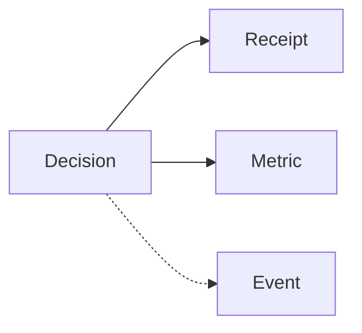

# Kafka & Eventing Reference (ReBAC v1)

This document describes PDP’s Kafka topics, event shapes, sequencing, and configuration.

## Topics
- `${KAFKA_TOPIC_PREFIX}.decisions` (default: `authz.decisions`)
- `${KAFKA_TOPIC_PREFIX}.metrics` (default: `authz.metrics`)
- `${KAFKA_TOPIC_PREFIX}.events` (default: `authz.events`)
- `${KAFKA_TOPIC_PREFIX}.receipts` (default: `authz.receipts`)

Ensure topics exist (compose `kafka-setup` creates defaults).

## Sequencing & Keys
- Partition key defaults:
  - Decisions: `${subject_id}:${resource_id}:${action}`
  - Metrics: metric type
  - Events: correlation_id
  - Receipts: correlation_id
- Ordering is guaranteed per partition (per key). Use the same key to correlate.



## Event Shapes

### authorization_decision (decisions)
```json
{
  "event_id": "uuid",
  "event_type": "authorization_decision",
  "timestamp": "RFC3339Z",
  "correlation_id": "uuid",
  "service": "pdp",
  "data": {
    "decision": true,
    "reason": "...",
    "subject_id": "user:123",
    "subject_type": "user",
    "resource_id": "doc:456",
    "resource_type": "document",
    "action": "read",
    "evaluation_time_ms": 10.5,
    "decision_factors": [ {"factor": "..."} ],
    "policies": [ {"policy_id": "...", "effect": "permit"} ]
  },
  "metadata": {"learning_mode": false}
}
```

### authorization_metric (metrics)
```json
{
  "event_id": "uuid",
  "event_type": "authorization_metric",
  "timestamp": "RFC3339Z",
  "correlation_id": "uuid",
  "service": "pdp",
  "data": {
    "metric_type": "authorization_performance",
    "timestamp": "RFC3339Z",
    "values": {"evaluation_time_ms": 10.5}
  }
}
```

### decision_receipt (receipts)
```json
{
  "event_id": "uuid",
  "event_type": "decision_receipt",
  "timestamp": "RFC3339Z",
  "correlation_id": "uuid",
  "service": "pdp",
  "data": {
    "decision_id": "uuid",
    "eps_etag": "W/\"...\"",
    "graph_snapshot_id": null,
    "policy_refs": ["policy:...@rev"],
    "degraded": false
  }
}
```

## Configuration
| Setting | Default | Meaning |
|---------|---------|---------|
| ENABLE_KAFKA_PRODUCER | false | Enable producer |
| KAFKA_BOOTSTRAP_SERVERS | (unset) | Broker list |
| KAFKA_CLIENT_ID | pdp-authz-producer | Client id |
| KAFKA_TOPIC_PREFIX | authz | Namespace |
| KAFKA_LINGER_MS | 10 | Producer linger |
| KAFKA_BATCH_SIZE | 16384 | Batch size |
| KAFKA_COMPRESSION_TYPE | gzip | Compression |

## Validation Tips
- Use Kafdrop to browse topics and validate message shape
- Correlate `correlation_id` across decisions, receipts, and logs
- Verify producer errors in PDP logs if messages are missing

## Consumers
- Analytics service: subscribe to decisions and receipts
- Security monitoring: subscribe to events/decisions as needed

## Error Handling
- Producer retry is handled at client level; errors are logged with `REQUEST_ERROR`
- Use dead‑letter topics in downstream consumers if required
