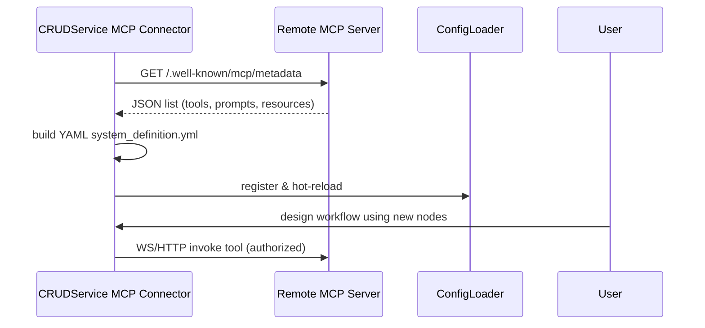
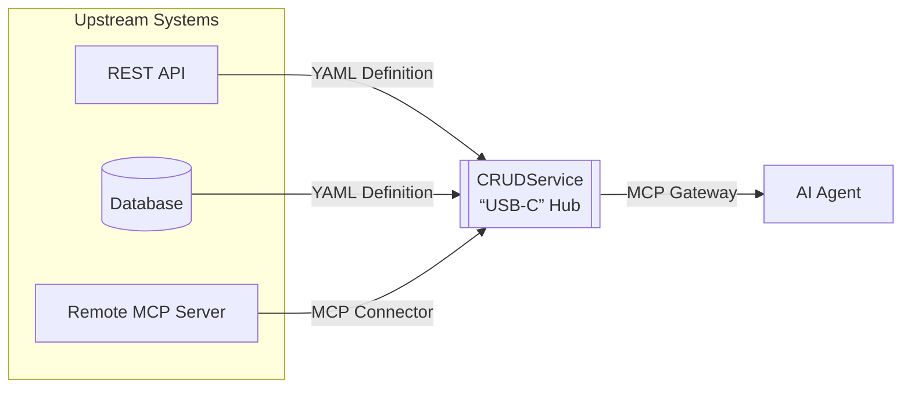

# Model Context Protocol (MCP) Integration – Technical & Patentability Brief

This brief describes CRUDService’s **MCP integration layer** which simultaneously provides:
1. An **MCP Connector (client)** that discovers any remote MCP‑compliant server, harvests its declared *tools / prompts / resources*, and auto‑generates CRUDService **System Definition YAML** + Graph‑workflow nodes – *without writing code*.
2. An **MCP Gateway (server)** exposing *all* CRUDService system definitions, commands and workflows as MCP‑compatible tools, enabling secure, policy‑controlled API access for external AI agents.

---

## 1 High‑Level Capability

• **Bidirectional operability** – the same engine can *consume* and *serve* MCP endpoints.  
• **Zero‑code connector generation** – remote capabilities are reverse‑engineered into YAML files then routed through existing `CommandExecutor` / `WorkflowExecutor` pipelines.  
• **User‑bound AI security** – leverages OBO delegation, PDP authorization, and Membership service to bind agents to human users.  
• **Dynamic discovery** – CRUDService server publishes a `.well‑known/mcp/metadata` endpoint with OpenAPI‑style schema; clients poll and hot‑reload changes.  
• **Unified observability** – OpenTelemetry spans and CAEP/Kafka events for every request & token lifecycle.
• **Virtual views** – expose filtered, read‑only views of the tool catalog on distinct paths (e.g., `/mcp/entra/tools/list`, `/mcp/workflows/jsonrpc`) with pagination and health tools always included.

---

## 2 Key Modules & Flow

| Module | Role |
|--------|------|
| `src/mcp/client/mcp_connector.py` | WebSocket/HTTP client that discovers remote metadata, negotiates schemas, and translates calls into CRUDService commands. |
| `src/mcp/server/gateway.py` | FastAPI/WS gateway offering MCP endpoints; pipes incoming operations into `CommandExecutor`/`WorkflowExecutor`. |
| `AuthService` | Validates bearer/DPoP tokens, extracts user‑bound agent claims, supports OBO flows. |
| `PDPServiceClient` | Attribute‑based authorization for each MCP operation using AuthZen PDP. |
| `MembershipServiceClient` | Verifies user↔agent relationships & fetches capabilities. |
| `TemplateRenderer` & `SchemaMapper` | Re‑used to synthesise YAML definitions from discovered tools. |
| `TokenBroker`, `VerificationSvc` | Redis‑based cache + invalidation listener for continuous token verification. |

---

### 2.1 Client‑Side Sequence – Auto‑generate Connector



### 2.2 Server‑Side Architecture (from final gateway)

```mermaid
flowchart TD
    subgraph LLM["LLM Agents"]
        Agent1[AI Agent]
    end
    subgraph Gateway["CRUDService MCP Gateway"]
        Auth[Auth Service]
        AuthZ[Authorization]
        Router[MCP Router]
        WSManager[Session Manager]
        TokenBroker
        VerificationSvc
    end
    subgraph CRUD["CRUDService Core"]
        CmdExec[CommandExecutor]
        WFExec[WorkflowExecutor]
        YAMLs[System Definitions]
    end
    Agent1 -- Token --> Gateway
    Gateway --> Auth
    Gateway --> AuthZ
    Router --> CmdExec
    CmdExec --> WFExec
    WFExec --> YAMLs
    Gateway -->|Expose tools| Agent1

### Virtual Views – Selection Layer
Views are configured in `mcp_virtual_servers.yaml` (or derived when missing) and constrain discovery/invocation to a filtered subset by `provider`, `instance`, `tags`, or `source`. JSON‑RPC requests to `/mcp/{view}/jsonrpc` only execute tools within that view.
```

### 2.3 USB‑C Analogy – CRUDService as Universal Hub

Think of MCP as **“USB‑C for AI.”** Just like a modern laptop exposes a single port that adapts to monitors, storage or power, CRUDService presents one interface (MCP) that:
1. **Accepts** any upstream capability – raw REST endpoints, databases, or another MCP server – by converting them into internal YAML definitions.
2. **Provides** the exact same universal interface outward so downstream AI agents can plug‑in and use those capabilities securely.



CRUDService is thus a **bidirectional adapter**: whatever plugs in on the left becomes instantly available on the right – with authorization, observability and workflow orchestration layered in automatically.

---

## 3 Problem Statement

AI tools are fragmented: each vendor surfaces bespoke JSON schemas and security models.  Integrating them requires custom code for discovery, auth, and request translation.  Conversely, exposing internal workflows to AI agents safely demands heavy gateway engineering.

---

## 4 Inventive Concept

We introduce a **dual‑mode MCP layer** that:
1. Automatically **discovers** remote MCP metadata and **materialises** it into YAML System Definitions + workflow nodes, reusing CRUDService’s existing low‑code pipeline.
2. **Publishes** every local command/workflow as an MCP tool with no additional coding – merely ticking `expose_mcp: true` in YAML.
3. Enforces **user‑bound agent OBO flows**, combining IdP token validation, Membership lookup, and PDP authorization in a single gateway span.
4. Uses **deterministic naming and per‑instance identity** (`mcpInstance`) to avoid collisions across providers/tenants; optional Router surface exposes short names with strict `oneOf` input schemas.

---

## 5 Draft Claimable Features

1. A connector that ingests MCP metadata and programmatically generates executable, type‑checked system definition files for an integration engine.
2. The system of claim 1 wherein discovered tools are directly invokable as workflow nodes without manual code deployment.
3. A gateway that surfaces existing low‑/no‑code system definitions and workflows as MCP‑compatible tools in real time.
4. The method of any preceding claim wherein every MCP request is authorised using a chain of token validation, user‑bound agent verification, and external PDP policy evaluation.
5. The system of claim 3 wherein AI agents interact exclusively via WebSocket or HTTP while tokens are continuously re‑validated and revoked through an event‑driven verification service.

---

## 6 Core Algorithms (Simplified)

### 6.1 Metadata Harvest → YAML
```python
meta = httpx.get(f"{url}/.well-known/mcp/metadata").json()
for tool in meta["tools"]:
    yml = _tool_to_yaml(tool)
    write_yaml(f"systems/{tool['name']}.yml", yml)
```

### 6.2 On‑Behalf‑Of Token Validation
```python
ok,payload,_ = AuthService.validate_token(token)
if payload and payload.act:
    info = AuthService.extract_user_bound_agent_info(payload)
    allowed = MembershipService.verify_user_bound_agent(info)
```

### 6.3 Gateway Authorization Step
```python
allowed, reason = PDPService.authorize(
    user_id=payload.sub,
    agent_id=info.agent_id,
    action=request.operation,
    resource_type="system",
    resource_id=request.operation,
)
```

---

## 7 Alternative Embodiments

* **Edge MCP Proxy** – WASM filter at CDN edge embedding the same dual‑mode logic.  
* **Auto‑schema GraphQL** – convert MCP metadata into GraphQL SDL rather than YAML.  
* **Offline sync** – periodic crawler producing YAMLs without live gateway calls.

---

## 8 Advantages Over Prior Art

* Removes hand‑coded connectors – discovery → YAML in minutes.  
* Unified security – OIDC + PDP + user‑bound agent controls in one flow.  
* Dynamically exposes workflows as AI‑consumable tools, reducing integration friction.  
* Event‑driven revocation ensures least‑privilege, realtime threat response.

---

*Prepared for legal & technical review – now*
