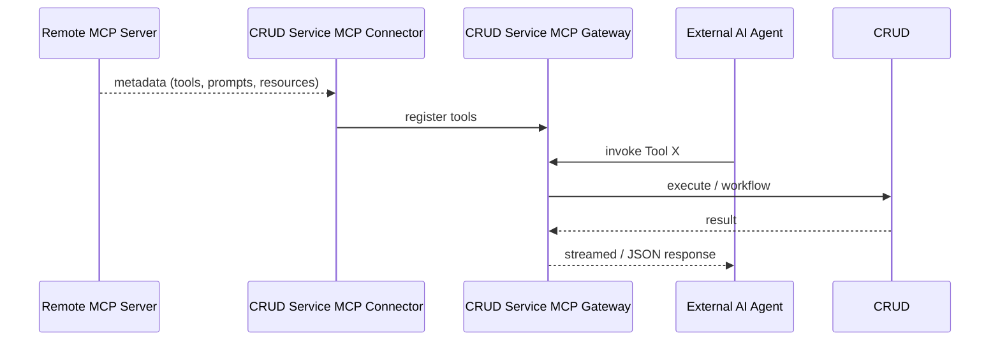

# CRUD Service × MCP – External Overview

This short brief explains *what* the Model-Context-Protocol (MCP) integration delivers, not the low-level implementation.  Use it to understand the value-prop and deployment shape when you consume CRUD Service as a platform or plug your own MCP-compatible services into it.

---

## 1  Why MCP?

MCP is an open JSON-over-HTTP protocol that lets AI agents discover, describe and invoke tools in a structured way.  By supporting MCP, CRUD Service becomes a "universal hub":

* **Publish** – every command and workflow you already model in CRUD Service instantly shows up as an MCP tool.
* **Consume** – CRUD Service can ingest any remote MCP server and treat its tools as if they were local connectors.

The result is a single, policy-controlled interface for cross-system automation – no custom SDKs or bespoke adapters.

---

## 2  What You Get Today

1. **MCP Gateway**  
   • Exposes CRUD Service commands & workflows as tools via HTTP or Server-Sent Events (streaming).  
   • Includes simple `GET /health`, `/tools`, `/discovery` endpoints for monitoring and service discovery.  
   • Supports "virtual views" – filtered catalogs on distinct paths: `GET /mcp/{view}/tools/list`, `POST /mcp/{view}/jsonrpc`.

2. **Deterministic naming & identity**  
   • Default namespaced strategy `provider.instance.base` prevents collisions across providers/tenants.  
   • Per-instance context via `mcpInstance` in system YAML (provider, instance, instance_label, env).  
   • Optional Router surface (short names with `oneOf`) can be enabled separately for UX demos.

3. **Unified Authorization & Observability**  
   • Every MCP call flows through CRUD Service's existing token validation, PDP authorization and OpenTelemetry tracing layers.

---

## 3  High-Level Interaction

*All traffic can run over plain HTTP 1.1 or HTTP/2; no WebSockets required.*

### Virtual views in practice
- Define views in `ServiceConfigs/CRUDService/config/mcp_virtual_servers.yaml` (override via `MCP_VIRTUAL_SERVERS_FILE`).
- Views filter the catalog by provider, instance, tags, source, etc. Health tools are always included.
- If the file is missing, defaults include a `workflows` view and provider-based views derived from configured systems.

---

## 4  Security At A Glance

• Accepts any OIDC-issued bearer or DPoP token.  
• External PDP strategies (AuthZen, EmpowerID, OPA…) can allow/deny each tool call.  
• Optional user-bound-agent checks prevent "runaway" AI agents.

---

## 5  Deployment Notes

• Gateway & Connector can be shipped together (same pod) or split for scale.  
• Both are stateless; horizontal scaling works out-of-the-box.  
• Connector supports a **Cron-pull** mode (periodic discovery) or **watch** mode (long-poll-plus-ETag) for near real-time sync.

---

For deeper API or schema questions please contact the CRUD Service engineering team.

