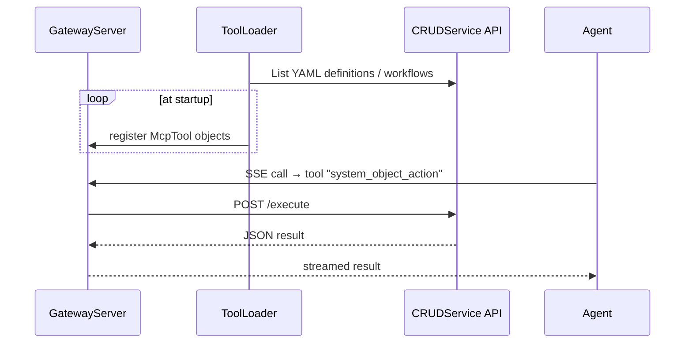

# MCP Integration – Engineering Overview

> This doc explains how CRUDService discovers external Model-Context-Protocol (MCP) services **and** publishes its own commands/workflows as MCP tools.  It lists what's available today and what's coming next.

---

## 1  Why MCP?

The goal is to make CRUDService act like a "USB-C hub for AI" – any upstream capability you plug in (REST API, DB, another MCP server) becomes a first-class tool; everything CRUDService already knows becomes accessible to downstream AI agents through the same protocol.

---

## 2  Key Components

| Feature | How it works | File(s) |
|---------|--------------|---------|
| **Gateway Server** – exposes CRUDService as MCP | `src/api/mcp_loopback_routes.py` (HTTP/JSON-RPC) tool list/invoke; per‑view endpoints under `/mcp/{view}`; SSE bridged via BFF. | this repo |
| **Tool Generator** – turns internal YAML/workflow defs into MCP tools | `src/mcp/loopback/generator.py`; namespaced naming, `mcpInstance`, schema derivation, resources. | this repo |
| **CRUDService Client** | Helper used by every generated tool to call `POST /execute` or `POST /workflow/start` on the core API. | `src/mcp/common/crud_client.py` |
| **Launcher** | `python -m src.mcp.main --all` spins up Gateway + (optional) user/group micro-services. | `src/mcp/main.py` |

The integration consists of two runtimes that can be deployed together or separately:

* **Loopback MCP** – FastAPI routes in CRUDService that publish every command and workflow as MCP-compatible tools via HTTP JSON-RPC. Public endpoints include:
  * `GET /mcp/tools/list` – aggregated tool list (JSON)
  * `GET /mcp/{view}/tools/list` – filtered discovery within a virtual view
  * `POST /mcp/jsonrpc` – JSON-RPC (initialize, tools/list, tools/invoke|tools/call)
  * `POST /mcp/{view}/jsonrpc` – JSON-RPC constrained to a virtual view

* **MCP Connector** – a client-side component that discovers remote MCP servers using `/.well-known/mcp/metadata`, converts each advertised tool/prompts/resources into internal YAML definitions, and hot-registers them so workflows can call them like any other system.  The connector can run as a side-car or Cron job.

Supporting sub-modules:
* **Tool Loader** – introspects internal YAML definitions and registers them with the Gateway at startup.
* **CRUDService Client** – thin wrapper that each generated tool uses to hit CRUDService's `/execute` or `/workflow/start` endpoints.

Startup helper: `python -m crudservice.mcp --all` (flags: `--gateway`, `--connector`, `--user`, `--group`).

---

## 3  High-level Flow

### 3.1  Exposing internal tools



### 3.2  Consuming remote tools

With the Connector running, the sequence is:

1. It fetches `https://remote-host/.well-known/mcp/metadata` (JSON schema of tools/prompts/resources).
2. Each tool description is converted into either
   * an in-memory `McpTool` object (immediate usage), or
   * a persisted YAML System Definition for long-term tracking (optional feature flag `persist_yaml`).
3. The resulting tools are hot-registered with the Gateway, so they appear instantly in `/tools` and can be invoked from workflows or external agents.

Remote systems therefore become first-class citizens inside the same auth, logging, and workflow pipeline.

---

## 4  Roadmap / In-Flight Work

4.1  Security & Auth
* Integrate core `AuthorizationService` so every MCP call is PDP-checked.
* Add OIDC bearer / DPoP token validation (user-bound agent).

4.2  Discovery Endpoint
* Implement `GET /.well-known/mcp/metadata` that emits OpenAPI-style JSON for external clients.

4.3  Persistent YAML Export
* Extend `ToolLoader` with a `write_yaml()` helper so discovered remote tools become version-controlled system files.

---

## 5  Running Everything Locally

```bash
# Run Gateway + sample user & group services
python -m src.mcp.main --all --debug

# Gateway only
python -m src.mcp.main --gateway --debug
```

Gateway logs will show lines like:
```
[gateway_server] Registered proxy tool: ldap_user_create from user_management
```

---

_Last updated: now_