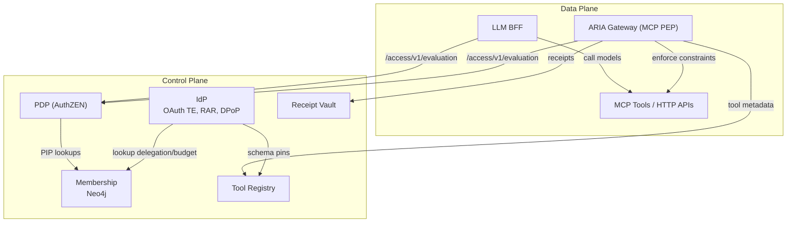
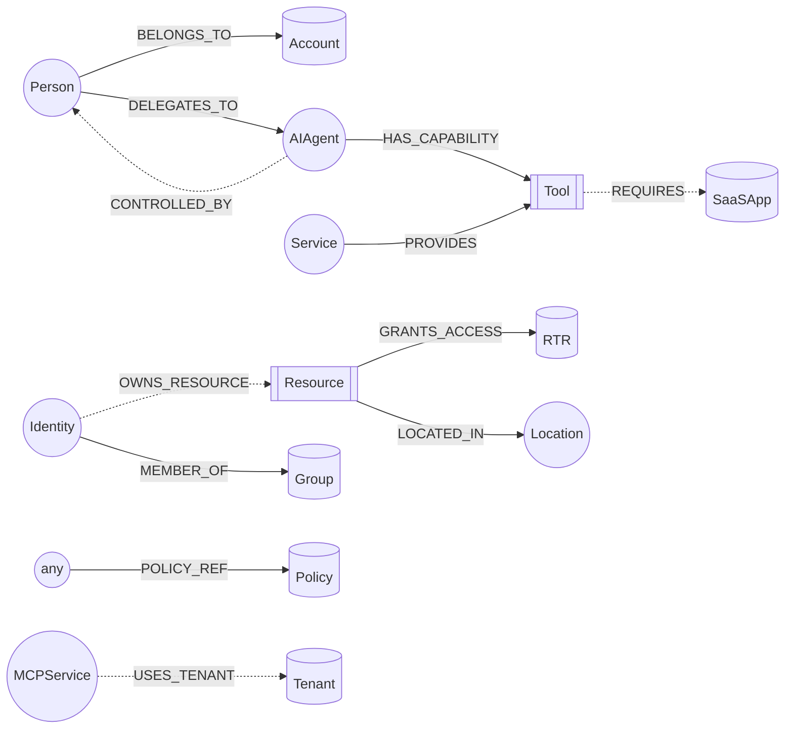
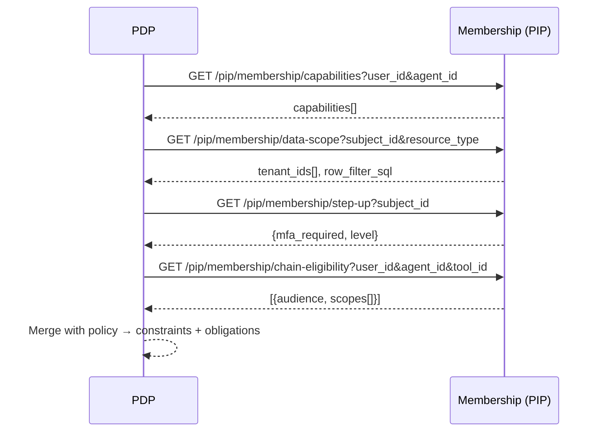
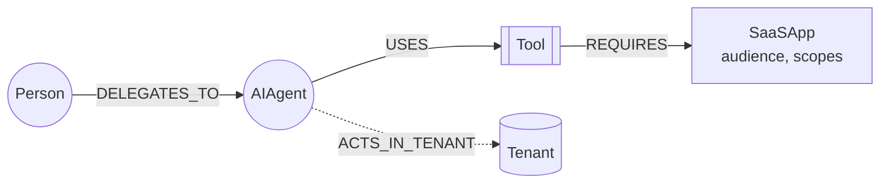

# Membership Service — Graph Schema, PIP Surface, and Gap Analysis

> **What this is:** The **authoritative relationship layer** for EmpowerNow’s Identity Fabric. It stores who can act for whom (and under what boundaries) and exposes a **policy‑information point (PIP)** surface the PDP uses to compute constraints.
> **What it is not:** Not a policy engine, not a tool catalog, not a token service. Policy remains in PDP/AuthZEN; tool metadata lives in the **Tool Registry**; tokens are minted by the **IdP**.

This edition tightens the overview, adds **Mermaid** visuals, and aligns terminology with the ARIA v1 architecture you finalized. It preserves your existing endpoints while clarifying responsibilities and closing gaps called out in prior reviews.

---

## 0) Where Membership fits (system overview)



**Why this separation exists:** Membership is the **graph of relationships** (delegations, groupings, ownership, location, etc.). PDP merges Membership facts with authored policy and request context to return **constraints + obligations**. This mirrors the **ABAC–ReBAC split** and **unified identity model** described in your June white paper (see the “ABAC‑ReBAC Hybrid Architecture” and “Unified Identity Model” sections and diagram), which our v1 implements directly.&#x20;

---

## 1) Graph model (labels, properties, and edges)

### 1.1 Node labels (current)

* **Identity** *(abstract)*

  * Concrete subtypes: **Person**, **Account**, **AIAgent**, **Service**, **MCPService** (`Identity:Service:MCPService`)
* **Group**, **ManagementRole**, **BusinessRole**
* **BusinessRoleLocation (BRL)**
* **Location**
* **Resource**
* **RTR** *(entitlements/permissions bundle)*
* **Tool**
* **Policy**

> **Proposed v1.1 additions** (for identity chaining & data scope):
> **Tenant**, **SaaSApp** — used to compute data scopes and chain‑eligibility (see §4.3).

**Key properties (suggested minimums)**

* `Identity`: `id`, `kind` (person|service|agent|account), `display_name`, `state`
* `AIAgent`: `id`, `owner_id` *(ref)*, `trust_score?`, `version?`
* `Service|MCPService`: `id`, `service_type`, `display_name`
* `Tool`: `id`, `name`, `version`, `service_id`
* `Resource`: `id`, `type`, `owner_id?`, `sensitivity?`
* `Policy`: `id`, `rev`, `uri`
* `Tenant`: `id`, `name`
* `SaaSApp`: `id`, `audience`, `scopes[]`

### 1.2 Relationship types (current)

* `(:Person|:Identity:Person) -[:BELONGS_TO]-> (:Account)`
* `(:Identity|:BRL|:Account) -[:MEMBER_OF {assignment_type,id,ts...}]-> (:Group|:ManagementRole|:BRL)`
* `(:Identity:Person) -[:DELEGATES_TO {id,status,capabilities[],constraints?,...}]-> (:Identity:AIAgent)`
* `(:Resource) -[:GRANTS_ACCESS]-> (:RTR)` *(read by queries)*
* `(:Identity|:Role) -[:HAS_RTR]-> (:RTR)` and scoped `-[:HAS_RTR_AT]-> (:Location)`
* `(:Resource) -[:LOCATED_IN]-> (:Location)`
* `(any) -[:POLICY_REF {rev?}]-> (:Policy)` *(normalized)*
* `(:Identity:Service) -[:PROVIDES]-> (:Tool)`
* `(:AIAgent) -[:HAS_CAPABILITY]-> (:Tool)`

> **Recommended additions**
> `(:AIAgent) -[:CONTROLLED_BY]-> (:Person|:Service)`
> `(:Identity|:Group) -[:OWNS_RESOURCE {role: 'primary'|'deputy'}]-> (:Resource)`
> `(:MCPService) -[:USES_TENANT]-> (:Tenant)`
> `(:Tool) -[:REQUIRES]-> (:SaaSApp {scopes: [...]})`

### 1.3 Visual schema (high level)



### 1.4 Constraints & indexes (Neo4j DDL)

```cypher
CREATE CONSTRAINT unique_identity_id IF NOT EXISTS
FOR (n:Identity) REQUIRE n.id IS UNIQUE;

CREATE CONSTRAINT unique_delegation_id IF NOT EXISTS
FOR ()-[d:DELEGATES_TO]-() REQUIRE d.id IS UNIQUE;

CREATE CONSTRAINT tool_id_unique IF NOT EXISTS
FOR (t:Tool) REQUIRE t.id IS UNIQUE;

CREATE INDEX tool_service_idx IF NOT EXISTS
FOR (t:Tool) ON (t.service_id, t.version, t.name);

CREATE CONSTRAINT mcp_service_id_unique IF NOT EXISTS
FOR (s:MCPService) REQUIRE s.id IS UNIQUE;

CREATE CONSTRAINT tenant_id_unique IF NOT EXISTS
FOR (t:Tenant) REQUIRE t.id IS UNIQUE;

CREATE CONSTRAINT saasapp_id_unique IF NOT EXISTS
FOR (a:SaaSApp) REQUIRE a.id IS UNIQUE;
```

---

## 2) Business logic (what the service does)

* **Assignments:** single/bulk create, update, delete with source/target validation.
* **Delegations:** create/update DELEGATES\_TO edges with `status`, `capabilities[]`, and optional constraint pointers.
* **Policy pointers:** attach/detach `POLICY_REF` with safe `rev` handling.
* **RBAC utilities:** read `HAS_RTR`, `HAS_RTR_AT` and `GRANTS_ACCESS` via Resource/Location scopes.
* **Search & reports:** full‑text identity search, counts, orphan detection, path probes.
* **Agent & MCP catalog:** register MCP services + tools; list capabilities by agent/service.

> This implements the **graph‑native relationship layer** your white paper calls for, keeping policy logic outside the database for speed and auditability.&#x20;

---

## 3) HTTP surface (selected)

### 3.1 CRUD & discovery

* **Identities**
  `POST /api/v1/identities`, `POST /api/v1/persons`, `POST /api/v1/ai-agents`
  `GET /api/v1/identities`, `GET /api/v1/identities/{id}`, `DELETE /api/v1/identities/{id}`
  `GET /api/v1/identities/fulltext-search?q=...`

* **Locations**
  `GET /api/v1/locations`, `GET /api/v1/locations/{id}`
  `POST /api/v1/locations`
  `POST /api/v1/locations/orphaned/fix`, `GET /api/v1/locations/orphaned`
  `DELETE /api/v1/locations/{id}`

* **Roles & Membership**
  `POST /api/v1/assignments`, `PUT /api/v1/assignments`, `POST /api/v1/assignments/bulk`
  `DELETE /api/v1/management_roles/{id}`
  Role listings (direct/all)

* **BRL & Groups**
  `POST /api/v1/brl`, `PUT /api/v1/brl/{id}`, `DELETE /api/v1/brl/{id}`
  `GET /api/v1/groups/top-by-membership`

* **Policies**
  `GET /api/v1/policies`, `GET /api/v1/policies/{id}`
  `POST /api/v1/policies`, `DELETE /api/v1/policies/{id}`
  `POST /api/v1/assign/policy`, `DELETE /api/v1/assign/policy`
  `DELETE /api/v1/policies/{id}/with-relationships`

* **Reports**
  `GET /api/v1/reports/top-identities-by-accounts?limit=15`
  `GET /api/v1/reports/access-outliers?limit=25`

* **Agent & MCP**
  Agent: list/create service principals, delegations, trust score, capabilities
  MCP: register MCP services/tools; list tools by service

* **Admin / Utilities**
  Health check, label/rel counts, shortest paths, related nodes, cleanup

### 3.2 PIP surface for PDP (stable v1)

* `GET /api/v1/pip/membership/capabilities?user_id=&agent_id=`
  → `{"capabilities": ["mcp:flights:search","mcp:flights:book"]}`

* `GET /api/v1/pip/membership/delegations?user_id=&agent_id=&status=active`
  → `[{"delegation_id":"...","status":"active","max_steps":20,"budget_usd":100.0,"expires_at":"..."}]`

* `GET /api/v1/pip/membership/data-scope?subject_id=&resource_type=`
  → `{"tenant_ids":["acme"],"row_filter_sql":"tenant_id IN ('acme')","column_mask":{}}`

* `GET /api/v1/pip/membership/step-up?subject_id=`
  → `{"mfa_required":false,"level":"strong"}`

* `GET /api/v1/pip/membership/chain-eligibility?user_id=&agent_id=&tool_id=`
  → `[{"audience":"okta:app:crm","scopes":["contacts.read","contacts.write"]}]`

**Call flow (PDP ↔ Membership):**



---

## 4) Fit vs. gaps (what’s done, what’s left)

### 4.1 Strong fit (already in place)

* **Identity unification:** `Account` promoted to `Identity`; consistent use in assignments and queries.
* **Delegations:** `DELEGATES_TO` with `id/status/capabilities/constraints` and PIP endpoints exist.
* **RBAC patterns:** `HAS_RTR` / `GRANTS_ACCESS` with `Location` scoping appear in operational queries.
* **Agent capabilities:** `Tool` nodes, `PROVIDES`, and `HAS_CAPABILITY` are modeled; `MCPService` exists.
* **Policy pointers:** `POLICY_REF` normalized; attach/detach avoids null revisions.

These align directly with **ARIA’s unified identity model** and the **constraints vs. obligations split** your white paper advocates.&#x20;

### 4.2 Known gaps (actionable)

1. **CONTROLLED\_BY edge (Agent → Person/Service)**
   *Status:* Partial via ownership fields; not consistently created or queried.
   *Action:* Add CRUD; enforce 1..N ownership; expose in PIP as `agent_controller_ids`.

2. **Resource ownership (`OWNS_RESOURCE`)**
   *Status:* Queries only.
   *Action:* First‑class endpoints for assigning primary/deputy owners; surface in PIP for governance.

3. **RTR authoring**
   *Status:* Reader‑heavy; minimal write APIs.
   *Action:* Add POST/DELETE for `HAS_RTR` and `HAS_RTR_AT` with validation hooks.

4. **Tenant / SaaSApp graph for identity chaining**
   *Status:* PIP returns safe defaults.
   *Action:* Introduce `Tenant` + `SaaSApp` nodes and edges:
   `(:Tool)-[:REQUIRES]->(:SaaSApp {scopes})` and `(:MCPService)-[:USES_TENANT]->(:Tenant)`;
   augment `/pip/membership/data-scope` and `/chain-eligibility`.

5. **Caching hints for PDP**
   *Status:* Not standardized.
   *Action:* Add `ETag` and `Cache-Control: max-age=TTL` headers on PIP responses; include `decision_hints.ttl_ms` in JSON if helpful.

### 4.3 Identity‑chaining graph pattern (for OAuth chaining add‑on)



PIP computes chain‑eligibility by walking `Agent → Tool → SaaSApp` and returning `{audience, scopes[]}`; PDP converts that into `constraints.identity_chain.*` (used later by IdP/Gateway feature‑flagged chaining). This directly supports the “identity chaining” backlog in ARIA v1.&#x20;

---

## 5) Operational notes (dev‑to‑dev)

* **Fail‑closed defaults:** Missing delegation, unknown tool, or empty tenant set → deny / `row_filter_sql: "1=0"`.
* **Indices first:** Apply the DDL in §1.4 before bulk loads.
* **Write hygiene:** Prefer `MERGE` with **idempotent** `id` on edges (`DELEGATES_TO.id`), and set `status` with valid enum (`active|paused|revoked|expired`).
* **Observability:** Count edges by type/label; export “top degree nodes” to detect accidental fan‑outs.
* **Safety:** Never store raw secrets on nodes/edges; `POLICY_REF.uri` should point to a policy store (Git/HTTP) rather than embed policy bodies.

---

## 6) PIP reference queries (Cypher snippets)

> These show the **intent**; your production code likely wraps them.

**Capabilities**

```cypher
MATCH (u:Identity {id:$user_id})-[:DELEGATES_TO {status:'active'}]->(:AIAgent {id:$agent_id})-[:HAS_CAPABILITY]->(t:Tool)
RETURN collect(DISTINCT t.id) AS capabilities
```

**Data scope**

```cypher
// Tenants directly and via projects/programs (extend as needed)
MATCH (u:Identity {id:$subject_id})-[:BELONGS_TO]->(a:Account)-[:MEMBER_OF*0..2]->(ten:Tenant)
WITH collect(DISTINCT ten.id) AS tids
RETURN {tenant_ids: [x IN tids WHERE x IS NOT NULL],
        row_filter_sql: CASE WHEN size(tids)>0
            THEN 'tenant_id IN (''' + apoc.text.join(tids, ''',''') + ''')'
            ELSE '1=0' END,
        column_mask: {}} AS scope
```

**Chain eligibility**

```cypher
MATCH (u:Identity {id:$user_id})-[:DELEGATES_TO {status:'active'}]->(:AIAgent {id:$agent_id})-[:HAS_CAPABILITY]->(tool:Tool {id:$tool_id})
MATCH (tool)-[:REQUIRES]->(app:SaaSApp)
RETURN collect({audience: app.audience, scopes: app.scopes}) AS elig
```

---

## 7) Endpoint catalogue (concise)

* **General:** identities, locations, roles/membership, BRL, groups, policies, reports, MCP/Agent, admin utilities — **unchanged** routes as in your current service.
* **PIP:** capabilities, delegations, data‑scope, step‑up, chain‑eligibility — **stable** and used by PDP today.

> These PIP calls power PDP’s constraint construction and match the “fast graph + flexible policy” architecture outlined in the white paper (graph lookups for relationships; policy engine for constraint logic).&#x20;

---

## 8) Gap remediation plan (small PRs; high impact)

1. **CONTROLLED_BY**: Implemented — PUT/GET/DELETE under `/api/v1/agent/agents/{agent_id}/*`.
2. **OWNERSHIP**: Implemented — POST/GET/DELETE under `/api/v1/resources/{resource_id}/owners`.
3. **RTR authoring**: Implemented — POST `/api/v1/rtrs/assign`, `/api/v1/rtrs/assign-at`.
4. **Identity chaining graph**: Tenant/SaaSApp materialization next (PIP works with metadata today).
5. **Performance hints**: PIP caching TTLs present; HTTP cache headers optional next.

---

## 9) Appendix—Health & diagnostics (handy endpoints)

* `GET /api/v1/health`
* `GET /api/v1/node-label-counts`, `/relationship-type-counts`, `/orphan-node-counts`
* `GET /api/v1/relationship-connections?start_id=&type=`
* `GET /api/v1/related-nodes?id=&hops=..`
* `GET /api/v1/shortest-path?from=&to=`

---

### One‑page takeaway

* **Membership** = **ground truth of relationships**.
* **PDP** pulls from Membership to compute **constraints** (tokens, egress, params, data scope) and **obligations**, per ARIA v1.
* **Tool Registry** remains separate (schema pins, endpoints).
* Add **CONTROLLED\_BY**, **OWNERSHIP**, and **Tenant/SaaSApp** now to unlock identity chaining and richer scopes—fully consistent with your June vision and the final ARIA v1 shape.&#x20;

---
