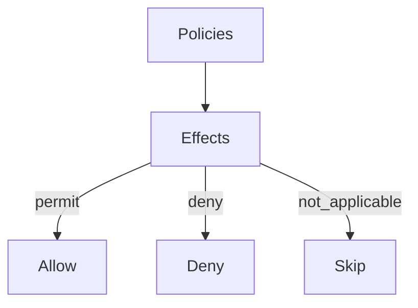

# Policy Authoring Cookbook

Copy‑paste examples for common authorization scenarios. Use with the Policy Authoring Guide.

## Index
1. Owner‑based read
2. Editor role write
3. Admin deny all
4. Deny suspended users
5. Time‑window access
6. Country allowlist
7. Resource label guard
8. Budget constraints (LLM)
9. Required MFA for admins off‑network
10. Document type matrix
11. Hierarchical resource rule
12. App‑scoped baseline
13. Global baseline (minimal)
14. Domain shared overrides
15. Cross‑environment policy
16. Delegation allow
17. Deny on confidential payroll



---

## 1) Owner‑based read
```yaml
id: owner-read
name: Owner can read document
schema_version: "2.0"
type: policy
rules:
  - resource: "document"
    action: "read"
    effect: PERMIT
    allowIf: "resource.owner == subject.id"
```

## 2) Editor role write
```yaml
id: editor-write
name: Editors can write
schema_version: "2.0"
type: policy
rules:
  - resource: "document"
    action: "write"
    effect: PERMIT
    allowIf: "'editor' in subject.roles"
```

## 3) Admin deny all
```yaml
id: admin-deny
name: Admin path deny example
schema_version: "2.0"
type: policy
rules:
  - resource: "*"
    action: "*"
    effect: DENY
    allowIf: "subject.is_admin == true && context.risk_score > 90"
```

## 4) Deny suspended users
```yaml
id: deny-suspended
name: Deny access for suspended users
schema_version: "2.0"
type: policy
rules:
  - resource: "*"
    action: "*"
    effect: DENY
    allowIf: "subject.status == 'suspended'"
```

## 5) Time‑window access
```yaml
id: business-hours
name: Permit during business hours
schema_version: "2.0"
type: policy
rules:
  - resource: "*"
    action: "read"
    effect: PERMIT
    allowIf: "context.timestamp.hour >= 8 && context.timestamp.hour < 18"
```

## 6) Country allowlist
```yaml
id: country-allowlist
name: Allow from approved countries
schema_version: "2.0"
type: policy
rules:
  - resource: "*"
    action: "*"
    effect: PERMIT
    allowIf: "context.country in ['US','BE','DE']"
```

## 7) Resource label guard
```yaml
id: label-guard
name: Deny on confidential payroll
schema_version: "2.0"
type: policy
rules:
  - resource: "document"
    action: "read"
    effect: DENY
    allowIf: "'payroll' in resource.labels && 'confidential' in resource.labels && !('payroll' in subject.teams)"
```

## 8) Budget constraints (LLM)
```yaml
id: llm-budget
name: LLM daily budget per user
schema_version: "2.0"
type: policy
rules:
  - resource: "llm"
    action: "invoke"
    effect: PERMIT
    obligations:
      - id: spend_user_daily
        attrs:
          scope: user
          period: daily
          limit_usd: 5.0
```

## 9) Required MFA for admins off‑network
```yaml
id: admin-off-net-mfa
name: Admin off-network requires MFA
schema_version: "2.0"
type: policy
rules:
  - resource: "admin_api"
    action: "*"
    effect: PERMIT
    allowIf: "subject.is_admin == true && (context.network == 'corp' || context.mfa == true)"
```

## 10) Document type matrix
```yaml
id: doc-matrix
name: Type-based actions
schema_version: "2.0"
type: policy
rules:
  - resource: "document:public"
    action: "read"
    effect: PERMIT
  - resource: "document:internal"
    action: "read"
    effect: PERMIT
    allowIf: "'employee' in subject.roles"
  - resource: "document:restricted"
    action: "read"
    effect: DENY
```

## 11) Hierarchical resource rule
```yaml
id: folder-inherit
name: Permit based on folder membership
schema_version: "2.0"
type: policy
rules:
  - resource: "document"
    action: "read"
    effect: PERMIT
    allowIf: "resource.folder_id in subject.permitted_folders"
```

## 12) App‑scoped baseline
```yaml
id: app-baseline
name: App baseline
schema_version: "2.0"
type: policy
rules:
  - resource: "*"
    action: "*"
    effect: PERMIT
```

Place this under `policies/applications/<app_id>/` for proper precedence.

## 13) Global baseline (minimal)
```yaml
id: global-baseline
name: Global minimal baseline
schema_version: "2.0"
type: policy
rules:
  - resource: "*"
    action: "read"
    effect: NOT_APPLICABLE
```

## 14) Domain shared overrides
```yaml
id: domain-shared-override
name: Domain shared guardrails
schema_version: "2.0"
type: policy
rules:
  - resource: "document"
    action: "delete"
    effect: DENY
```

## 15) Cross‑environment policy
```yaml
id: cross-env
name: Cross environment policy
schema_version: "2.0"
type: policy
rules:
  - resource: "*"
    action: "*"
    effect: NOT_APPLICABLE
```

## 16) Delegation allow
```yaml
id: delegation-allow
name: Allow act-on-behalf-of
schema_version: "2.0"
type: policy
rules:
  - resource: "identity"
    action: "act_on_behalf_of"
    effect: PERMIT
    allowIf: "context.delegation.verified == true && context.delegation.binding_valid == true"
```

## 17) Deny on confidential payroll
```yaml
id: payroll-deny
name: Deny payroll access for non-payroll
schema_version: "2.0"
type: policy
rules:
  - resource: "document:payroll"
    action: "read"
    effect: DENY
    allowIf: "!('payroll' in subject.teams)"
```

---

## Notes
- Quote condition strings and literals inside conditions.
- Keep effects uppercase in YAML (normalized later for UI).
- Organize by application/domain/global for correct precedence.
- Constraints/obligations surface in `context.constraints[]` in PDP responses.
