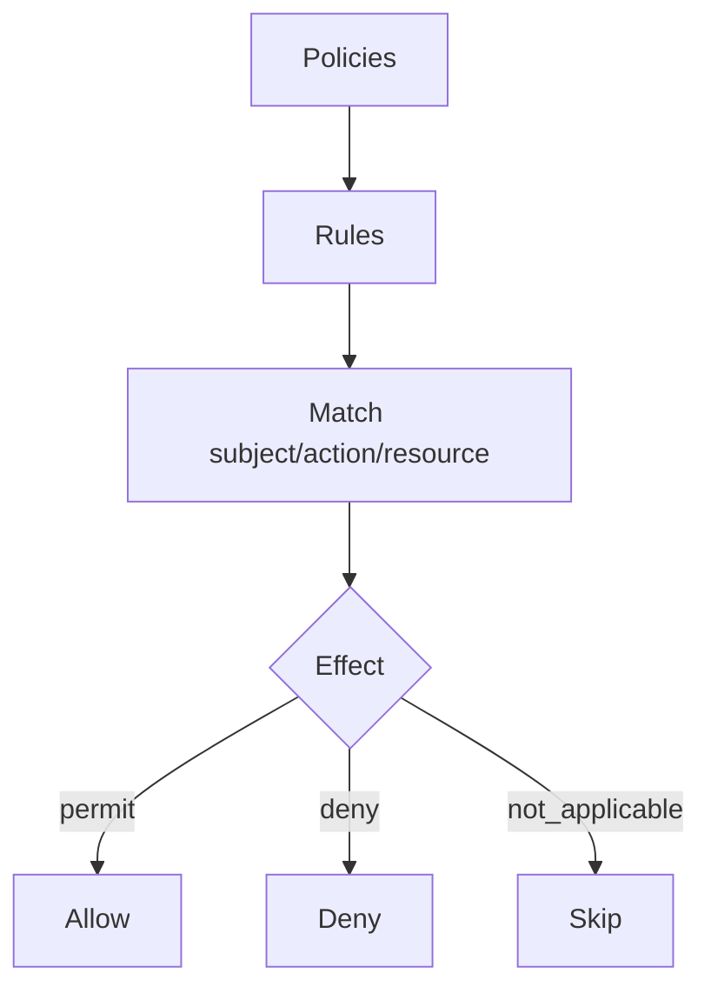
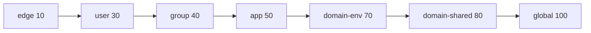
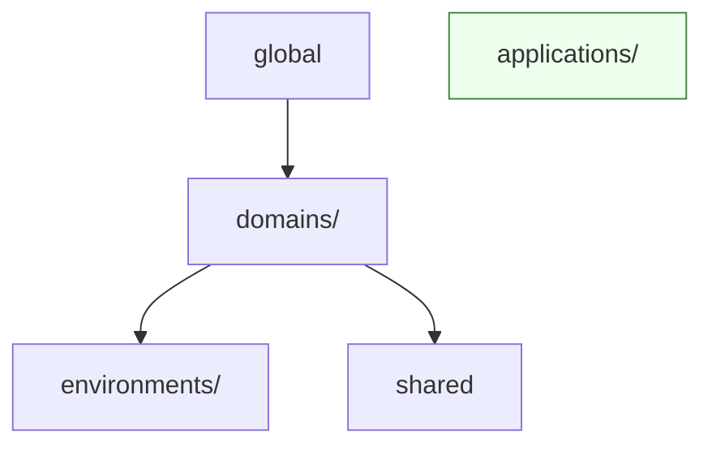

# Policy Authoring Guide (ReBAC v1)

This guide teaches policy authors how to write YAML policies, apply precedence and deny‑overrides correctly, and enforce application boundaries. It also includes copy‑paste examples and validation tips.

## Mental Model



- Policies contain rules. Rules evaluate to an effect.
- Within the same precedence level, deny wins (deny‑overrides).
- Across levels, lower precedence score wins (edge < user < group < app < domain < global).

## YAML Schema Basics

Minimal policy:
```yaml
id: example-permit
name: Permit example
schema_version: "2.0"
type: policy
rules:
  - resource: "form"
    action: "read"
    effect: PERMIT
```

Valid effects: `PERMIT`, `DENY`, `NOT_APPLICABLE`, `INDETERMINATE` (internal normalization to lowercase occurs in UI views).

Conditions:
```yaml
rules:
  - resource: "document"
    action: "read"
    effect: PERMIT
    allowIf: "subject.id == 'alice' && resource.owner == 'alice'"
```

## Precedence & Deny‑Overrides

Precedence ranking (lower wins):
- edge‑local(10) < user(30) < group/org(40) < application(50) < domain‑env(70) < domain‑shared(80) < global(100)



Authoring tips:
- Model explicit DENY at the same level when needed (deny‑overrides)
- Prefer narrower scopes at lower precedence levels
- Keep global policies minimal, favor app/domain ownership

## Application Boundary Enforcement

Each rule should carry `meta.application_id` implicitly via EPS build; PDP enforces only rules with `application_id ∈ {request_app, global}`.

Author rule intent:
```yaml
rules:
  - resource: "form"
    action: "read"
    effect: PERMIT
    # meta.application_id will be set during EPS build; author within app dir
```

## Constraints & Obligations

Policies can attach constraints/obligations that appear in the decision response:
```yaml
rules:
  - resource: "llm"
    action: "invoke"
    effect: PERMIT
    obligations:
      - id: spend_user_daily
        attrs:
          scope: user
          period: daily
          limit_usd: 5.0
```

These will surface in `context.constraints[]` as normalized structures.

## Real‑World Examples

### 1) Owner‑based read
```yaml
id: owner-read
name: Owner can read document
schema_version: "2.0"
type: policy
rules:
  - resource: "document"
    action: "read"
    effect: PERMIT
    allowIf: "resource.owner == subject.id"
```

### 2) Admin deny overwrite at same level
```yaml
id: deny-suspended
name: Deny access for suspended users
schema_version: "2.0"
type: policy
rules:
  - resource: "*"
    action: "*"
    effect: DENY
    allowIf: "subject.status == 'suspended'"
```

### 3) App‑scoped rule with constraints
```yaml
id: app-budget
name: App budget per user daily
schema_version: "2.0"
type: policy
rules:
  - resource: "llm"
    action: "invoke"
    effect: PERMIT
    obligations:
      - id: spend_user_daily
        attrs:
          scope: user
          period: daily
          limit_usd: 5.0
```

## Directory Structure (Application‑Scoped)

Place policies in `$SERVICE_CONFIG_DIR/policies/applications/<app_id>/...` to ensure correct precedence and boundary handling.



## Validation & Linting Tips
- Keep `schema_version` as a quoted string
- Use uppercase for effects in YAML
- Quote condition strings (`allowIf`) and string literals inside
- Avoid mixing tabs/spaces

## Debugging Authoring Issues
- Enable DEBUG logs; verify which policies/rules matched
- Use Decision Lab to test requests and see provenance/constraints
- Inspect receipts in `authz.receipts` for policy_refs[] when available

## Config Notes for Authors
- You usually don’t set `application_id` directly; it’s derived by EPS build based on file location and registry
- Coordinate with admins for per‑app mode (EPS vs Graph‑Eval) if your app relies on graph attributes

See also:
- `docs/integration-guides/policy-language.md` for DSL details
- `docs/deployment/rebac_deployment_configuration.md` for environment flags
