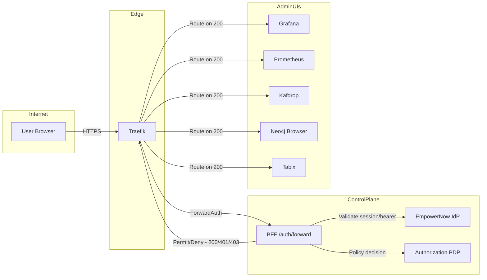
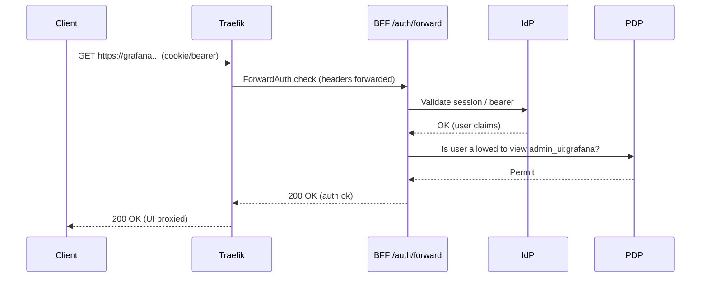

### Protecting 3rd Party Web Apps Using ARIA Shield
A complete, copy-pasteable guide to protect any internal web UI behind EmpowerNow authentication and PDP authorization using Traefik + BFF ForwardAuth, with example configs and diagrams.

### What you’ll build
- Traefik sits in front of UIs and delegates auth decisions to the BFF via ForwardAuth.
- The BFF validates EmpowerNow IdP sessions/tokens and calls the PDP for fine-grained authorization.
- Optional IP allowlists add an extra perimeter.



### Prerequisites
- Traefik is configured with the docker and file providers.
- The BFF exposes `GET/POST /auth/forward` to validate sessions/bearers and perform PDP checks.
- Your admin UIs are routed by Traefik (labels or file routers).

#### Confirmed in your repo
- Traefik file provider and network:
```41:49:CRUDService/traefik/traefik.yml
providers:
  docker:
    endpoint: "unix:///var/run/docker.sock"
    exposedByDefault: false
    network: empowernow_app-network
  file:
    filename: /etc/traefik/dynamic.yml
    watch: true
```
- ForwardAuth middleware wired to BFF:
```7:21:CRUDService/traefik/dynamic.yml
middlewares:
  bff-forwardauth:
    forwardAuth:
      address: "http://bff_app:8000/auth/forward"
      trustForwardHeader: true
      authResponseHeaders:
        - "Authorization"
        - "X-User-ID"
        - "X-Session-ID"
        - "X-Auth-Time"
        - "X-User-Email"
        - "X-User-Name"
      authRequestHeaders:
        - "Cookie"
        - "Authorization"
```

### Step 1 — Attach ForwardAuth to a UI
Add these Traefik labels to the UI’s service. Replace host and service port as needed.

```yaml
labels:
  - "traefik.enable=true"
  - "traefik.http.routers.<ui>.rule=Host(`<your-ui-host>`)"
  - "traefik.http.routers.<ui>.entrypoints=websecure"
  - "traefik.http.routers.<ui>.tls=true"
  - "traefik.http.routers.<ui>.tls.certresolver=letsencrypt"
  - "traefik.http.services.<ui>.loadbalancer.server.port=<ui-container-port>"

  # Optional: IP perimeter
  - "traefik.http.middlewares.<ui>-allowlist.ipallowlist.sourcerange=10.0.0.0/8,192.168.0.0/16,172.16.0.0/12"

  # Order: allowlist first (fast fail), then ForwardAuth, then headers/rate-limit
  - "traefik.http.routers.<ui>.middlewares=<ui>-allowlist,bff-forwardauth@file,security-headers@file,rate-limit@file"
```

Concrete examples in your compose:
- Prometheus labels (now protected):
```1058:1065:CRUDService/docker-compose-authzen4.yml
labels:
  - "traefik.enable=true"
  - "traefik.http.routers.prometheus.rule=Host(`prometheus.ocg.labs.empowernow.ai`)"
  - "traefik.http.routers.prometheus.entrypoints=websecure"
  - "traefik.http.routers.prometheus.tls=true"
  - "traefik.http.routers.prometheus.tls.certresolver=letsencrypt"
  - "traefik.http.services.prometheus.loadbalancer.server.port=9090"
```
…and the middlewares you added:
```1060:1064:CRUDService/docker-compose-authzen4.yml
- "traefik.http.middlewares.prometheus-allowlist.ipallowlist.sourcerange=10.0.0.0/8,192.168.0.0/16,172.16.0.0/12"
- "traefik.http.routers.prometheus.middlewares=bff-forwardauth@file,prometheus-allowlist,security-headers@file,rate-limit@file"
```

Repeat for Grafana, Kafdrop, Neo4j, Tabix (already done in your compose).

### Step 2 — Ensure BFF cookie and issuer settings
In your BFF env:
- BFF_COOKIE_SECURE="true"
- BFF_COOKIE_SAMESITE=Lax (or Strict)
- BFF_COOKIE_HTTPONLY="true"
- OIDC_ISSUER points to EmpowerNow IdP discovery

You already set:
```1734:1738:CRUDService/docker-compose-authzen4.yml
BFF_COOKIE_DOMAIN: .ocg.labs.empowernow.ai
BFF_COOKIE_SECURE: "true"
BFF_COOKIE_SAMESITE: Lax
BFF_COOKIE_HTTPONLY: "true"
```

### Step 3 — PDP-enforce admin UI access inside BFF ForwardAuth
In the BFF’s `/auth/forward`, add:
- Validate user session or bearer via IdP (existing).
- Humans-only (optional): reject amr=client_credentials.
- Map host → PDP resource:
  - grafana.ocg… → admin_ui:grafana
  - prometheus.ocg… → admin_ui:prometheus
  - kafdrop.ocg… → admin_ui:kafdrop
  - neo4j.ocg… → admin_ui:neo4j
  - tabix.ocg… → admin_ui:tabix
- Require role/scope (e.g., admin.ui), then call PDP:
  - subject: current user
  - action: view
  - resource: admin_ui:<name>
- Return:
  - 200 allow → Traefik routes to UI
  - 401 unauthenticated
  - 403 authenticated but unauthorized

Example handler sketch (illustrative):
```python
from fastapi import APIRouter, Request, Response, status

router = APIRouter()

HOST_TO_RESOURCE = {
  "grafana.ocg.labs.empowernow.ai": "admin_ui:grafana",
  "prometheus.ocg.labs.empowernow.ai": "admin_ui:prometheus",
  "kafdrop.ocg.labs.empowernow.ai": "admin_ui:kafdrop",
  "neo4j.ocg.labs.empowernow.ai": "admin_ui:neo4j",
  "tabix.ocg.labs.empowernow.ai": "admin_ui:tabix",
}

@router.get("/auth/forward")
@router.post("/auth/forward")
async def forward_auth(request: Request) -> Response:
    # 1) Extract session/bearer, validate with IdP (existing BFF logic)
    user = await require_authenticated_user(request)  # raises or returns user claims

    # Optional: humans-only
    if user.get("amr") == "client_credentials":
        return Response(status_code=status.HTTP_403_FORBIDDEN)

    # 2) Map host → resource
    host = request.headers.get("X-Forwarded-Host") or request.headers.get("Host", "")
    resource = HOST_TO_RESOURCE.get(host)
    if not resource:
        return Response(status_code=status.HTTP_403_FORBIDDEN)

    # 3) Quick scope/role gate (defense-in-depth)
    scopes = set(user.get("scope", "").split())
    roles = set(user.get("roles", []))
    if "admin.ui" not in scopes and "platform-ops" not in roles:
        return Response(status_code=status.HTTP_403_FORBIDDEN)

    # 4) PDP decision
    decision = await pdp_authorize(
        subject=user["sub"],
        action="view",
        resource=resource,
        context={"host": host, "path": request.headers.get("X-Forwarded-Uri", "/")}
    )
    if decision != "Permit":
        return Response(status_code=status.HTTP_403_FORBIDDEN)

    # 5) Success → ForwardAuth 200
    return Response(status_code=status.HTTP_200_OK)
```

PDP call example (pseudo):
```python
async def pdp_authorize(subject: str, action: str, resource: str, context: dict) -> str:
    payload = {
        "subject": {"id": subject},
        "action": {"id": action},
        "resource": {"id": resource},
        "context": context,
    }
    # POST to PDP /access/evaluate or your PDP API
    # Return "Permit" | "Deny" | "NotApplicable"
```

### Step 4 — Define PDP policy
Model: resource prefix `admin_ui:*`, action `view`. Allow roles/groups or scopes.

Example (conceptual):
```yaml
# Admin UI view policy
policy:
  id: "admin-ui-view"
  description: "Permit platform operators to view internal admin UIs"
  target:
    resource.matches: "admin_ui:*"
    action.equals: "view"
  condition:
    any:
      - subject.roles.includes: "platform-ops"
      - subject.scopes.includes: "admin.ui"
  effect: Permit
```

### Step 5 — Optional perimeter hardening
- Keep IP allowlists on Traefik routers for these UIs:
  - `traefik.http.middlewares.<ui>-allowlist.ipallowlist.sourcerange=...`
  - `traefik.http.routers.<ui>.middlewares=<ui>-allowlist,bff-forwardauth@file,...`
- Keep UIs off direct host port mappings (only via Traefik).
- Ensure Forwarded headers are trusted (`trustForwardHeader: true` is set).

### Step 6 — Test matrix
- Unauthenticated:
  - curl -I with Host to UI → 401 (ForwardAuth)
- Authenticated, no scope/role:
  - login → 403 (ForwardAuth+PDP)
- Authenticated, proper scope/role but denied by PDP:
  - → 403
- Authenticated, proper scope/role and PDP Permit:
  - → 200 and UI loads
- Off-allowlist IP:
  - → 403 (Traefik ipallowlist)
- Token-only (bearer) from automation (optional policy):
  - Allow or block based on your PDP/“humans-only” rule



### Ready-to-use checklist
- Traefik dynamic has `bff-forwardauth` (already present).
- Each admin UI router has:
  - `traefik.enable=true`
  - TLS and host rule
  - Service port
  - Middlewares: `<ui>-allowlist,bff-forwardauth@file,security-headers@file,rate-limit@file`
- BFF:
  - Cookie flags set (Secure, SameSite, HttpOnly)
  - `/auth/forward` validates IdP and enforces PDP (add host→resource mapping and PDP call)
  - Optionally reject `amr=client_credentials` for humans-only UIs
- PDP:
  - Policy for `admin_ui:*` resources with action `view`

Want me to implement the BFF ForwardAuth PDP checks and host→resource mapping now, using the scope “admin.ui” and role “platform-ops” as defaults?