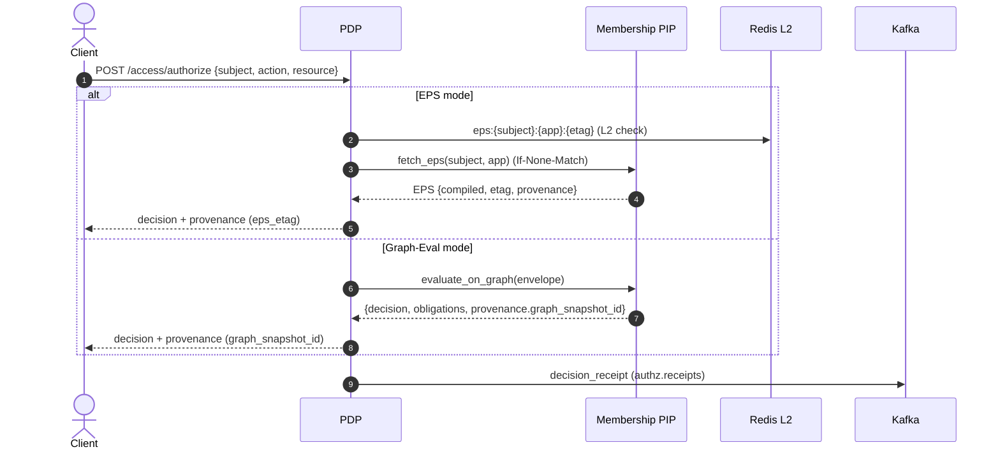
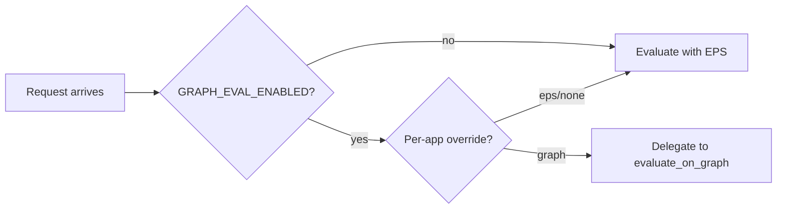

# PDP Quickstart: Local Dev, First Decision, and Receipts Verification

This guide gets you from zero to a working PDP instance, makes your first authorization decision, and verifies decision receipts via logs and Kafka. It is optimized for developers, DevOps, QA, and trainers.

## 1) Overview
- PDP supports two evaluation modes per app: EPS (default) and Graph‑Eval.
- Caching: L1 (in‑process), L2 (Redis), LKG (disk) with CDC invalidation.
- Receipts: structured logs + Kafka `authz.receipts` topic.



## 2) Prerequisites
- Docker and Docker Compose.
- Windows WSL2 or Linux/macOS recommended for local containers.
- Repo layout (compose lives in CRUDService for the whole stack):
  - `CRUDService/docker-compose-authzen4.yml` (includes `pdp`, `kafka`, `redis`, `membership`, etc.)

## 3) Start the stack
- Navigate to `CRUDService/` and bring up required services:

```bash
# from repository root or directly in CRUDService/
cd CRUDService
docker compose -f docker-compose-authzen4.yml up -d kafka kafka-setup shared_redis membership pdp kafdrop
```

Wait for `kafka` and `pdp` to be healthy. Visit Kafdrop at `http://localhost:9000/` to see topics (including `authz.decisions`, `authz.receipts`).

## 4) Key configuration (dev defaults)
The PDP service accepts flags via env vars. Common ones:

- GRAPH_EVAL_ENABLED: Enable graph‑eval pathway (`true|false`).
- EVALUATION_MODE: Default mode (`eps|graph`).
- GRAPH_EVAL_APPS: Comma list of apps that use graph‑eval (e.g., `sharepoint-prod,app-graph`).
- REDIS_URL: L2 cache (e.g., `redis://shared_redis:6379/1`).
- ENABLE_KAFKA_PRODUCER: Enable Kafka producer (`true|false`).
- KAFKA_BOOTSTRAP_SERVERS: Broker address (e.g., `kafka:9092`).
- KAFKA_TOPIC_PREFIX: Topic prefix for events (`authz`).
- PDP_L1_CACHE_ENABLED: Enable graph‑eval L1 decision cache (`true|false`).
- PDP_L1_CACHE_TTL: L1 TTL seconds (default 10).

These are already wired in `docker-compose-authzen4.yml` (service `pdp`). For per‑app override, use `evaluation_mode_per_app` in settings or `GRAPH_EVAL_APPS`.

## 5) Make your first decision (EPS path)
Example request (Postman/curl) hitting PDP:

```bash
curl -s -X POST http://localhost:8001/access/authorize \
  -H "Content-Type: application/json" \
  -d '{
    "subject": {"type": "user", "id": "test"},
    "action": {"name": "read"},
    "resource": {"type": "form", "id": "all", "properties": {"system": "FormsService"}},
    "context": {"timestamp": "2024-01-24T10:30:00Z"}
  }'
```

You should see:
- `decision: true|false`
- `context.provenance.eps_etag` (EPS) or `context.provenance.graph_snapshot_id` (Graph‑Eval)
- `context.extended.correlation_id` and `policies[]` with normalized effects
- optional `constraints[]` when policies add obligations/constraints

Response shape is documented in API Reference; typical example:

```json
{
  "decision": true,
  "context": {
    "provenance": { "eps_etag": "W/\"...\"" },
    "extended": { "correlation_id": "...", "policies": [ { "policy_id": "...", "effect": "permit" } ] }
  }
}
```

## 6) Verify decision receipts
Receipts are emitted to logs and Kafka (`authz.receipts`).

- Logs: search for `decision_receipt` in PDP logs.
- Kafka: open Kafdrop → select topic `authz.receipts` → browse latest messages.

Receipt example (fields may vary over time):

```json
{
  "event_type": "decision_receipt",
  "data": {
    "decision_id": "...",
    "eps_etag": "W/\"...\"",
    "graph_snapshot_id": null,
    "policy_refs": ["policy:sharepoint-document-access@3"],
    "degraded": false,
    "correlation_id": "..."
  }
}
```

## 7) Switching evaluation modes
- Global default: set `EVALUATION_MODE=eps|graph` and `GRAPH_EVAL_ENABLED=true` to allow graph mode.
- Per‑app override: add app to `GRAPH_EVAL_APPS` or set `evaluation_mode_per_app[app_id] = graph` in settings backend (the Admin UI exposes a selector).



## 8) Caching and resilience
- L1: in‑process caches for expressions and optional graph decisions (TTL 5–15s).
- L2 (Redis): shared EPS storage by etag; short TTLs.
- LKG: local disk store used only within staleness budgets; disabled for hard‑evicted keys.
- CDC: invalidates caches and updates a `cdc_lag_ms` gauge (alert if > 2000ms by default).

Key cache keys (simplified):
- `authz:eps:{subject_arn}:{app}:{etag}` → EPS blob
- `ge:{subject}:{res_type}:{res_id}:{action}:{app}` → graph decision (L1 only)

## 9) Observability (minimum SLOs)
- Timers compute p95/p99 (authorization request duration).
- Counters/gauges: L1/L2 hits, misses, `degraded_total`, `cdc_lag_ms`.
- Default alert: warn when `cdc_lag_ms > 2000ms`.

## 10) Real‑world examples
- Per‑app rollout: keep `EVALUATION_MODE=eps`, enable `GRAPH_EVAL_ENABLED=true`, and set `GRAPH_EVAL_APPS=app-graph` for a pilot application.
- Disable LKG for revocation: ensure CDC publishes hard‑evict; PDP will skip LKG for those keys and deny/require fresh data.
- Budget constraints: policies attach constraints; PDP surfaces them in `context.constraints[]` and in receipts.

## 11) Troubleshooting quick tips
- "Membership token flow misconfigured": ensure `MEMBERSHIP_TOKEN_URL`, `MEMBERSHIP_CLIENT_ID`, `MEMBERSHIP_CLIENT_SECRET` are set.
- No receipts in Kafka: verify `ENABLE_KAFKA_PRODUCER=true`, broker connectivity, and topic `authz.receipts` exists (`kafka-setup` creates it).
- Unexpected `degraded=true` in receipts: membership/PIP error triggered LKG; check CDC lag and upstream availability.

## 12) Next steps
- See Deployment & Configuration for full flag matrix and tuning.
- See Operations Runbook for dashboards and incident playbooks.
- See Policy Authoring Guide for YAML/DSL, precedence, and boundary enforcement.

