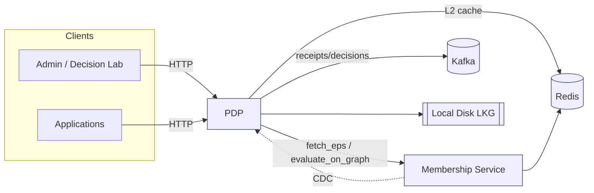
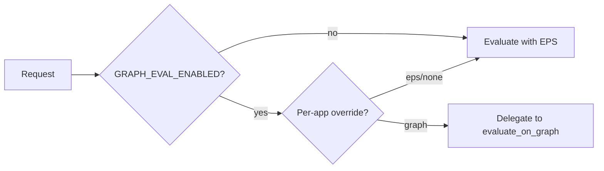

# ReBAC Deployment & Configuration Guide (PDP v1)

This guide complements the base Configuration Reference with ReBAC‑specific topology, evaluation mode settings, caching/LKG/CDC posture, Kafka receipts, and real‑world deployment examples.

## Topology



## Evaluation Modes

- EPS (default): PIP compiles an Effective Policy Set (EPS); PDP evaluates locally.
- Graph‑Eval: PDP delegates evaluation to Membership Service per request.

Environment flags:

| Variable | Values | Meaning |
|----------|--------|---------|
| GRAPH_EVAL_ENABLED | true/false | Enables graph‑eval path globally |
| EVALUATION_MODE | eps/graph | Default evaluation mode when no per‑app override |
| GRAPH_EVAL_APPS | csv list | App ids forced to graph‑eval (e.g., `app-graph,sharepoint-prod`) |



Patterns:
- Baseline: `GRAPH_EVAL_ENABLED=false` (all EPS)
- Pilot: `GRAPH_EVAL_ENABLED=true`, `EVALUATION_MODE=eps`, `GRAPH_EVAL_APPS=app-graph`
- Force graph (rare): `GRAPH_EVAL_ENABLED=true`, `EVALUATION_MODE=graph`

## Caching & LKG

- L1: in‑process caches (expressions; optional L1 for graph decisions).
- L2: Redis for EPS by ETag; short TTLs.
- LKG: disk store for EPS used within staleness budgets; disabled for hard‑evicted keys.
- CDC: updates `cdc_lag_ms` gauge and invalidates caches.

Key knobs:

| Variable | Default | Meaning |
|----------|---------|---------|
| REDIS_URL | (unset) | Enables L2 caching of EPS if set |
| PDP_L1_CACHE_ENABLED | false | Enables L1 cache for Graph‑Eval decisions |
| PDP_L1_CACHE_TTL | 10 | TTL seconds for Graph‑Eval L1 |

## Kafka: Decisions, Metrics, Receipts

When enabled, PDP publishes to topics under `${KAFKA_TOPIC_PREFIX}` (default `authz`):
- `authz.decisions`: authorization_decision events
- `authz.metrics`: authorization_metric events
- `authz.events`: generic events
- `authz.receipts`: decision_receipt events (provenance summaries)

Environment:

| Variable | Default | Meaning |
|----------|---------|---------|
| ENABLE_KAFKA_PRODUCER | false | Enable Kafka producer |
| KAFKA_BOOTSTRAP_SERVERS | (unset) | Broker list (e.g., `kafka:9092`) |
| KAFKA_CLIENT_ID | pdp-authz-producer | Producer client id |
| KAFKA_TOPIC_PREFIX | authz | Namespace prefix |
| KAFKA_LINGER_MS | 10 | Producer linger for batching |
| KAFKA_BATCH_SIZE | 16384 | Producer batch size bytes |
| KAFKA_COMPRESSION_TYPE | gzip | Producer compression |

Receipt example:

```json
{
  "event_type": "decision_receipt",
  "data": {
    "decision_id": "...",
    "eps_etag": "W/\"...\"",
    "graph_snapshot_id": null,
    "policy_refs": ["policy:sharepoint-document-access@3"],
    "degraded": false,
    "correlation_id": "..."
  }
}
```

## Real‑World Config Examples

### EPS‑Only (safe baseline)
```env
SERVICE_CONFIG_DIR=/app/config
REDIS_URL=redis://redis:6379/1
EVALUATION_MODE=eps
GRAPH_EVAL_ENABLED=false
ENABLE_KAFKA_PRODUCER=true
KAFKA_BOOTSTRAP_SERVERS=kafka:9092
KAFKA_TOPIC_PREFIX=authz
```

### Pilot One App on Graph‑Eval
```env
SERVICE_CONFIG_DIR=/app/config
REDIS_URL=redis://redis:6379/1
GRAPH_EVAL_ENABLED=true
EVALUATION_MODE=eps
GRAPH_EVAL_APPS=app-graph
ENABLE_KAFKA_PRODUCER=true
KAFKA_BOOTSTRAP_SERVERS=kafka:9092
KAFKA_TOPIC_PREFIX=authz
PDP_L1_CACHE_ENABLED=true
PDP_L1_CACHE_TTL=10
```

### Compose Snippet
```yaml
services:
  pdp:
    image: pdp:latest
    environment:
      SERVICE_CONFIG_DIR: /app/config
      REDIS_URL: redis://shared_redis:6379/1
      GRAPH_EVAL_ENABLED: "true"
      EVALUATION_MODE: eps
      GRAPH_EVAL_APPS: app-graph
      ENABLE_KAFKA_PRODUCER: "true"
      KAFKA_BOOTSTRAP_SERVERS: kafka:9092
      KAFKA_TOPIC_PREFIX: authz
    volumes:
      - ./policies:/app/config/policies
```

## Operational Notes
- CDC lag alert default threshold: 2000ms (warning). Tune based on SLOs.
- LKG is skipped when hard‑evicted for a subject/app.
- Delegation context disables LKG for decisions requiring delegation verification.
- Receipts are for ops/analytics; HTTP responses include provenance but not the full receipt.

See also:
- `docs/operations/quickstart.md` for a full end‑to‑end smoke.
- `docs/operations/AUTHZ_FLAGS_AND_CACHING.md` for deeper caching/flags details.
