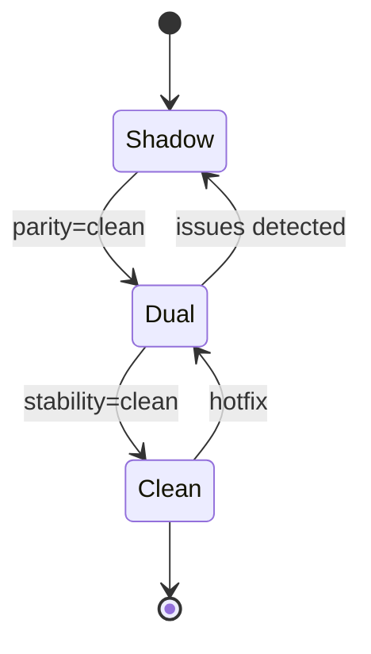

# Rollout Playbook: EPS → Graph‑Eval (Per‑App)

Phased rollout to enable Graph‑Eval per application with guardrails and rollback.

## States & Transitions

- Shadow: compute both, serve EPS; collect diffs (no user impact)
- Dual: serve selected mode; fallback flags available
- Clean: lock chosen mode; flags retained for emergency

## Entry Criteria
- Unit/integration suites green
- E2E critical flows green
- Nightly parity: zero diffs for ≥ 7 days for target app(s)
- Latency SLOs met; CDC lag within thresholds

## Shadow Phase
- Config: `GRAPH_EVAL_ENABLED=true`, `EVALUATION_MODE=eps`, do not set app override in production response (shadow compute behind flag if applicable)
- Tasks:
  - Run parity on production‑like data
  - Investigate any diffs; fix or document exceptions

## Dual Phase
- Config: `GRAPH_EVAL_ENABLED=true`, `GRAPH_EVAL_APPS=<app-id>`
- Monitor:
  - `authorization_request_duration.p95` for app
  - `degraded_total` growth
  - `cdc_lag_ms` stability
  - Receipts arrival in `authz.receipts`

## Clean Phase
- Config: Keep per‑app override; confirm stability after 1–2 weeks
- Documentation: update app runbook to reflect chosen mode

## Rollback Plan
- From Dual → Shadow:
  - Remove app from `GRAPH_EVAL_APPS`
  - Keep `GRAPH_EVAL_ENABLED=true` for other pilots
- From Clean → Dual:
  - Temporarily revert to Dual and monitor, then Shadow if needed

## Observability Checklist
- Dashboards include app‑scoped panels (latency, degraded, CDC, receipts/sec)
- Alerts enabled: CDC lag, p95 latency, degraded spike

## Communication Plan
- Stakeholders: app owners, SRE, security
- Change windows: low‑traffic periods
- Announce Shadow start; announce Dual activation per app; publish Clean milestone

## Config Summary
| Var | Example | Phase |
|-----|---------|-------|
| GRAPH_EVAL_ENABLED | true | Shadow/Dual/Clean |
| EVALUATION_MODE | eps | Shadow default |
| GRAPH_EVAL_APPS | app-graph | Dual/Clean target |

## Real‑World Example
- Week 0–1: Shadow for `app-graph`; nightly parity clean
- Week 2: Dual (graph enabled for `app-graph`); watch SLOs
- Week 3–4: Clean if stable, otherwise iterate fixes

## References
- `docs/testing/qa_test_strategy.md`
- `docs/events/kafka_eventing_reference.md`
- `docs/operations/runbook.md`
