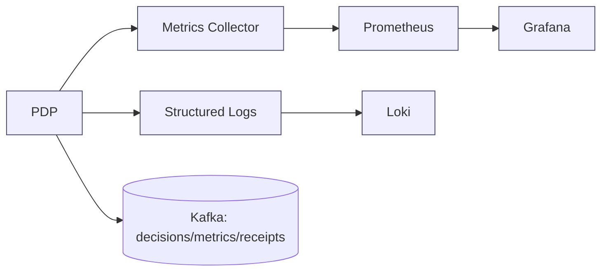
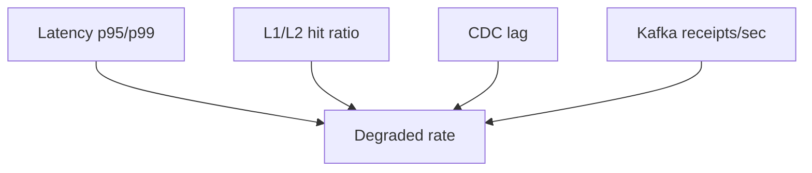

# PDP Operations Runbook (ReBAC v1)

This runbook covers day‑2 operations: metrics, SLOs, dashboards, alerts, incident playbooks, and routine tasks for the PDP running EPS/Graph‑Eval modes.

## 1) Observability Overview



Key streams:
- Metrics: in‑process counters/gauges/timers (p95/p99) exported for dashboards/alerts
- Logs: structured JSON with correlation_id, provenance
- Kafka: `authz.decisions`, `authz.metrics`, `authz.receipts`

## 2) Metrics Inventory

Minimum metrics (already instrumented):

- Counters
  - `eps_cache_l1_hits`
  - `eps_cache_l2_hits`
  - `eps_cache_misses`
  - `degraded_total`
- Gauges
  - `cdc_lag_ms`
- Timers (recorded with distribution; p95/p99 available)
  - `authorization_request_duration`

Interpretation:
- High L1/L2 hits with low misses indicate warm caches
- Rising `degraded_total` suggests LKG path usage (PIP/Redis issues)
- `cdc_lag_ms` sustained > 2000ms risks stale grants
- `authorization_request_duration.p95` should stay within SLO (see below)

## 3) SLO Targets (initial)

| Dimension | Target |
|----------|--------|
| Cached decision latency p99 | ≤ 10 ms |
| Cold single decision p99 | ≤ 25 ms |
| CDC end‑to‑end p99 | ≤ 2000 ms |
| Availability on LKG | ≥ 30–60 min except hard‑evicted keys |

Tune for your environment; start with the above as guardrails.

## 4) Default Alerts

- CDC Lag Warning
  - Condition: `cdc_lag_ms > 2000` for 5m
  - Action: page on‑call, tag `pdp,cdc`
- Latency Degradation
  - Condition: `authorization_request_duration.p95 > 50ms` for 10m
  - Action: investigate path (cache, PIP latency, graph eval)
- Degraded Mode Spike
  - Condition: `increase(degraded_total[10m]) > 50`
  - Action: check membership/redis health and network

Prometheus sample rules:
```yaml
- alert: PdpCdcLagHigh
  expr: pdp_cdc_lag_ms > 2000
  for: 5m
  labels: {severity: warning}
  annotations:
    summary: CDC lag high (>2s)
    description: PDP CDC lag is above threshold.

- alert: PdpLatencyP95High
  expr: histogram_quantile(0.95, sum(rate(pdp_authorization_request_duration_bucket[5m])) by (le)) > 0.05
  for: 10m
  labels: {severity: warning}
  annotations:
    summary: PDP p95 latency degraded (>50ms)

- alert: PdpDegradedSpike
  expr: increase(pdp_degraded_total[10m]) > 50
  for: 5m
  labels: {severity: warning}
  annotations:
    summary: Degraded mode spike
```

## 5) Dashboards (Grafana)

Recommended panels:
- Latency: request duration (p50/p95/p99)
- Cache: L1/L2 hits vs misses (stacked), hit ratio
- CDC: `cdc_lag_ms` over time with alert band
- Degraded: `rate(degraded_total[5m])`
- Kafka: receipts/decisions throughput (from broker exporter)

Layout visual:


## 6) Incident Playbooks

### A) Latency Spike (p95/p99)
1. Check L1/L2 hit ratio; a drop suggests cold caches
2. Verify membership/PIP health and response times
3. If Graph‑Eval enabled, confirm PIP latency and depth limits
4. Review recent deploys/feature flags (`GRAPH_EVAL_*`, `PDP_L1_CACHE_*`)
5. Escalate if underlying services degraded

### B) CDC Lag Warning
1. Confirm Kafka and CDC publisher health
2. Inspect `cdc_lag_ms` trend; identify spike start time
3. Validate Redis connectivity/throughput
4. Consider temporarily reducing EPS TTLs
5. If sustained, page data platform/SRE for CDC pipeline

### C) Degraded Mode Spike (LKG usage)
1. Correlate with PIP/Redis errors in logs
2. Validate `MEMBERSHIP_TOKEN_*` envs for PIP token flow
3. Confirm network connectivity to PIP/Redis
4. Check hard‑evict registry; ensure not over‑flagged
5. Recover path: restore dependencies → confirm `degraded_total` growth stops

## 7) Routine Operations
- Rotating per‑app mode: use Admin UI selector or set `GRAPH_EVAL_APPS`
- Receipts health check: browse `authz.receipts` in Kafdrop daily
- Log sampling: ensure structured logs present `correlation_id` and provenance
- TTL hygiene: adjust Redis/LKG TTLs seasonally with load patterns

## 8) Configuration Cheat‑Sheet

| Area | Setting | Default | Notes |
|------|---------|---------|------|
| Eval mode | GRAPH_EVAL_ENABLED | false | Gate graph‑eval path |
| Eval mode | EVALUATION_MODE | eps | Default mode |
| Eval mode | GRAPH_EVAL_APPS | (unset) | Comma apps use graph |
| Caching | REDIS_URL | (unset) | L2 EPS cache |
| Caching | PDP_L1_CACHE_ENABLED | false | Graph L1 decisions |
| Caching | PDP_L1_CACHE_TTL | 10 | L1 TTL |
| Kafka | ENABLE_KAFKA_PRODUCER | false | Enable producer |
| Kafka | KAFKA_BOOTSTRAP_SERVERS | (unset) | Broker(s) |
| Kafka | KAFKA_TOPIC_PREFIX | authz | Events/decisions/metrics/receipts |

## 9) Verification Steps (Post‑Change)
- After changing `GRAPH_EVAL_APPS`:
  - Make a test decision for the app; verify `graph_snapshot_id` in response
  - Confirm receipts arrive in `authz.receipts`
- After Redis change:
  - Watch L2 hit ratio rise; ensure latency improves
- After CDC tuning:
  - Verify `cdc_lag_ms` stays < 2000ms over 24h

## 10) References
- `docs/operations/quickstart.md` – first decision and receipts
- `docs/deployment/rebac_deployment_configuration.md` – full env flags
- `docs/operations/AUTHZ_FLAGS_AND_CACHING.md` – flags and caching details
