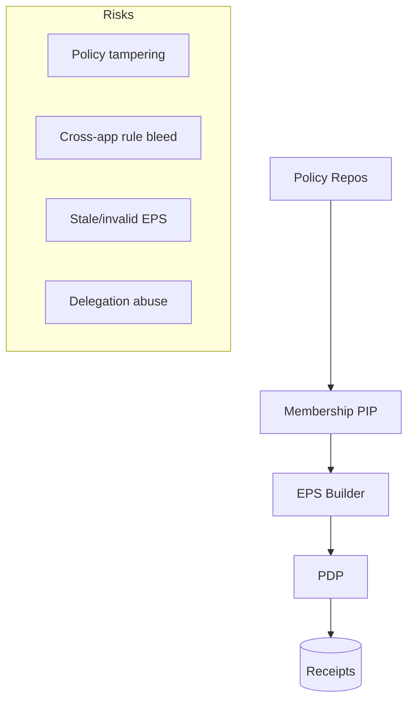

# Security & Integrity Guide (ReBAC v1)

This guide documents PDP security controls: application boundary enforcement, EPS integrity (SHA/JWS), delegation handling, failure policies, and operational hardening.

## Threat Model Overview

Controls mapped:
- R1: `external_ref_sha256` verify; optional EPS JWS
- R2: boundary enforcer: only `{request_app, global}` contribute
- R3: ETag/If‑None‑Match; LKG staleness budgets; CDC invalidation
- R4: delegation verification; hard‑evict disables LKG for delegation context

## Application Boundary Enforcement
- Every compiled rule carries `meta.application_id`
- PDP accepts contributions only if `application_id ∈ {request_app, global}`
- Defense‑in‑depth: enforced even if authored incorrectly

## EPS Integrity

### SHA256 of External References
- For each policy ref, PIP stores a pinned `external_ref_sha256`
- On compile, fetched YAML’s content hash is compared to the pinned value
- Mismatch → EPS build fails (fail‑closed)

### Optional JWS (Phase‑Later)
- EPS payload can be JWS‑signed by PIP; PDP verifies
- Recommended when supplying EPS across trust boundaries

Config (future):
| Setting | Meaning |
|---------|---------|
| EPS_JWS_VERIFY_ENABLED | Enable JWS verification |
| EPS_JWS_TRUSTED_KEYS | Trusted key IDs or JWKS URL |

## Delegation Security
- Verify delegation with `verify_delegation(… jkt)`
- On revoke/expire/high‑risk, publish hard‑evict → PDP disables LKG for affected keys
- PDP denies when delegation cannot be freshly verified beyond TTL

## Failure Policy
- Graph‑Eval PIP timeouts/5xx → DENY (fail‑closed)
- EPS unavailable → LKG fallback within staleness budget; mark `degraded=true`
- Delegation context: avoid LKG; deny when fresh verification is required

## CDC & Staleness
- CDC events update `cdc_lag_ms`; alert when sustained > 2000ms
- Coarse invalidation in v1; reverse index for precise eviction can be added later
- LKG staleness bounded (e.g., ≤ 300s)

## Receipts & Audit
- PDP emits `decision_receipt` to `authz.receipts`
- Fields: `decision_id`, `eps_etag`, `graph_snapshot_id`, `policy_refs[]`, `degraded`
- Use for audit trails and incident triage

## Configuration Cheat‑Sheet
| Area | Setting | Default | Notes |
|------|---------|---------|------|
| Boundary | (built‑in) | n/a | Enforced at evaluation time |
| EPS hash | (built‑in) | n/a | SHA256 verify per `external_ref` |
| EPS JWS | EPS_JWS_VERIFY_ENABLED | false | Optional in v1 |
| LKG | LKG_MAX_STALENESS_SEC | 300 | Max age for LKG use |
| Delegation | (verify via PIP) | n/a | Includes JKT; disables LKG on revoke |
| Failure | (built‑in) | n/a | Graph‑Eval timeout/5xx → deny |
| CDC | cdc_lag_ms alert | >2000ms | Tune threshold per SLO |

## Hardening Checklist
- Enforce read‑only mounts for policy directories in prod
- Pin policy repos to immutable commits; require signed commits server‑side
- Run PIP with minimum network permissions and short timeouts
- Use TLS between services; pin certs where possible
- Protect Kafka topics with ACLs; restrict producer credentials

## References
- `docs/deployment/rebac_deployment_configuration.md`
- `docs/operations/runbook.md`
- `docs/testing/qa_test_strategy.md`
