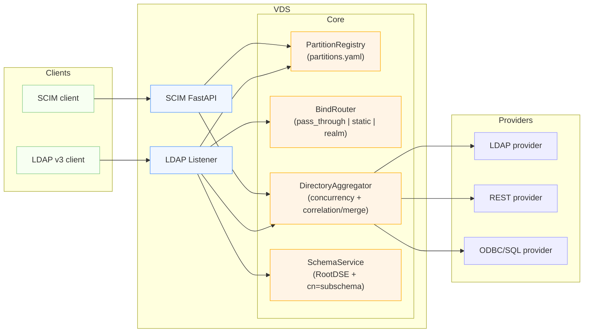
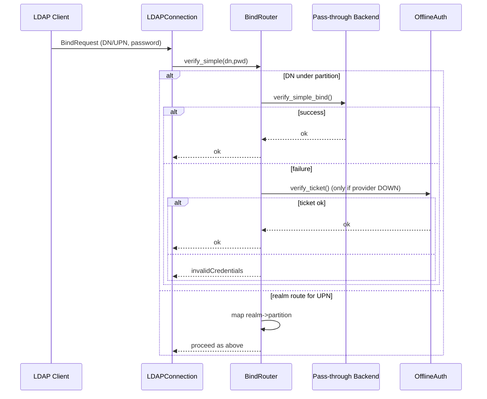
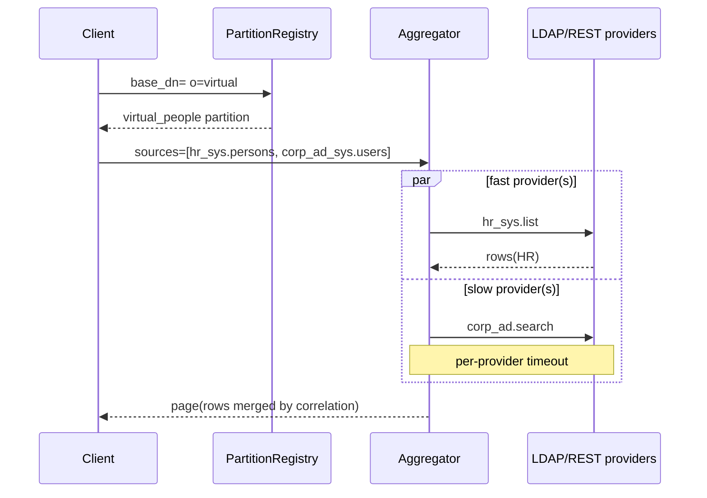
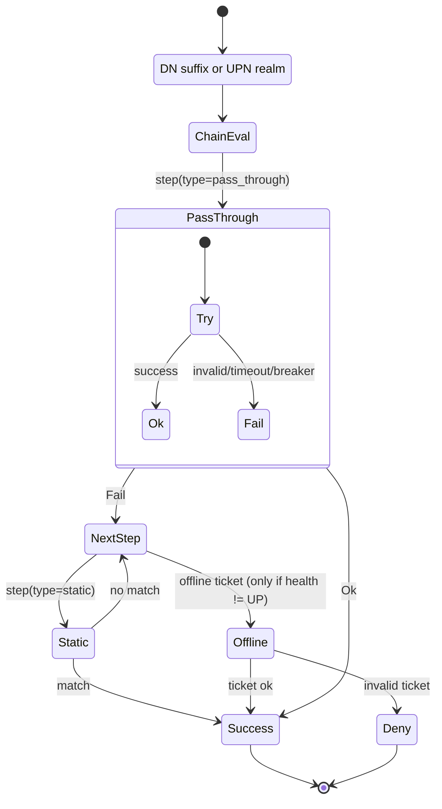
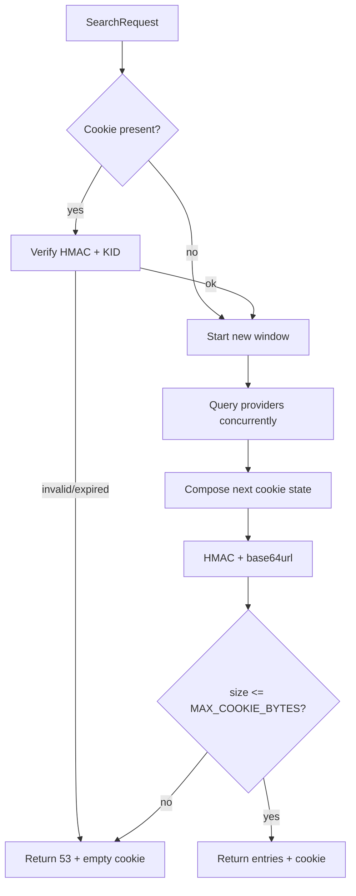

# Virtual Directory Service v3 – End-to-End Guide

This is your single source of truth for running, configuring, and testing the VDS v3 stack. It covers the shared core (partitions, aggregator, correlation/merge), LDAP specifics (bind, RootDSE, subschema), SCIM parity, paging & controls, observability, deployment, and ready-to-use configurations.

---

## Big picture



Core ideas:
- Partitions define per-base routing, bind behavior, schema, and sources.
- The same core primitives serve LDAP and SCIM; differences are protocol-only.
- Aggregation is concurrent and resilient; slow sources can’t stall first paint.

---

## Real configs to start testing

### 1) Partitions
Create or update `ServiceConfigs/vds/partitions.yaml` with two partitions:

```yaml
partitions:
  - name: corp_ad
    base_dn: dc=corp,dc=example,dc=com
    sources:
      - { system: corp_ad_sys, object_type: users }
    auth:
      chain:
        - { type: pass_through, system: corp_ad_sys }
    schema:
      subschema_dn: cn=subschema
      objectclasses:
        - { name: inetOrgPerson, attributes: [cn, sn, mail, uid] }
    scim:
      directory: corp
      resources: ["Users", "Groups"]

  - name: virtual_people
    base_dn: o=virtual
    sources:
      - { system: corp_ad_sys, object_type: users }
      - { system: hr_sys,      object_type: persons }
    merge_rules:
      identity:
        key_strategy:
          - { system: hr_sys,      key: employeeNumber }
          - { system: corp_ad_sys, key: employeeID }
        fallback: { join_on: mail }
      precedence: [hr_sys, corp_ad_sys]
      attributes:
        displayName: { pick: first_present, sources: ["hr_sys.displayName", "corp_ad_sys.cn"] }
        memberOf:    { merge_unique: { sources: ["corp_ad_sys.memberOf"], sort: ci } }
    schema:
      subschema_dn: cn=subschema
      objectclasses:
        - { name: virtualPerson, attributes: [cn, mail, employeeNumber, memberOf] }
    scim:
      directory: unified
      resources: ["Users"]

realms:
  corp.example.com: corp_ad
```

What this gives you:
- `dc=corp,dc=example,dc=com` is a pass-through view of your AD users.
- `o=virtual` merges HR + AD using `employeeNumber/employeeID` with a mail fallback.
- SCIM directory `unified` maps to the `virtual_people` partition.

### 2) Providers & systems
Ensure connectors point at your sources.

`ServiceConfigs/vds/config/connectors.yaml`:
```yaml
connectors:
  corp_ad_sys:
    type: ldap
    server:
      base_url: ad.ocg.labs.empowernow.ai
      port: 636
      use_ssl: true
      base_dn: dc=corp,dc=example,dc=com
    credentials:
      username: cn=reader,dc=corp,dc=example,dc=com
      password: ${AD_READER_PASS}
    mapping:
      subject_attr: uid
      id_attr: entryUUID

  hr_sys:
    type: rest
    server:
      base_url: https://hr.api.internal
    credentials:
      token: ${HR_TOKEN}
    mapping:
      subject_attr: profile.employeeNumber
      id_attr: profile.employeeNumber
```

`ServiceConfigs/connectors/systems/hr_sys.yaml` (catalog example):
```yaml
type: rest
object_types:
  persons:
    commands:
      list:
        method: GET
        endpoint: /v1/employees
        params:
          page: ${cursor.page}
          per_page: ${limit}
```

Export secrets (or mount via your orchestrator):
```powershell
$env:AD_READER_PASS="<pass>"
$env:HR_TOKEN="<token>"
```

---

## Bind routing and auth chains

- DN suffix → partition match (e.g., `cn=user,dc=corp,...` → `corp_ad`).
- UPN realm routing if DN doesn’t match (`user@corp.example.com`).
- Chain types:
  - `pass_through`: binds to upstream LDAP with provided DN/password.
  - `static`: exact DN/password pairs for labs or bootstrap.
- Resilience:
  - Circuit breaker avoids hammering a failing upstream.
  - Lockout prevents brute-force across repeated failures.
  - Offline ticket (optional): When upstream is DOWN, accept `exp.signature` in the password with HMAC verification.

Example static user for quick lab testing:
```yaml
auth:
  chain:
    - type: static
      users:
        "cn=reader,dc=corp,dc=example,dc=com": "reader_pass"
```



---

## Search execution, concurrency, correlation

- Partition match by `base_dn` builds a per-request aggregator from `partition.sources`.
- Aggregator concurrently queries providers with a per-source timeout (env: `VDS_PROVIDER_TIMEOUT_S`, default 0.5s). Partial pages are filled from sources that return within the timeout; laggards contribute on subsequent pages.
- Correlation merges rows across systems using `merge_rules.identity` and applies precedence and attribute rules.



---

## LDAP specifics

- RootDSE
  - `supportedLDAPVersion=[3]`
  - `supportedControl` includes RFC 2696 (paged results)
  - `namingContexts` from partitions
- `cn=subschema`
  - Published from partition `schema` with stable private OIDs.
- Controls & limits mapping
  - Unknown critical control → `unavailableCriticalExtension (12)`
  - Invalid/expired cookie → `unwillingToPerform (53)` + empty cookie
  - Client limits → `4/3`; server ceilings → `11`

---

## SCIM parity

- Directory routing uses partitions; `/scim/v2/{directory}/Users` maps to that partition’s sources/merge rules.
- `/Schemas` and `/ResourceTypes` include vendor schemas for partition objectclasses (e.g., `virtualPerson`).

See: [SCIM Interface — VDS](./scim_interface.md) for API surface, filters, sorting, pagination, writes, and deployment settings. For connector catalogs used by SCIM aggregators, see [Connector developer guide](./connector_guide.md).

Test quickly (replace host/token):
```bash
curl -s -H "Authorization: Bearer $TOKEN" "https://host/scim/v2/unified/Users?count=50&startIndex=1" | jq .
curl -s -H "Authorization: Bearer $TOKEN" "https://host/scim/v2/Schemas" | jq .
```

---

## Paging & cookies

- Stateless, HMAC-signed, base64url cookies; cap size with `MAX_COOKIE_BYTES` (default 2 KiB).
- Overflow → `53` with empty cookie; metric increments for oversize & old-kid.


---

## Observability & audit

- Metrics: bind/search counters labeled by partition; provider latency & contribution; view requests/latency; mapping latency; cookie events.
- Audit: `bind_done` (dn, partition, code), `search_start`/`search_done` (base, scope, code).
- Prometheus text is exposed via `GET /metrics` in the SCIM app or through your exporter.

---

## Deployment

- TLS: set `VDS_TLS_CERT`, `VDS_TLS_KEY`; LDAPS only in v1.
- PROXY v2 (pre-TLS) supported when `proxy_protocol` is enabled.
- Health and resilience are in-memory by default; back them with Redis in production.

---

## Run & test

### LDAP
```powershell
cd C:\source\repos\vds
$env:PARTITIONS_FILE="ServiceConfigs/vds/partitions.yaml"
$env:VDS_TLS_CERT="C:/path/fullchain.pem"
$env:VDS_TLS_KEY="C:/path/privkey.pem"
python -m vds.tools.run_dev_server
```

```bash
# RootDSE
ldapsearch -H ldaps://127.0.0.1:2636 -x -b "" -s base "(objectClass=*)" -LLL
# Partition search
ldapsearch -H ldaps://127.0.0.1:2636 -x -D "cn=reader,dc=corp,dc=example,dc=com" -w reader_pass \
  -b "o=virtual" -s sub "(objectClass=*)" -LLL
```

### SCIM
```powershell
cd C:\source\repos\vds
$env:PARTITIONS_FILE="ServiceConfigs/vds/partitions.yaml"
python -m vds.tools.run_scim_http
```

```bash
curl -s "http://127.0.0.1:8011/scim/v2/ServiceProviderConfig" | jq .
curl -s "http://127.0.0.1:8011/scim/v2/Schemas" | jq .
```

### Tests
```powershell
cd C:\source\repos\vds
$env:PYTEST_DISABLE_PLUGIN_AUTOLOAD='1'
python -m pytest -q
```

---

## Operational tips

- DN policy: never lowercase DN values in outputs; normalize only for internal comparisons.
- Attribute gates: keep PDP checks lightweight; fail-closed on error per policy.
- Paging: prefer smaller pages for low-latency first paint; keep cookies small by design.

---

## Appendix: Troubleshooting

- `protocolError` on bind → check TLS/cert, ensure client isn’t sending StartTLS.
- No results under `o=virtual` → confirm correlation keys present in provider rows.
- Cookie invalid (53) → client reused an expired cookie, or cookie exceeded size cap.
- Ticket bind rejected → ensure health reports provider DOWN/DEGRADED and ticket TTL not expired.

---

## Visual deep-dives

### Bind chain decision flow (with breaker/timeouts)



Key notes:
- Each step has a short timeout and a circuit breaker to avoid cascading latency.
- Offline ticket is considered only when upstream health is not UP.

### Paging decision flow



### Aggregator fairness window

```mermaid
sequenceDiagram
  participant Client
  participant Agg as Aggregator
  participant HR as hr_sys
  participant AD as corp_ad
  participant SQL as sql_sys
  Client->>Agg: page size=100
  par Query all sources
    Agg->>HR: list()
    Agg->>AD: search()
    Agg->>SQL: list()
  end
  HR-->>Agg: 40 rows @150ms
  SQL-->>Agg: 20 rows @320ms
  Note over Agg: per-provider timeout 500ms
  AD--x Agg: timeout @500ms
  Agg-->>Client: 60 rows (HR+SQL); AD contributes next page
```

---

## Real-world AD and OpenLDAP examples

### Active Directory (LDAPS)

Connector example (`ServiceConfigs/vds/config/connectors.yaml`):
```yaml
connectors:
  corp_ad_sys:
    type: ldap
    server:
      base_url: ad01.example.corp
      port: 636
      use_ssl: true
      base_dn: dc=corp,dc=example,dc=com
      insecure_skip_tls_verify: false   # set true in labs only
    credentials:
      username: cn=reader,dc=corp,dc=example,dc=com
      password: ${AD_READER_PASS}
    mapping:
      subject_attr: sAMAccountName
      id_attr: objectGUID
```

Common filters:
- Enabled users (exclude disabled flag 0x2):
  - `(&(objectClass=user)(!(userAccountControl:1.2.840.113556.1.4.803:=2)))`
- People (avoid computers):
  - `(&(objectClass=user)(objectCategory=person))`
- Nested group membership (transitive):
  - `(memberOf:1.2.840.113556.1.4.1941:=CN=Engineering,OU=Groups,DC=corp,DC=example,DC=com)`
- Changed since timestamp (GeneralizedTime):
  - `(&(objectClass=user)(whenChanged>=20240901000000.0Z))`

ldapsearch examples:
```bash
# RootDSE to learn defaultNamingContext
ldapsearch -H ldaps://ad01.example.corp -x -b "" -s base -LLL

# Paged search with critical control (1000/page)
ldapsearch -H ldaps://ad01.example.corp -x -D "cn=reader,dc=corp,dc=example,dc=com" -w "$AD_READER_PASS" \
  -b "dc=corp,dc=example,dc=com" -E pr=1000/noprompt -LLL \
  '(&(objectClass=user)(!(userAccountControl:1.2.840.113556.1.4.803:=2)))' sAMAccountName mail memberOf
```

Gotchas:
- Large groups use ranged retrieval (e.g., `member;range=0-1499`). VDS normalizes attributes across ranges.
- `userPrincipalName` may differ from `sAMAccountName`. Prefer UPN for realm binds, sAM for legacy apps.
- Many ADs require full chain trust; install enterprise CA root into the VDS trust store.

### OpenLDAP

Connector example:
```yaml
connectors:
  openldap_sys:
    type: ldap
    server:
      base_url: ldap.internal.example
      port: 636
      use_ssl: true
      base_dn: dc=internal,dc=example
      insecure_skip_tls_verify: false
    credentials:
      username: cn=reader,dc=internal,dc=example
      password: ${OL_READER_PASS}
    mapping:
      subject_attr: uid
      id_attr: entryUUID
```

OpenLDAP tips:
- Enable `memberof` overlay to materialize reverse group membership.
- Add indexes for `uid`, `mail`, `member`, `memberOf`, and `entryUUID` for performance.
- Password policy overlay (`ppolicy`) sets `pwdAccountLockedTime`; active users filter:
  - `(&(objectClass=inetOrgPerson)(!(pwdAccountLockedTime=*)))`

ldapsearch examples:
```bash
ldapsearch -H ldaps://ldap.internal.example -x -b "dc=internal,dc=example" -LLL '(objectClass=inetOrgPerson)' uid mail memberOf
```

### Partition recipes

Merge AD + HR:
```yaml
partitions:
  - name: virtual_people
    base_dn: o=virtual
    sources:
      - { system: corp_ad_sys, object_type: users }
      - { system: hr_sys,      object_type: persons }
    merge_rules:
      identity:
        key_strategy:
          - { system: hr_sys,      key: employeeNumber }
          - { system: corp_ad_sys, key: employeeID }
        fallback: { join_on: mail }
      precedence: [hr_sys, corp_ad_sys]
      attributes:
        displayName: { pick: first_present, sources: ["hr_sys.displayName", "corp_ad_sys.cn"] }
        memberOf:    { merge_unique: { sources: ["corp_ad_sys.memberOf"], sort: ci } }
```

Bind via UPN realm:
```yaml
realms:
  corp.example.com: corp_ad
```

---

---

## Troubleshooting (more scenarios and fixes)

- Certificate chains
  - Symptom: TLS handshake error or `certificate verify failed`.
  - Fix: install enterprise CA root into the VDS trust store; verify full chain; align server name with certificate SAN.
  - Labs-only: set connector `insecure_skip_tls_verify: true`.
- Referrals (AD/LDAP)
  - Symptom: `referral` entries returned, client timeouts.
  - Fix: disable chasing referrals at the provider or point to GC; VDS does not chase by default.
- Alias dereferencing
  - Symptom: missing entries under alias trees.
  - Fix: set `derefAliases` appropriately; VDS forwards client preference.
- Size/time limits
  - Symptom: `sizeLimitExceeded (4)` / `timeLimitExceeded (3)`.
  - Fix: reduce page size; add more selective filters; raise admin ceilings cautiously (server-side → 11 when hit).
- Paged results control
  - Symptom: invalid/expired cookie → `unwillingToPerform (53)`.
  - Fix: restart from first page; avoid large pauses; ensure cookie size within cap.
- Attribute ranges (AD)
  - Symptom: partial group membership via `member;range`.
  - Fix: VDS normalizes ranged values; verify attribute is included in mapping.

---

## Offline authentication details

Ticket envelope:
- Password field carries: `<subject>:<exp>:<nonce>:<hmac>`
- HMAC covers `partition|subject|client|exp|nonce` with server secret; header includes `kid`.

Acceptance rules:
- Only when provider health is DOWN/DEGRADED (configurable).
- `exp` within TTL; `nonce` single-use if Redis enabled; device/mTLS fingerprint optional.

Key rotation:
- Maintain `active_kid` and `previous_kids` with grace period; count accepts under old KIDs.

Lockouts and throttling:
- Lockout keys: `{principal|client}` with backoff durations.
- Reauth throttle keys: `{partition|principal|client}` with short TTL.

---

## Metrics and PromQL examples

Key metrics:
- `ldap_bind_total{result,partition}`
- `ldap_search_total{result,partition}`
- `provider_contrib_entries_total{partition,system}`
- `bind_failover_steps_total{partition}`
- `cookie_overflow_total`
- `cookie_old_kid_total`
- `offline_auth_allowed_total{mode,partition}`
- `offline_auth_denied_total{reason}`
- `health_state{provider}` (0=DOWN,1=DEGRADED,2=UP)

PromQL:
```promql
sum by(partition, result) (rate(ldap_bind_total[5m]))
```
```promql
sum by(partition) (rate(ldap_search_total{result="success"}[5m]))
```
```promql
sum by(system) (increase(provider_contrib_entries_total[15m]))
```
```promql
avg_over_time(health_state[30m])
```

Dashboard tips: separate panels for bind mix, throughput, provider contribution, health, cookie events.

---

## SCIM examples (filters and PATCH)

List with filter:
```bash
curl -s -H "Authorization: Bearer $TOKEN" \
  "https://host/scim/v2/unified/Users?filter=userName%20co%20'bob'&count=50&startIndex=1"
```

PATCH replace displayName:
```bash
curl -s -X PATCH -H "Authorization: Bearer $TOKEN" -H "Content-Type: application/scim+json" \
  -d '{"Operations":[{"op":"replace","path":"displayName","value":"Robert"}]}' \
  "https://host/scim/v2/unified/Users/abc123"
```

---

## Controls, VLV, and sort

Supported now:
- RFC 2696 Paged Results

Planned/flagged:
- Server Side Sort (simple forms)
- VLV (provider-dependent)

Example:
```bash
ldapsearch -H ldaps://127.0.0.1:2636 -x -E pr=500/noprompt -b "o=virtual" -s sub "(objectClass=*)" -LLL
```

---

## Performance tuning

- Per-provider timeout `VDS_PROVIDER_TIMEOUT_S` (default 0.5). Increase cautiously.
- Page size 50–200 for balanced latency/throughput.
- Enable provider connection pooling.
- Push down selective filters; limit returned attributes.

---

## PROXY v2 load balancer examples

HAProxy (TLS passthrough):
```haproxy
frontend ldaps_in
  bind *:636 accept-proxy
  mode tcp
  default_backend vds_ldaps

backend vds_ldaps
  mode tcp
  server vds 10.0.0.10:2636 send-proxy-v2
```

Traefik TCP:
```yaml
tcp:
  routers:
    vds:
      rule: "HostSNI(`ldaps.example.com`)"
      service: vds
  services:
    vds:
      loadBalancer:
        servers:
          - address: "vds:2636"
        proxyProtocol:
          version: 2
```

---

## Admin procedure: add and validate a partition

1) Edit `ServiceConfigs/vds/partitions.yaml` to add the partition.
2) Reload: verify `/config/status` and logs show atomic swap.
3) RootDSE includes new base in `namingContexts`.
4) Search the base with a small page and validate schema.
5) Test binds: DN and UPN (realm) if configured.
6) Check metrics labels for the new partition.

---

## DN policy examples (escaping and case)

Given `CN=Jürgen Müller,OU=Users,DC=corp,DC=example,DC=com`:
- Preserve value case in outputs.
- Escape per RFC 4514: `\,` `\+` `\#` `\;` `\<` `\>` `\=` `\"`.
- Internally, attribute types may be lowercased (e.g., `cn=`), not values.

---

## SchemaService OIDs and matching

- Private OID arc: `1.3.6.1.4.1.<enterprise>.<service>.{attr|class}.<hash>`
- Stability from deterministic hashing of names and attribute lists.
- Matching rules align with normalizers (e.g., `caseIgnoreMatch` for DirectoryString).

---

## Advanced recipes

- Group-only partition: project groups from AD and compute reverse `memberOf`.
- Computed `displayName`: fallback to `givenName + ' ' + sn`.
- Precedence tie-breakers: prefer non-empty, then larger `whenChanged`.

---

## CLI appendix

LDAP:
```bash
ldapsearch -H ldaps://127.0.0.1:2636 -x -b "o=virtual" -s sub "(mail=*@example.com)" -LLL
ldapwhoami -H ldaps://127.0.0.1:2636 -x -D "cn=reader,dc=corp,dc=example,dc=com" -w reader_pass
```

SCIM:
```bash
curl -s "http://127.0.0.1:8011/scim/v2/ServiceProviderConfig" | jq .
curl -s "http://127.0.0.1:8011/scim/v2/ResourceTypes" | jq .
```

---

## IdP failover chain example

```yaml
auth:
  chain:
    - { type: pass_through, system: corp_ad_sys }
    - { type: pass_through, system: backup_ad_sys }
    - { type: static, users: { "cn=breakglass,dc=corp,dc=example,dc=com": "<pw>" } }
  strategy: failover
  per_step_timeout_ms: 800
```

Monitor:
- `bind_failover_steps_total{partition}`
- `ldap_bind_total{result,partition}`

---

## Client trust store quickstart

Ubuntu (ldapsearch):
```bash
sudo cp fullchain.pem /usr/local/share/ca-certificates/vds.crt
sudo update-ca-certificates
```

Windows (MMC → Certificates → Trusted Root CA):
- Import enterprise root and intermediates used by AD/LDAP endpoints.

---

## Runbook: key rotation, reload, rollback

- Key rotation
  - Generate new key, set as `active_kid`; keep previous in `previous_kids` for grace.
  - Rotate secrets with minimal downtime; watch `cookie_old_kid_total`/ticket accept counts.
- Config reload
  - Update YAML; let the reloader parse/validate then atomically swap.
  - Verify `/config/status` hashes changed; confirm new `namingContexts` if partitions changed.
- Rollback
  - Revert YAML; reloader swaps back; verify in logs and via health/metrics.

---

## Lab: OpenLDAP sample compose

docker-compose snippet:
```yaml
services:
  openldap:
    image: osixia/openldap:1.5.0
    environment:
      - LDAP_ORGANISATION=Example Corp
      - LDAP_DOMAIN=internal.example
      - LDAP_ADMIN_PASSWORD=admin
    ports:
      - "389:389"
      - "636:636"
    volumes:
      - ./ldif:/container/service/slapd/assets/config/bootstrap/ldif/custom
```

Sample LDIF (`ldif/10-base.ldif`):
```ldif
dn: dc=internal,dc=example
objectClass: top
objectClass: domain
dc: internal

dn: ou=People,dc=internal,dc=example
objectClass: top
objectClass: organizationalUnit
ou: People

dn: uid=bob,ou=People,dc=internal,dc=example
objectClass: inetOrgPerson
cn: Bob Example
sn: Example
uid: bob
mail: bob@example.com
userPassword: {SSHA}Vj2dP6KkFQZ9uD8kQXr8kC9U6sCqYpVh
```

---

## FAQ and edge cases

- Why does a bind succeed without contacting AD?
  - Offline ticket accepted during provider outage; check health and offline mode flags.
- Why do I see duplicate users?
  - Correlation keys missing or mismatched; ensure `key_strategy` and fallback join are correct.
- Why is VLV not working?
  - Not supported yet; use paging + sort at the client or provider-native views.

---

© VDS v3 – clarity, safety, composability.

