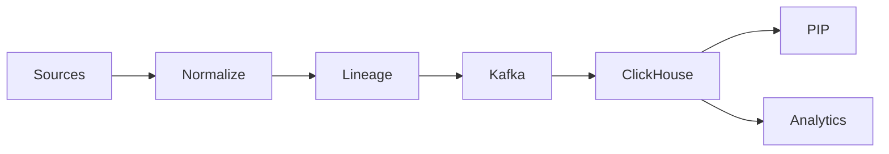

# Primer — Lineage & Freshness for Policy Accuracy

## What it is

A normalized identity & usage backbone with source→transform→sink lineage and domain SLAs for freshness.

## Why it matters

- Accurate policy decisions reflect current facts
- Traceable lineage reduces audit time
- Usage analytics support FinOps and budgets

## How it works

1) Collect deltas; normalize to canonical model
2) Emit events with lineage metadata
3) Query inventory/usage views and feed PDP/analytics

## Pitfalls to avoid

- Batch-only exports → stale policies
- Opaque transforms → audit friction

## See also

- `/docs/services/data-collector/index.md`
- `/docs/services/data-collector/explanation/lineage.md`
- `/docs/services/data-collector/explanation/freshness.md`
