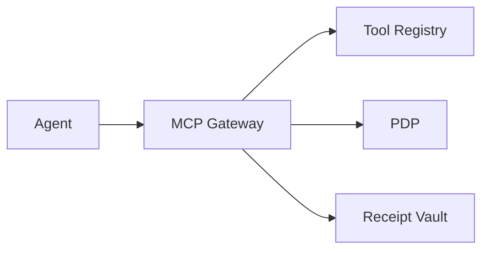

# Primer — Schema Pins & Plan Discipline at the Tool Boundary

## What it is

Governed MCP/HTTP tool calls with plan-step JWS and schema pins `{version,hash}`, plus params/egress allowlists.

## Why it matters

- Stops off‑plan tool calls before execution
- Prevents silent schema drift
- Produces receipts for audit trails

## How it works

1) Verify Passport & plan-step JWS
2) Enforce pins with grace windows
3) Allowlist params/egress; emit receipt on permit

## Pitfalls to avoid

- Observing without blocking
- Pinning without a rollout strategy

## See also

- `/docs/services/bff/explanation/bff_gateway_technical.md`
- `/docs/services/bff/explanation/bff_gateway.md`
