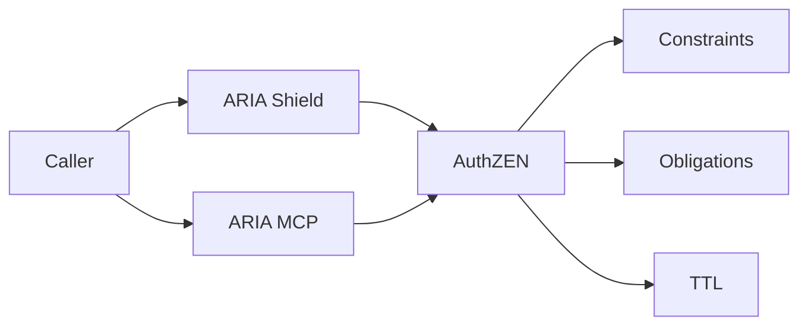

# Primer — AuthZEN Decisions & Conservative Merge

## What it is

A standardized authorization decision contract that returns decision + constraints + obligations + TTL, enriched by PIP context.

## Why it matters

- Consistency across APIs and agents
- Explainable denies/permits for audits
- Safer outcomes via conservative merge

## How it works

1) Evaluate request with context (subject, action, resource, environment)
2) Enrich via PIP (data-scope, capabilities)
3) Merge constraints conservatively; return decision + TTL + obligations

## Pitfalls to avoid

- Union/priority merges → over-grant
- Hidden explainability → audit pain

## See also

- `/docs/services/pdp/index.md`
- `/docs/services/pdp/explanation/merge-model.md`
- `/docs/services/pdp/explanation/pip-membership.md`
