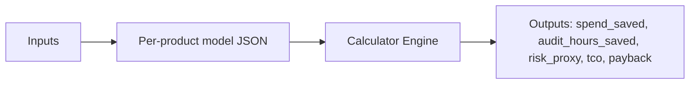

# Primer — ROI/TCO Calculator

Use the shared ROI models to estimate spend savings, audit-hour reduction, risk proxy, TCO, and payback.

## What it is

A lightweight calculator driven by per‑product JSON models under `/marketing/roi/*` and a shared schema.

## How it works



- Inputs: monthly calls, avg cost/call, rogue rate, audit events, hours on controls, breach baseline.
- Assumptions per product: spend reduction %, hours saved/event, risk reduction %, license/infra.

## Using the CLI

```bash
node scripts/roi-calc.mjs --product shield --hourly 160
```

## See also

- `/marketing/roi/roi.schema.json`
- `/marketing/roi/shield.json`
- `scripts/roi-calc.mjs`
