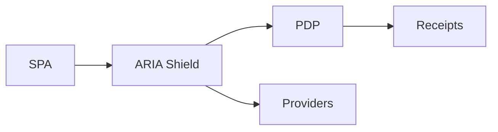

# Primer — Zero‑Token SPA & Budget Enforcement

## What it is

Backend‑only tokens via BFF (httpOnly cookies), with route‑mapped PDP policy and runtime budget/stream caps.

## Why it matters

- Reduces breach risk by removing browser tokens
- Controls AI spend via budgets and 402 semantics
- Provides provable enforcement with receipts

## How it works

1) Backend OAuth; cookies; `/api/*` proxy
2) PDP map per route; enforce constraints/streams
3) Budget hold/settle; 402 on exceed; receipt on permit

## Pitfalls to avoid

- Storing tokens in localStorage
- Observation without enforcement

## See also

- `/docs/services/aria-shield/index.md`
- `/docs/services/aria-shield/explanation/zero-token.md`
- `/docs/services/aria-shield/explanation/budgets.md`
