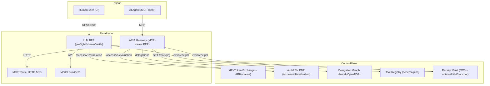
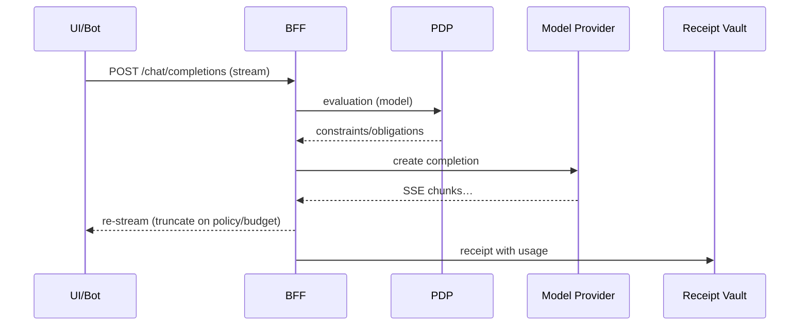

# Product — Agentic AI: Prepare for the Agent Economy

## Overview
Provable AI guardrails that cap spend, stop data leaks, and pass audit — without slowing teams.

- Who it’s for: CIO/CISO, VP Eng/AI Platform, FinOps, Risk/Compliance
- Flagship use cases:
  - Spend governance for GenAI: budgets pre‑gate + stream‑time settle + receipts → predictable costs
  - Agent/tool safety: schema pins, egress control, parameter allowlists → prevent breakage/exfiltration
  - Audit‑ready operations: signed, hash‑chained receipts → faster audits and RCA
- Why us: Application‑aware enforcement at the edges that matter (ARIA Gateway for tools, BFF for SPAs/LLMs), policy on every call (AuthZEN PDP), and evidence by default (receipts, metrics, events)

Learn more: `services/bff/explanation/bff_gateway.md`, `services/bff/explanation/bff_gateway_technical.md`, `services/aria-shield/receipt-chains.md`

## The challenge
- IAM must be agent‑ready: Agents plan and act; access must be policy‑bound and evidence‑rich to maintain control and accountability.
- New channels & workflows: Agents invoke tools and APIs continuously; streaming paths need hard limits and pre‑checks to avoid overruns and leaks.
- Good agents vs bad bots: You need strict boundaries (schema pins, params/egress allowlists, origin checks) to admit authorized agents while rejecting unwanted automation.

Reference: [Ping Agentic AI Identity](https://www.pingidentity.com/en/solution/agentic-ai-identity.html)

## Our solution — Identity Fabric for Agentic AI
- Application‑aware enforcement:
  - `ARIA Gateway` is the PEP at the agent→tool boundary; terminates requests, enforces policy, and emits receipts.
  - `BFF` secures SPAs/LLM calls with zero‑token sessions, per‑service token brokering, PDP authorization, and stream‑time enforcement.
- Policy on every call: Central PDP (OpenID AuthZEN) evaluates resource/action/id with fail‑secure behavior on NoMapping.
- Zero‑token SPAs: HTTP‑only session cookies; tokens never reach the browser.
- Provable outcomes: Structured Kafka business logs and hash‑chained receipts; Prometheus metrics with dashboards/alerts.

See: `services/bff/explanation/bff_gateway.md`, `services/bff/explanation/overview.md`, `services/bff/explanation/bff_gateway_technical.md`

## Core capabilities
### Identify and classify agents
- Enforce agent→user binding (pairwise identities), origin checks, tool schema pins, parameter allowlists, and egress allowlists at the PEP.
- See: `website_copy/product_gateway.md`, `services/aria-shield/tool-schema-attestation`

### Scoped access (no shared credentials)
- Per‑route AuthZEN checks; server‑side per‑service token brokering in the BFF; least‑privilege via PDP constraints.
- See: `services/bff/explanation/overview.md`, `services/bff/reference/pdp-mapping.md`

### Grant access with limits (runtime controls)
- Stream‑time caps and budget enforcement with `402 budget_exceeded`; SSE pre‑checks before opening streams.
- See: `website_copy/product_bff.md`, `services/bff/reference/streaming.md`

### Human‑in‑the‑loop (when policy requires)
- Pre‑issuance consent via IdP obligations; approvals gate token issuance before execution.
- See: `services/bff/explanation/bff_gateway_technical.md`

### Continuous monitoring & audits
- Structured Kafka `AUTHZ_DECISION` events; Prometheus metrics/dashboards; signed, hash‑chained receipts for immutable audit.
- See: `services/bff/explanation/bff_gateway_technical.md`, `services/aria-shield/receipt-chains.md`

## How it works
- Tools: Agent → `ARIA Gateway` → PDP → Tool Registry checks → Tool → Receipt Vault (signed receipts)
- LLMs: UI/Agent → `BFF` → PDP → Provider (SSE) with stream‑time truncation and final settlement + receipt

See sequence diagrams and details: `services/bff/explanation/bff_gateway.md`

### Architecture (high‑level)

#### Flow: UI/Bot → LLM via BFF (stream‑time enforcement)

## Get started
- Enable LLM routing: `services/bff/how-to/llm-routing-enable.md`
- Enforce budgets (402): `services/bff/how-to/llm-routing-budgets.md`
- Observe runtime: `services/bff/how-to/llm-routing-observability.md`, `services/bff/how-to/prometheus-grafana.md`
- Zero‑token SPAs (ForwardAuth): `services/bff/how-to/traefik-forwardauth.md`
- Map policies to routes: `services/bff/how-to/pdp-mapping-for-apis.md`, `services/bff/how-to/endpoint-map-validation.md`
- Protect streaming/SSE: `services/bff/how-to/sse-websockets.md`
- Emit events (Kafka/CAEP): `services/bff/how-to/events-kafka-caep.md`

## Proof & evidence
- Business events: Kafka `AUTHZ_DECISION` with decision, resource/action/id, route_id, actor/principal ARNs, correlation.
- Metrics: Allow/deny/no‑mapping counters, PDP latency histograms, service error rates; dashboards and alerts provided.
- Receipts: Signed, hash‑chained records with policy snapshots and parameter hashes; continuity validated by Analytics.

See: `services/bff/explanation/bff_gateway_technical.md`, `services/aria-shield/receipt-chains.md`, `services/bff/reference/observability.md`

## Roadmap & next
### Shipped
- IdP token exchange (passports, schema pins, optional plan contracts)
- `ARIA Gateway` PEP for tools; `BFF` stream‑time enforcement for LLMs
- PDP constraints/obligations; Membership PIP integration
- Receipt Vault; Analytics (receipt‑centric ingest); PDP‑led budgets (enforce)

### Deferred/flags
- Identity chaining (delegated) for selected tools; deny receipts everywhere; rate limits
- Future hardening: PoP defaults at PEP, SPIFFE/mTLS to tools, transaction tokens, signed registry attestations

## FAQs
**What is an AI agent identity here?** An agent bound to a specific user via pairwise identifiers (in the ARIA Passport) invoking tools under PDP policy at the PEP.

**Why not browser tokens for SPAs?** We use zero‑token SPAs: HTTP‑only session cookies; tokens are brokered server‑side by the BFF.

**Do you replace WAF/bot detection?** No. Edge WAF/DDOS/bot and productization stay at Traefik/edge providers. We enforce application‑aware policy inside the boundary.

**Which IdPs do you support?** Vendor‑agnostic; integrates with your IdP via standards.

## See also
- BFF product: `website_copy/product_bff.md`
- ARIA Gateway product: `website_copy/product_gateway.md`
- Technical: `services/bff/explanation/bff_gateway.md`, `services/bff/explanation/bff_gateway_technical.md`
- Competitive: `marketing/competitive.md`

Reference: [Ping Agentic AI Identity](https://www.pingidentity.com/en/solution/agentic-ai-identity.html)

