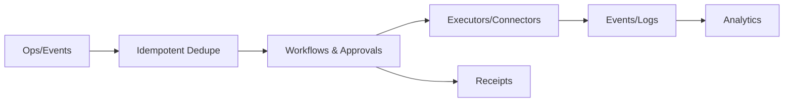
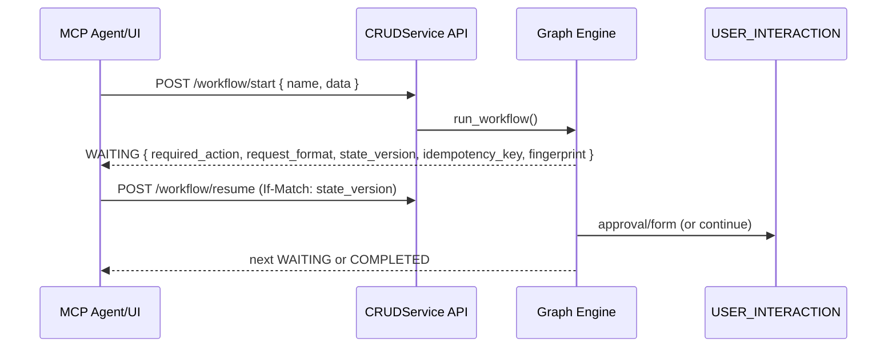

# CRUD Service — Identity Operations Plane

Make identity workflows reliable, auditable, and observable with idempotent operations, approvals, and connectors.

## Problem → Value

- Problem: brittle scripts, ad‑hoc retries, and approvals create long MTTR and audit gaps.
- Value: predictable SLOs, clean audit linkage to policy, and faster launches using templates and connectors.

## How it works (at a glance)

1) Receive op → dedupe by `event_id` → persist → orchestrate approvals.
2) Execute with retries and circuit breakers; emit receipts/logs.
3) Stream to analytics.

## Agent Workflow Explainability (V3)

- Self-describing WAITING responses tell any client exactly what to do next and how to resume safely.
- Safety metadata: state_version (concurrency), idempotency_key (replay dedupe), fingerprint (audit join), plus an MCP tool facade to resume without SDKs.

## Demo snippet (talk track)

- Bulk import with partial failures → deterministic retry shows only remaining items.
- Approval path enforces policy and records decisions.
- Permit → cryptographic receipt correlates with PDP decision.

## FAQ

- How do you guarantee idempotency? By deduping on stable correlation/event IDs across steps.
- What’s the approval model? Multi‑step, policy‑linked paths with audit.

## See also

- Services overview: `/docs/services/crud-service/index.md`
- Idempotency: `/docs/services/crud-service/explanation/idempotency.md`
- Approvals: `/docs/services/crud-service/explanation/approvals-overview.md`
