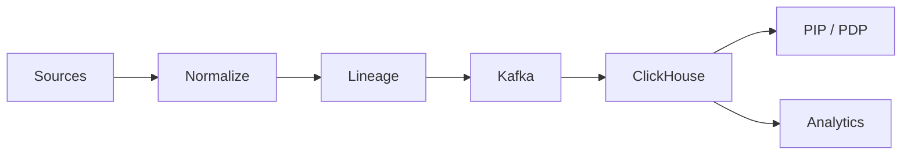

# Data Collector — Inventory & Usage Backbone

Make policy accurate and audits fast with timely, normalized identity & usage data and lineage.

## Problem → Value

- Problem: fragmented, stale data; decisions made on lagging facts; no lineage.
- Value: freshness SLAs, normalized schemas, and lineage for explainable decisions and FinOps.

## How it works (at a glance)

1) Connectors pull delta; normalize to canonical model.
2) Write events with lineage; expose inventory and usage views.
3) Feed PDP PIP and analytics dashboards.

## Demo snippet (talk track)

- Inventory freshness dashboard with SLA indicators.
- Lineage trace for an entitlement from source → transform → sink.
- Usage trends → budget insights.

## FAQ

- How do you ensure freshness? Delta syncs and SLAs per data domain.
- What lineage metadata is stored? Source, transform, timestamps, integrity markers.

## See also

- Services overview: `/docs/services/data-collector/index.md`
- Lineage: `/docs/services/data-collector/explanation/lineage.md`
- Freshness SLAs: `/docs/services/data-collector/explanation/freshness.md`
