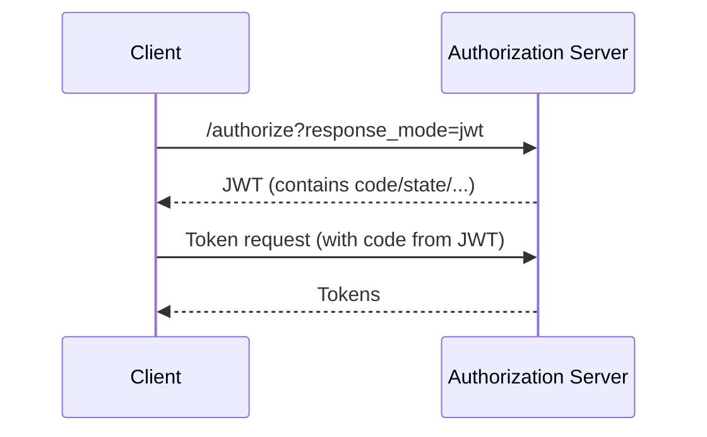

# What is JARM (JWT Secured Authorization Response Mode)?

JARM signs and optionally encrypts the authorization response returned from the authorization endpoint, improving integrity and confidentiality over traditional query/fragment responses.

## Why it matters
- Protects authorization response parameters from tampering
- Enables confidentiality (encryption) where needed
- Used in high-assurance profiles

## How it works (high-level)

## Key terms
- response_mode=jwt, JWS, JWE, claims inside the JWT (code, state, iss, aud, exp)

## Common pitfalls
- Not validating the JWS/JWE correctly; clock skew on exp/nbf

## Next steps
- FAPI context: `services/bff/how-to/fapi-switches.md`
- OAuth/OIDC flows: `website_copy/standards/oauth.md`, `website_copy/standards/oidc.md`
