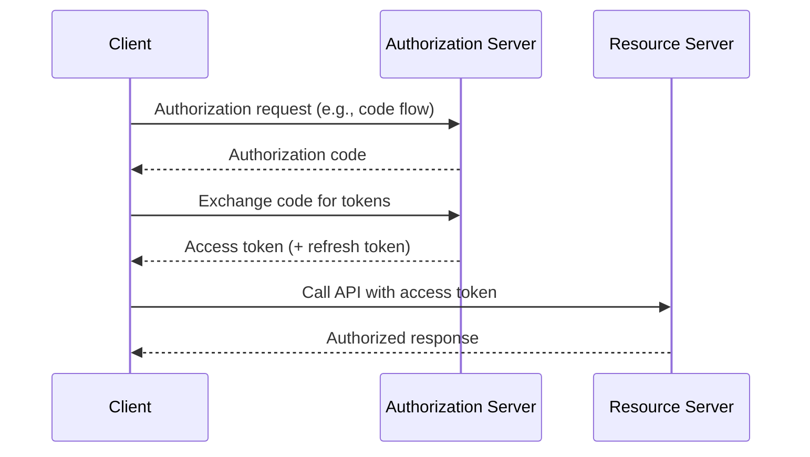

# What is OAuth 2.0?

OAuth 2.0 is an authorization framework that lets applications obtain limited access to resources on behalf of a resource owner, using tokens issued by an authorization server.

## Why it matters
- Separation of concerns: apps avoid passwords and use tokens
- Least privilege: scopes constrain token capabilities
- Delegation: safe "act on behalf of" patterns

## How it works (high-level)

## Key terms
- Authorization server (AS), resource server (RS), access token, refresh token, scopes

## Common pitfalls
- Over-broad scopes; long-lived tokens; storing tokens in browsers (prefer BFF for SPAs)

## Next steps
- BFF OAuth integration: `services/bff/reference/bff-idp-oauth-e2e.md`
- ForwardAuth for SPAs: `services/bff/how-to/traefik-forwardauth.md`
- FAPI switches: `services/bff/how-to/fapi-switches.md`
