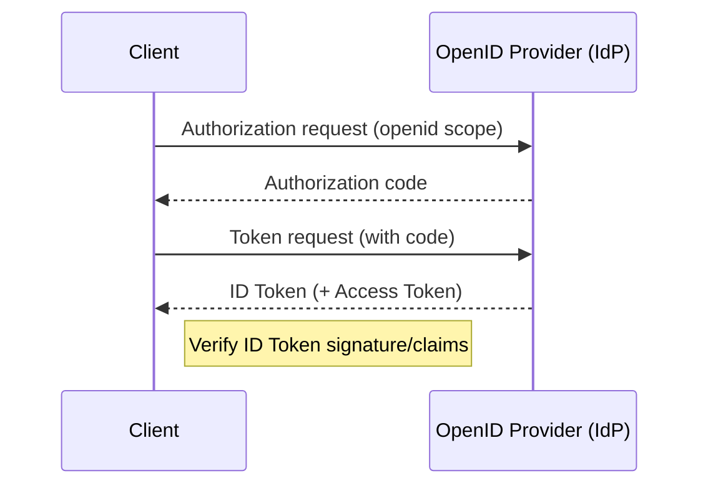

# What is OpenID Connect (OIDC)?

OIDC is an identity layer on top of OAuth 2.0 that issues an ID Token (JWT) describing the authenticated end-user.

## Why it matters
- Federated login with standard claims
- Interop across IdPs and apps
- Adds user identity to OAuth access flows

## How it works (high-level)

## Key terms
- OpenID Provider (OP), Relying Party (RP), ID Token, UserInfo, discovery

## Common pitfalls
- Treating ID Token as an API token; skipping signature/nonce checks

## Next steps
- IdP integration in BFF: `services/bff/reference/idps-reference.md`
- End-to-end OIDC with BFF: `services/bff/reference/bff-idp-oauth-e2e.md`
- Session binding/CSRF: `services/bff/reference/session-binding-csrf.md`
