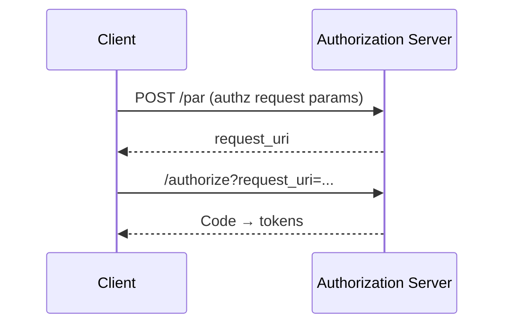

# What is PAR (Pushed Authorization Requests)?

PAR moves large or sensitive authorization request parameters from the front-channel redirect to a backchannel POST to the authorization server.

## Why it matters
- Integrity and confidentiality for request parameters
- Avoid URL size limits and leakage via logs/referrers
- Required by some security profiles (e.g., FAPI)

## How it works (high-level)

## Key terms
- request_uri, pushed authorization request endpoint

## Common pitfalls
- Incorrect lifetimes for request_uri; mixing PAR with unsigned front-channel params

## Next steps
- FAPI switches: `services/bff/how-to/fapi-switches.md`
- ForwardAuth reference: `services/bff/reference/traefik-forwardauth.md`
