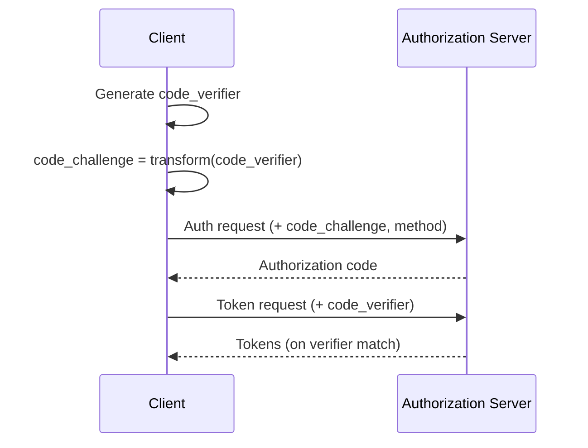

# What is PKCE?

Proof Key for Code Exchange (PKCE) hardens the OAuth 2.0 authorization code flow by binding the code to a one-time secret derived by the client.

## Why it matters
- Prevents code interception attacks
- Required for public clients (SPAs/mobile)

## How it works (high-level)

## Key terms
- code_verifier, code_challenge, S256 method

## Common pitfalls
- Using plain method; not storing verifier securely for the exchange step

## Next steps
- SPA with BFF: `services/bff/how-to/spa-with-bff.md`
- ForwardAuth setup: `services/bff/how-to/traefik-forwardauth.md`
