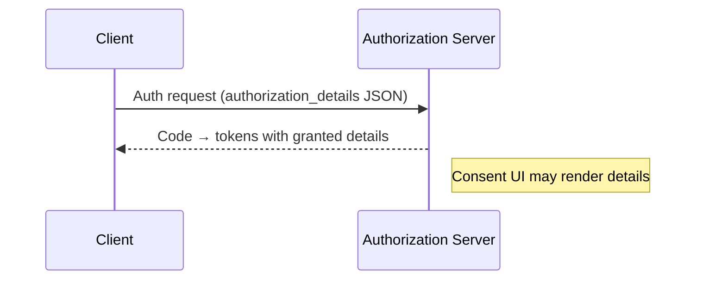

# What is RAR (Rich Authorization Requests)?

RAR extends OAuth by letting clients request permissions as structured objects in `authorization_details` rather than coarse scopes.

## Why it matters
- Express least-privilege with semantics (resource, actions, locations)
- Clear consent surfaces for users and auditors

## How it works (high-level)

## Key terms
- authorization_details, type, actions, locations, datatypes

## Common pitfalls
- Oversized payloads; mismatch between requested details and policy model

## Next steps
- PDP mapping concepts: `services/bff/reference/pdp-mapping.md`
- FAPI context and switches: `services/bff/how-to/fapi-switches.md`
