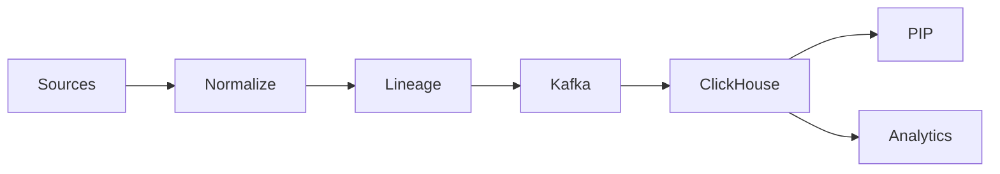

# Battlecard — Data Collector (Inventory & Usage)

## Positioning

Fresh, normalized identity & usage data with lineage for policy accuracy and FinOps.

## Quick pitch

- Outcome: accurate decisions, faster audits, budget visibility.
- Moat: freshness SLAs + lineage + ClickHouse/Kafka scale.

## Traps → Counters

- Trap: “Daily exports are fine.”
  - Counter: Policies require near-real-time freshness.
- Trap: “ETL handles this.”
  - Counter: ETL lacks lineage tied to policy & receipts.

## Proof assets

- Overview: `/docs/services/data-collector/index.md`
- Lineage: `/docs/services/data-collector/explanation/lineage.md`
- Freshness: `/docs/services/data-collector/explanation/freshness.md`

## Demo beats

1) Freshness dashboard.
2) Lineage trace.
3) Budget trend from usage feeds.

## Visual (Mermaid)

