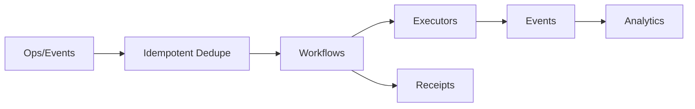

# Battlecard — CRUD Service (Identity Operations)

## Positioning

Reliable, auditable identity operations with idempotency, approvals, and observability.

## Quick pitch

- Outcome: fewer failures and faster recovery; clean audit linkage.
- Moat: idempotent-first design + approvals tied to policy + receipts.

## Traps → Counters

- Trap: “Our scripts + retries are fine.”
  - Counter: Retries without idempotency cause duplicates; audits fail.
- Trap: “iPaaS is good enough.”
  - Counter: Identity ops need idempotency, approvals, and receipts.

## Proof assets

- Overview: `/docs/services/crud-service/index.md`
- Idempotency: `/docs/services/crud-service/explanation/idempotency.md`
- Approvals: `/docs/services/crud-service/explanation/approvals-overview.md`

## Demo beats

1) Partial failure bulk import → deterministic retry.
2) Approval path bound to policy.
3) Receipt correlates to PDP decision.

## Displacement plan

- Assess: duplicate ops + long MTTR.
- Pilot: 2 critical workflows migrate; measure failed jobs ↓.

## Visual (Mermaid)

