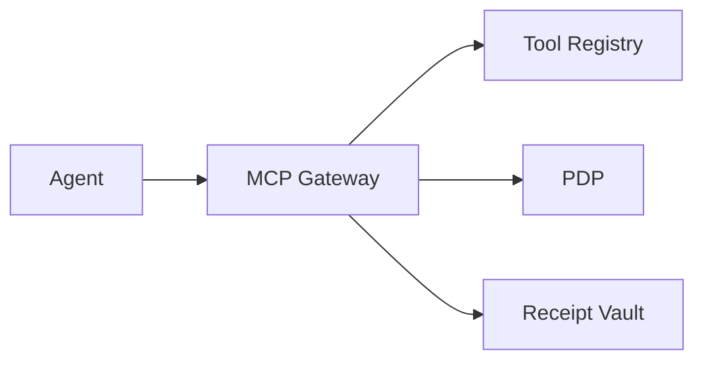

# Battlecard — ARIA MCP Gateway (Tool‑Boundary Enforcement)

## Positioning

Enforce plan-step JWS, pin tool schemas, allowlists for params/egress, and receipts at the agent→tool boundary.

## Quick pitch

- Outcome: stop off‑plan calls and schema drift before execution.
- Moat: plan discipline + pins + receipts.

## Traps → Counters

- Trap: “We log tool calls; that’s enough.”
  - Counter: Logging doesn’t block nor prove integrity.
- Trap: “Pins are hard to manage.”
  - Counter: CURRENT + grace windows simplify rollout.

## Proof assets

- Technical: `/docs/services/bff/explanation/bff_gateway_technical.md`
- Gateway overview: `/docs/services/bff/explanation/bff_gateway.md`

## Demo beats

1) Off‑plan call blocked with reason.
2) Pin mismatch → grace message.
3) Permit → receipt with policy & pin hashes.

## Visual (Mermaid)

