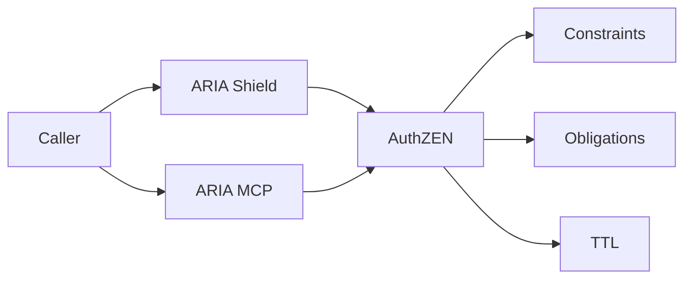

# Battlecard — PDP (AuthZEN Decisions)

## Positioning

Standardize runtime authorization with explainable, conservative constraints and obligations.

## Quick pitch

- Outcome: consistent decisions across APIs/agents; faster audits.
- Moat: AuthZEN contract + conservative merge + PIP enrichment.

## Traps → Counters

- Trap: “OPA/ABAC is enough.”
  - Counter: Lacks AuthZEN response (constraints/obligations/TTL) and merge semantics.
- Trap: “Union/priority rules are simpler.”
  - Counter: Conservative merge prevents over-grant incidents.
- Trap: “Latency concerns.”
  - Counter: TTL caching + sidecar modes; show p50 targets.

## Proof assets

- PDP overview: `/docs/services/pdp/index.md`
- Merge model: `/docs/services/pdp/explanation/merge-model.md`
- PIP enrichment: `/docs/services/pdp/explanation/pip-membership.md`

## Demo beats

1) Conflicting policies → conservative min constraint.
2) Step-up MFA obligation.
3) TTL-driven re-eval during stream.

## Displacement plan

- Assess: drift incidents and policy forks.
- Pilot: migrate 2 routes + 1 agent; validate decisions/logs.
- Success: explainable denies; no over-grants.

## Visual (Mermaid)

