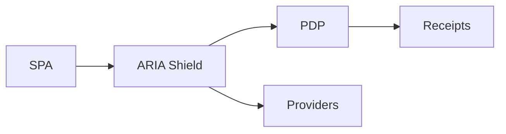

# Battlecard — ARIA Shield (Zero‑Token SPA & AI Gateway)

## Positioning

Keep tokens out of the browser; enforce budgets/402 and streaming limits; emit receipts.

## Quick pitch

- Outcome: lower breach risk, controlled spend, provable enforcement.
- Moat: zero-token SPA + budget enforcement + receipts.

## Traps → Counters

- Trap: “Our gateway observes; good enough.”
  - Counter: Observation ≠ enforcement; no 402 semantics or receipts.
- Trap: “Frontend SDK is simpler.”
  - Counter: Tokens in browser increase breach risk; backend-only tokens.

## Proof assets

- Overview: `/docs/services/aria-shield/index.md`
- Zero-token: `/docs/services/aria-shield/explanation/zero-token.md`
- Budgets: `/docs/services/aria-shield/explanation/budgets.md`

## Demo beats

1) Tokenless SPA login.
2) Streaming cap enforced mid-call.
3) 402 over-budget + receipt.

## Visual (Mermaid)

