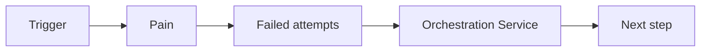

## Narrative

Problem → brittle scripts; Failed attempts → more scripts; Resolution → idempotent workflows with approvals & receipts.

## Journey (Mermaid)

## CTAs

Assessment → Demo → ROI session (ops time saved)

