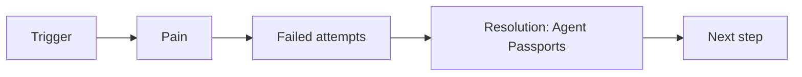

## Narrative

Problem → keys & unprovable delegation create risk and audit drag. Failed attempts → rotate keys, manual reviews. Resolution → Agent Passports: pairwise, purpose-bound, provable chain.

## Journey (Mermaid)

## CTA Ladder

- Soft: Assess agent identity maturity
- Medium: Watch 5‑min Passports demo
- Hard: ROI consult on eliminating keys

## Talking points (by role)

- Board: breach reduction
- Legal: provable delegation
- SecOps: revocation & TTLs
- Platform: TE/RAR/DPoP
- FinOps: fewer incidents

