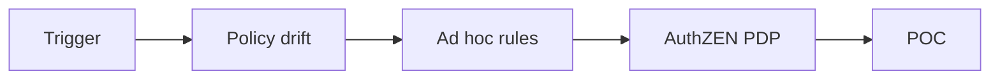

## Narrative

Problem → fragmentation; Failed attempts → per-service allowlists; Resolution → AuthZEN PDP + PIP + conservative merge.

## Journey (Mermaid)

## CTA Ladder

- Soft: AuthZEN explainer
- Medium: Decision explorer demo
- Hard: POC with your policies

