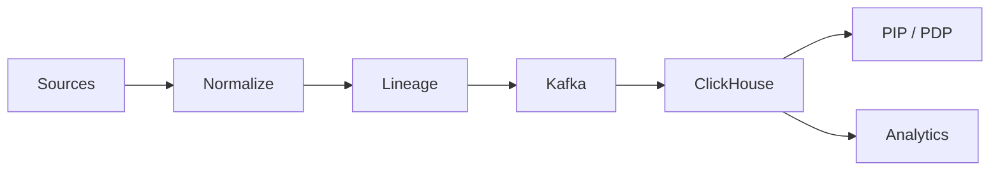

## One-liner

A fresh, normalized data backbone for identity + usage, with lineage and SLAs—so policies are accurate and audits are fast.

## Problem

- Fragmented, stale data across systems; policy decisions made on lagging facts.
- No lineage → hard to prove where facts came from.

## Architecture at a glance

## How it works

1. Connectors pull delta; normalize to canonical model.
2. Write events with lineage; expose inventory and usage views.
3. Feed PDP PIP and analytics dashboards.
→ See `/docs/services/data-collector/index.md`.

## Proof Library

- Lineage → `/docs/services/data-collector/explanation/lineage.md`
- Freshness SLAs → `/docs/services/data-collector/explanation/freshness.md`

## See also

- Website page (to add) → `/docs/website_copy/product_data-collector.md`

