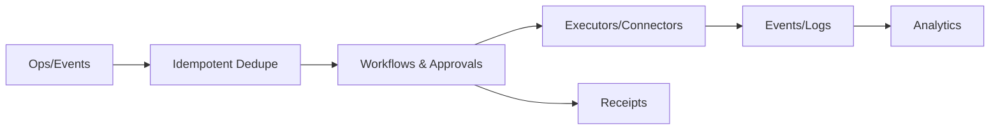

## One-liner

A reliable operations plane for identity objects and workflows—idempotent, auditable, and observable.

## Problem

- Fragile, bespoke provisioning code; retries & approvals are ad hoc.
- Long MTTR for failed identity ops; weak audit linkage to policies.

## Architecture at a glance

## How it works

1. Receive op → dedupe by event_id → persist → orchestrate approvals.
2. Execute with retries and circuit breakers; emit receipts/logs.
3. Stream to analytics.
→ See `/docs/services/crud-service/index.md`.

## Proof Library

- Idempotency → `/docs/services/crud-service/explanation/idempotency.md`
- Approvals → `/docs/services/crud-service/explanation/approvals-overview.md`

## See also

- Website page (to add) → `/docs/website_copy/product_crud-service.md`

