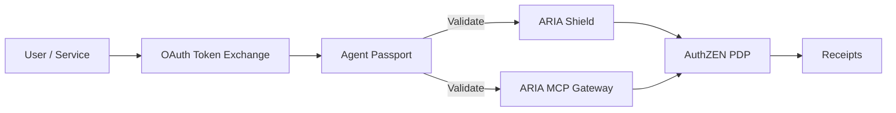

## One-liner (outcome-first)

Replace fragile API keys with purpose-bound, pairwise Agent Passports so every human/agent call is provable, least-privilege, and audit-ready.

## Problem (business)

- Shadow keys and shared tokens create breach risk and audit gaps.
- No provable link from human → agent → tool; delegation is informal and invisible.
- Revocation and scope minimization are manual and inconsistent.

## What it is / Who it’s for

OAuth Token Exchange–based IdP for Agent Passports (pairwise `sub`, actor chains, plan contracts, schema pins). For Security, Platform, AI Teams, and Developers.

## Value Proposition

- Risk ↓: replace keys with short-lived, pairwise credentials bound to purpose.
- Audit time ↓: delegation and actor chains are provable.
- Velocity ↑: standards (TE, RAR, DPoP) ease integration.

## Architecture at a glance

## How it works (link to Reference)

1. Issue Passports via Token Exchange (RFC 8693) with RAR (RFC 9396) scopes.
2. Encode pairwise identity, actor chains, plan contract, and schema pins.
3. Optional DPoP (RFC 9449) binding for proof-of-possession.
4. Passport validated by PEPs (ARIA Shield/MCP Gateway); receipts anchored.
→ See `/docs/services/idp/index.md` and related reference pages.

## Competitive Landscape (summary)

Cloud IdPs (delegation & TE), key managers/secrets stores, agent identity add-ons. Gap closed: plan contracts + pins + receipt-grade issuance.

## SWOT

- S: Standards-aligned (TE/RAR/DPoP), pairwise, chain of actors.
- W: Requires provider/tool alignment for best value.
- O: AI governance mandates; “no API keys” policies.
- T: Cloud incumbents adding partial agent identity.

## Objection Handling

- “We already have OAuth”: Not purpose-bound nor pairwise for agents; no plan/pins/receipts.
- “Too complex”: Start with TE + pairwise; add chain/pins incrementally.

## Demo Beats

1) Shadow key replaced by Passport. 2) Delegation flow shows actor chain. 3) Deny without required RAR; permit produces receipt.

## Proof Library

- Delegation demo → `/docs/services/idp/index.md`
- TE + RAR reference → `/docs/services/idp/reference/token-exchange.md`
- Receipts → `/docs/services/aria-shield/reference/receipts.md`

## FAQ Seeds

- How do Passports differ from JWT access tokens?
- What does “pairwise subject” mean?
- How do you model actor chains securely?

## See also

- Website page → `/docs/website_copy/product_idp.md`

