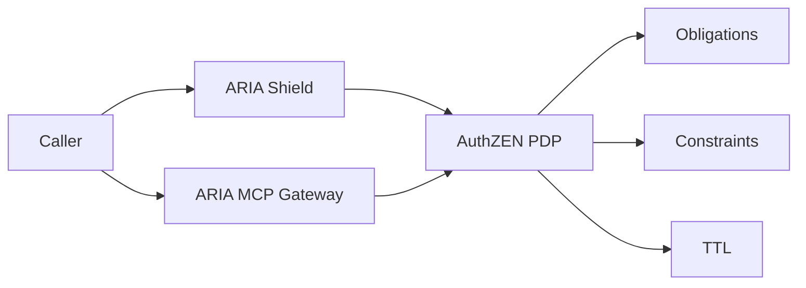

## One-liner

Make every API/agent decision consistent and explainable with AuthZEN-aligned responses and conservative merge of constraints.

## Problem

- Inconsistent policy across services/tools; policy drift causes incidents.
- Hard to prove why a call was allowed/denied; audits stall.

## Architecture at a glance

## How it works

1. Receive AuthZEN request (subject, action, resource, context).
2. Enrich with Membership PIP (capabilities, data-scope).
3. Conservative merge across layers; return decision + obligations + TTL.
→ See `/docs/services/pdp/index.md`.

## Proof Library

- Merge model → `/docs/services/pdp/explanation/merge-model.md`
- PIP data scope → `/docs/services/pdp/explanation/pip-membership.md`

## See also

- Website page → `/docs/website_copy/product_pdp.md`

